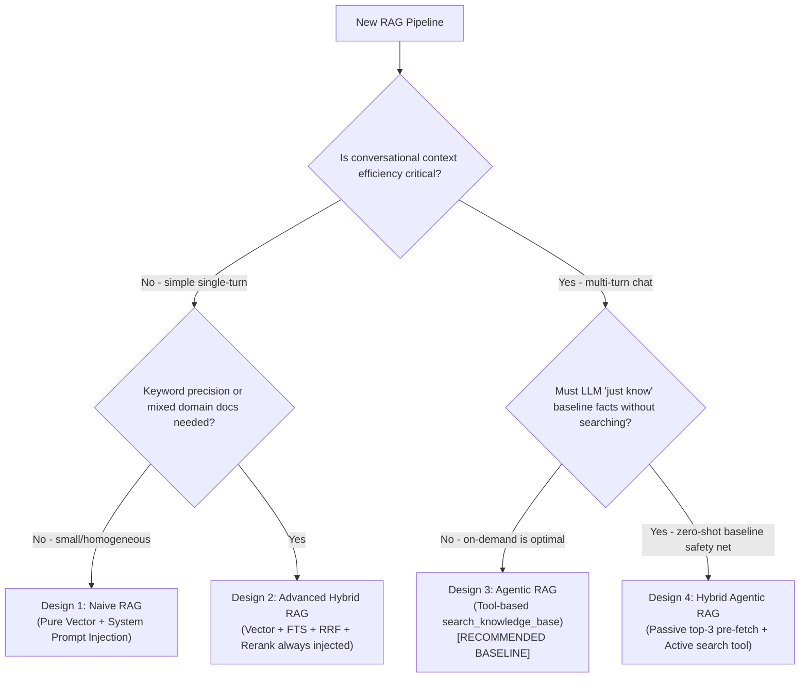

# Designing RAG Systems

## Overview

A robust Retrieval-Augmented Generation (RAG) system grounds LLM responses in external, authoritative knowledge without unconditional context stuffing. The core pattern decouples **document ingestion**, **multi-modal candidate retrieval** (dense semantic + sparse keyword), **rank fusion** (Reciprocal Rank Fusion), and **agentic tool-based invocation**.

```
[Documents] ──> Ingest & Chunk ──> [Vector + FTS DB] ──> Hybrid Query ──> RRF Fusion ──> [LLM Tool Call / Context]
```

## Architecture Decision Guide

Choose between the 4 fundamental RAG architectures based on domain requirements, context budget, and latency tolerance:



### Architecture Comparison

| Feature | Design 1: Naive | Design 2: Advanced Hybrid | Design 3: Agentic (Production Default) | Design 4: Hybrid Agentic |
| :--- | :--- | :--- | :--- | :--- |
| **Retrieval Trigger** | Unconditional (every turn) | Unconditional (every turn) | LLM autonomous tool call | Automatic passive + LLM tool |
| **Search Mechanism** | Dense vector similarity | Vector + BM25/FTS + RRF | Vector + BM25/FTS + RRF | Fast Vector (passive) + Full Hybrid (tool) |
| **Context Injection** | System prompt prepending | System prompt prepending | Tool result message | System prompt + Tool result |
| **Context Window Waste** | High (~2k tokens wasted/turn) | High (unnecessary stuff) | Zero on non-search turns | Low (~500 tokens passive) |
| **Latency Overhead** | +5–15 ms | +100–300 ms (always) | 0 ms (idle) / +200–500 ms (search) | +10 ms baseline + tool latency |
| **Query Reformulation** | None (raw user prompt) | None (raw user prompt) | Dynamic query synthesis by LLM | Raw (passive) + Dynamic (tool) |
| **Implementation Detail** | [architectures.md](references/architectures.md#design-1-naive-rag) | [architectures.md](references/architectures.md#design-2-advanced-hybrid-rag) | [architectures.md](references/architectures.md#design-3-agentic-rag) | [architectures.md](references/architectures.md#design-4-hybrid-agentic-rag) |

## Quick Reference Constants & Rules

| Parameter / Component | Recommended Value | Engineering Rationale |
| :--- | :--- | :--- |
| **Chunk Size** | 1,600 characters (~400 tokens) | Optimal balance between semantic coherence and retrieval specificity. |
| **Chunk Overlap** | 200 characters (~50 tokens) | Prevents losing critical facts cut across chunk boundaries. |
| **Separators Priority** | `\n\n` &rarr; `\n` &rarr; `. ` &rarr; ` ` &rarr; `""` | Splits along paragraphs, then lines, sentences, words, and characters. |
| **RRF Constant ($k$)** | $k = 60$ | Empirical standard (Cormack et al., 2009). Balances top ranks without over-penalizing tails. |
| **Candidates Retrieved** | Top 20 Vector + Top 20 FTS | Provides wide enough candidate pool for RRF to identify consensus docs. |
| **Final Tool Top-K** | Top 5 chunks | Fits within a ~2,000–3,000 token injection budget. |
| **pgvector Index Rule** | Exact cosine if dim > 2000; HNSW if dim &le; 2000 | PostgreSQL pgvector limits HNSW/IVFFlat indexes to 2,000 dimensions. |
| **Model Prefixes** | `"passage: "` (docs), `"query: "` (search) | Asymmetric embeddings (e.g. E5, BGE, Nemotron) optimize retrieval alignment. |

## Core Ingestion Pipeline

All production designs share a 5-step idempotent ingestion flow:

```
Upload (S3/MinIO) ──> Parse/Extract ──> Recursive Chunk ──> Embed Chunks ──> Atomic DB Swap
```

1. **Extraction**: Parse PDF (`unpdf`), Markdown, plain text, or XLSX into normalized text. Enforce a hard ceiling (e.g., 500k characters) to avoid memory exhaustion.
2. **Chunking**: Apply recursive separator splitting with overlap.
3. **Embedding**: Prefix texts if required by the model. Batch API requests (e.g. 100 chunks/batch) to avoid provider payload limits.
4. **Atomic Swap**: In a single database transaction, delete existing chunks for the document, then insert the new chunks. Never leave orphan vectors or partial documents.
5. **Full-Text Sync**: Maintain full-text tokens via PostgreSQL `GENERATED ALWAYS AS (to_tsvector('english', content)) STORED` with a GIN index.

See [ingestion-and-chunking.md](references/ingestion-and-chunking.md) for complete ingestion rules.

## Core Hybrid Retrieval & Rank Fusion

Do not rely on vector distance alone (fails on identifiers, acronyms, and error codes) or keyword search alone (fails on synonyms and semantic phrasing).

```
Vector Candidates (Top 20) ─┐
                             ├─> Reciprocal Rank Fusion (k=60) ─> Top 5 Chunks
Keyword Candidates (Top 20) ─┘
```

The fused RRF score for document $d$ across retrieval arms $R = \{\text{vector}, \text{fts}\}$:

$$\text{RRF}(d) = \sum_{r \in R} \frac{1}{k + \text{rank}_r(d)}$$

- No score normalization needed (ranks are scale-independent).
- If full-text search encounters syntax errors or dialect bugs, treat FTS as **non-fatal** and fall back gracefully to vector-only results.

See [hybrid-retrieval.md](references/hybrid-retrieval.md) for SQL implementations and mathematical proof.

## Security & Multitenancy Guarantees

1. **Query-Level Tenant Filtering**: Never retrieve candidates globally and filter in memory. Every SQL query must bind `kb_id` in the `WHERE` clause:
   ```sql
   WHERE c.kb_id = $1 AND c.embedding IS NOT NULL
   ```
2. **Ownership Validation**: Before executing any search or ingestion mutation, authenticate the session and verify that `knowledgebase.user_id === session.user_id`.
3. **Storage Scoping**: Isolate files in object storage with tenant keys: `kb/{kbId}/{documentId}/{filename}`.

See [security-and-multitenancy.md](references/security-and-multitenancy.md) for full isolation guidelines.

## Framework Implementations

- **Vercel AI SDK (TypeScript / Next.js)**: [references/framework-vercel-ai-sdk.md](references/framework-vercel-ai-sdk.md) — production implementation with `embedMany`, `streamText`, `tool()`, multi-step agentic loops (`maxSteps: 10`), and citation parsing.
- **LangChain / LangGraph (Python / TypeScript)**: [references/framework-langchain.md](references/framework-langchain.md) — implementation with `EnsembleRetriever`, `RecursiveCharacterTextSplitter`, custom RAG tool, and LangGraph agent loops.

## Common Mistakes & Red Flags

| Anti-Pattern | Why It Fails | Correct Solution |
| :--- | :--- | :--- |
| **Always-on context stuffing** | Injects thousands of tokens into every chat turn, bloating costs and diluting attention. | Use Design 3 (Agentic RAG): expose retrieval as an LLM tool. |
| **Pure vector search for tech data** | Misses exact identifiers, SKU numbers, error strings, and function names. | Use Hybrid Search: Vector + PostgreSQL `tsvector` fused with RRF ($k=60$). |
| **Attempting HNSW on >2000 dims** | PostgreSQL pgvector throws an error (`column cannot have more than 2000 dimensions for index`). | Use exact cosine search (`ORDER BY embedding <=> query`) or reduce dimensions. |
| **Unprotected re-ingestion** | Failed re-ingest deletes old vectors and errors out, leaving zero searchable chunks. | Use atomic database transactions (`DELETE` old + `INSERT` new in one transaction). |
| **Ignoring asymmetric prefixes** | Models like E5/BGE/Nemotron produce degraded embeddings if query/passage prefixes are omitted. | Apply `"passage: "` on ingest and `"query: "` on search. |
| **Post-filtering by tenant** | Running vector KNN across all users and filtering by `user_id` in code leaks metadata and wastes ANN recall. | Apply `WHERE kb_id = $1` directly inside the database query. |
| **Failing completely on FTS syntax error** | Special characters in user query crash `plainto_tsquery` or `to_tsquery`. | Wrap FTS in `try/catch`; fall back to vector-only results if FTS fails. |

