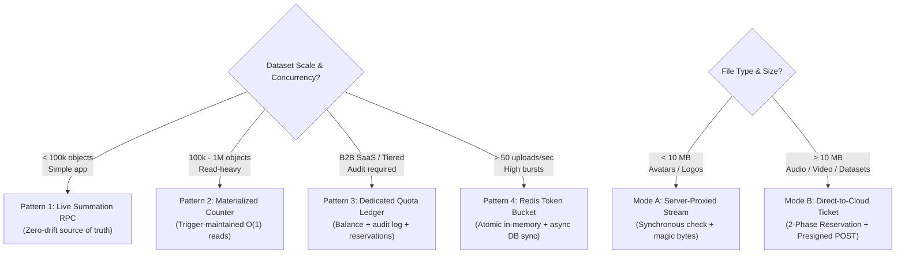

# Storage & Quota Management

## Overview

Storage limits must be gated at the application trust boundary using **$O(1)$ fast stateful counters or live SQL aggregations**, never by querying cloud object storage APIs in the upload hot path. Inevitable drift between database records and physical object storage is healed by asynchronous background reconciliation.

**Core principles:**
1. **Never trust the client** — Enforce file size ceilings and MIME/magic bytes on the server or via signed cloud policy conditions.
2. **Follow the progressive scale roadmap** — Use zero-drift live summation for early-to-mid scale (<100k objects); transition transparently to materialized trigger counters (100k–1M objects) or distributed ledgers (>1M objects) without altering application validation contracts.
3. **Short-circuit hierarchical checks** — Enforce user or tenant limits first; halt immediately on failure to prevent wasted global aggregation queries and ensure clear error attribution.
4. **Account for net impact on replacements** — Calculate $\Delta = \text{new\_size} - \text{old\_size}$ to prevent blocking legitimate asset updates when near storage capacity.
5. **Two-phase reservation for direct uploads** — Atomically reserve quota before issuing presigned upload tickets; commit usage only after upload confirmation or cloud event notification.
6. **DB-first deletion with dual cleanup** — Delete database records first to preserve user UX, execute trigger-based metadata cleanup, and follow up with idempotent, best-effort storage SDK removal.
7. **Account for trash and lifecycle** — Soft-deleted files must consume quota until permanently purged to prevent trash abuse.

---

## Architecture Selection

| Trait | Mode A: Server-Proxied Upload | Mode B: Direct-to-Cloud (Presigned POST) |
|---|---|---|
| **Use Case** | Avatars, logos, metadata images (< 10 MB) | Audio, videos, raw datasets, documents (> 10 MB) |
| **Server Load** | High (RAM, stream CPU, double bandwidth) | Zero (Direct client-to-bucket network transfer) |
| **Quota Gate** | Synchronous pre-flight check in handler | 2-Phase reservation (Reserve → Upload → Commit) |
| **Tamper Proofing** | Inspected in memory before disk/bucket write | Hardened via `content-length-range` cloud policy |

---

## Quick Reference

| Task | Pattern | Documentation Reference |
|---|---|---|
| **Live Summation (Source-of-Truth)** | Direct SQL `SUM(size)` RPC (<100k objects) | [tracking-and-quotas.md](tracking-and-quotas.md#pattern-1-source-of-truth-live-summation-zero-drift-simple) |
| **Materialized Counter via Trigger** | $O(1)$ reads with zero application changes | [tracking-and-quotas.md](tracking-and-quotas.md#pattern-2-materialized-row-level-counters-via-triggers-o1-reads) |
| **Progressive 3-Phase Scale Path** | Roadmap from Live Summation to Distributed | [tracking-and-quotas.md](tracking-and-quotas.md#progressive-scale-path-3-phase-scale-roadmap) |
| **Atomic Concurrency Guard** | Check-and-add in single SQL `UPDATE` | [tracking-and-quotas.md](tracking-and-quotas.md#concurrency-atomic-guard-queries) |
| **Hierarchical Short-Circuiting** | User/Tenant limit check first, Global second | [enforcement-and-upload-flows.md](enforcement-and-upload-flows.md#dual-tier-hierarchical-validation-short-circuiting) |
| **Asset Replacement Delta** | Net impact: $\Delta = \text{new} - \text{old}$ | [enforcement-and-upload-flows.md](enforcement-and-upload-flows.md#net-impact-replacement-validation) |
| **Direct Upload Safety** | Presigned POST with `content-length-range` | [enforcement-and-upload-flows.md](enforcement-and-upload-flows.md#phase-2-presigned-policy-hardening-preventing-byte-spoofing) |
| **Quota Reservation Protocol** | Reserve bytes with TTL + cleanup worker | [enforcement-and-upload-flows.md](enforcement-and-upload-flows.md#direct-to-cloud-the-2-phase-quota-reservation-protocol) |
| **UI Capacity Meters** | Progress bars with 75% and 90% thresholds | [enforcement-and-upload-flows.md](enforcement-and-upload-flows.md#ui-presentation-visual-capacity-indicators) |
| **DB-First Deletion & Dual Cleanup**| DB Trigger + SDK remove (404-safe) | [reconciliation-and-lifecycle.md](reconciliation-and-lifecycle.md#deletion-ordering-the-dual-cleanup-strategy) |
| **Drift & Orphan Cleanup** | 2-Way S3 vs DB audit with 24h quarantine | [reconciliation-and-lifecycle.md](reconciliation-and-lifecycle.md#2-two-way-drift-detection-bucket-database) |
| **Trash & Soft Deletes** | Count trash against quota; auto-purge at 30d | [reconciliation-and-lifecycle.md](reconciliation-and-lifecycle.md#2-soft-deletes-vs-quotas) |
| **Supabase Storage** | JSONB `(metadata->>'size')::bigint` & RPCs | [provider-playbook.md](provider-playbook.md#1-supabase-storage) |
| **AWS S3 / Cloudflare R2** | Presigned POST + Event Notifications | [provider-playbook.md](provider-playbook.md#2-aws-s3-cloudflare-r2) |
| **Google Cloud Storage** | V4 Signed URLs with length headers | [provider-playbook.md](provider-playbook.md#3-google-cloud-storage-gcs) |
| **Drizzle / Prisma / Mongo** | Quota and ledger table definitions | [provider-playbook.md](provider-playbook.md#4-relational-document-schema-implementations) |
| **Local Disk / Containers** | `statfs` volume saturation check | [provider-playbook.md](provider-playbook.md#5-local-posix-container-disk-storage) |

---

## Common Mistakes & Traps

| Mistake | Consequence | Fix |
|---|---|---|
| Querying `s3.listObjectsV2` or bucket APIs on upload | 500ms–3s latency, rate limiting, crashes | Use fast DB RPCs or $O(1)$ counters; reconcile in background |
| Issuing presigned `PUT` without size conditions | Malicious client uploads 50 GB via 1 MB ticket | Use Presigned POST with `content-length-range` bounds |
| Separate `SELECT quota` then `UPDATE quota` | Race condition: concurrent uploads exceed cap | Use atomic SQL check: `UPDATE ... WHERE (used + incoming) <= max` |
| Blocking replacements because `used + new > quota` | Users at 99% capacity cannot update avatars/files | Calculate net impact: $(\text{used} - \text{old} + \text{new}) \le \text{quota}$ |
| Deleting storage object before database record | Network glitch leaves dead DB link; UI breaks | Delete DB record first; clean up storage second (404-safe) |
| Querying column `size` in Supabase `storage.objects` | SQL error: column "size" does not exist | Query `(metadata->>'size')::bigint` via `SECURITY DEFINER` RPC |
| Excluding soft-deleted files ("trash") from quota | Users park files in trash to bypass storage limits | Count soft-deleted assets towards quota until 30d hard-purge |
| Immediate deletion during reconciliation scans | Deletes valid in-flight uploads | Apply 24h quarantine buffer before deleting untracked bucket keys |
