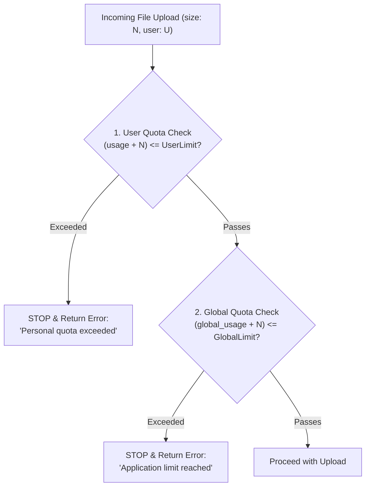

# Enforcement & Upload Flows

## Upload Architecture Models

Choosing the upload architecture dictates how quota limits and security constraints must be enforced:

```
  MODE A: SERVER-PROXIED UPLOAD
  Client ──(Multipart Form/Stream)──> Server Action/API ──(SDK Upload)──> Object Store
  [Security Gate: Server controls stream & memory directly. Heavy server RAM/bandwidth.]

  MODE B: DIRECT-TO-CLOUD (PRESIGNED TICKET)
  Client ──(1. Request Ticket)──> Backend API (Pre-flight Quota Reservation)
  Client ──(2. Direct Upload)───> S3 / R2 / Supabase Storage (Direct)
  Client ──(3. Confirm)─────────> Backend API (Commit Reservation -> Active Usage)
  [Security Gate: Cryptographic Presigned Policy. Zero server bandwidth overhead.]
```

| Dimension                     | Server-Proxied (Mode A)                 | Direct-to-Cloud (Mode B)                       |
| ----------------------------- | --------------------------------------- | ---------------------------------------------- |
| **Best For**                  | User avatars, profile images (< 10 MB)  | Audio files, videos, raw datasets (> 10 MB)    |
| **Server Bandwidth**          | 2x transfer (Client → Server → Storage) | 0x transfer (Direct Client → Bucket)           |
| **Quota Enforcement**         | Immediate synchronous byte verification | Requires 2-Phase Reservation Protocol          |
| **Content Inspection**        | Direct magic-bytes sniffing in memory   | Requires post-upload async worker or edge hook |
| **Implementation Complexity** | Low                                     | Medium to High                                 |

---

## Dual-Tier Hierarchical Validation & Short-Circuiting

When applications enforce both local limits (per-user or per-tenant) and a platform-wide global limit, checks must run in a strict hierarchy with short-circuiting:



### Why Validation Order Matters
1. **Query Conservation**: If a user violates their personal quota, halting immediately eliminates unnecessary global aggregation queries.
2. **Fair Resource Protection**: Prevents a single rogue tenant or user from monopolizing global headroom.
3. **Pinpoint Error Feedback**: Surfaces exact actionable messages ("Your 1 GB personal quota is full" vs "System capacity reached").

### Production Implementation (TypeScript)

```typescript
// lib/storage/validate-storage-limits.ts
export async function validateStorageLimits(
  newFileSize: number,
  userId: string,
  oldFileSize: number = 0,
): Promise<{ ok: boolean; error?: string }> {
  // 1. Validate User / Tenant Quota First (Short-circuits on failure)
  const userCheck = await validateUserStorageLimit(newFileSize, userId, oldFileSize);
  if (!userCheck.ok) return userCheck;

  // 2. Validate Global Platform Quota Second (Only reached if user check passes)
  const globalCheck = await validateGlobalStorageLimit(newFileSize, oldFileSize);
  if (!globalCheck.ok) return globalCheck;

  return { ok: true };
}
```

---

## Net-Impact Replacement Validation

When a user replaces an existing file (e.g. updating an avatar, replacing a song, or updating a document), treating the upload as an additive increase falsely rejects users who are near 100% capacity.

Always evaluate the **net change in bytes ($\Delta$)**:

$$\Delta = \text{new\_file\_size} - \text{old\_file\_size}$$

$$\text{is\_valid} = (\text{current\_usage} + \Delta) \le \text{quota\_limit}$$

```typescript
// lib/storage/validate-user-storage-limit.ts
export async function validateUserStorageLimit(
  newFileSize: number,
  userId: string,
  oldFileSize: number = 0,
): Promise<{ ok: boolean; error?: string }> {
  const currentUsage = await getUserStorageUsage(userId);
  const netIncrease = newFileSize - oldFileSize;

  if (currentUsage + netIncrease > STORAGE_LIMITS.USER_MAX_BYTES) {
    const limitGB = STORAGE_LIMITS.USER_MAX_BYTES / (1024 * 1024 * 1024);
    return {
      ok: false,
      error: `Your personal storage limit (${limitGB}GB) has been reached. Please delete existing files.`,
    };
  }

  return { ok: true };
}
```

---

## Direct-to-Cloud: The 2-Phase Quota Reservation Protocol

In direct-to-bucket uploads, the backend server never sees the raw bytes. If the server does not hold a temporary reservation, concurrent parallel uploads can bypass quotas, or abandoned uploads can leak storage headroom.

### Protocol Sequence

```
Client               Backend API              Object Store (S3/R2)      DB / Quota Ledger
  │                       │                            │                       │
  │── 1. Request Upload ─>│                            │                       │
  │   (name, bytes, mime) │── 2. Atomic Reservation ──────────────────────────>│
  │                       │<─ (Reservation OK, Ticket ID)──────────────────────│
  │                       │── 3. Mint Signed URL/Policy│                       │
  │<─ 4. Presigned Ticket─│                            │                       │
  │                       │                            │                       │
  │── 5. Direct PUT/POST ─────────────────────────────>│                       │
  │                       │                            │                       │
  │── 6. Confirm Upload ─>│                            │                       │
  │   (ticketId, fileKey) │── 7. Verify in Bucket ────>│                       │
  │                       │<─ (Actual Size Confirmed)──│                       │
  │                       │── 8. Commit Usage & Release Reservation ──────────>│
  │<─ 9. Upload Success ──│                                                    │
```

### Phase 1: Pre-flight Quota Reservation Ticket
```typescript
export async function createUploadTicket({ tenantId, declaredBytes, mimeType, extension }: CreateTicketInput) {
  if (declaredBytes > FILE_LIMITS.MAX_SINGLE_FILE_BYTES) {
    throw new Error("File exceeds maximum allowable size.");
  }

  // Atomically reserve bytes in DB (fails if used + reserved + declared > max)
  const reservation = await db.$queryRaw<[{ ticket_id: string }]>`
    WITH check_quota AS (
      UPDATE tenant_storage_quotas
      SET reserved_bytes = reserved_bytes + ${declaredBytes},
          updated_at = NOW()
      WHERE tenant_id = ${tenantId}
        AND (used_bytes + reserved_bytes + ${declaredBytes}) <= max_bytes
      RETURNING tenant_id
    )
    INSERT INTO storage_upload_tickets (
      tenant_id, file_key, reserved_bytes, mime_type, expires_at
    )
    SELECT 
      tenant_id, 
      ${`${tenantId}/${crypto.randomUUID()}.${extension}`}, 
      ${declaredBytes}, 
      ${mimeType}, 
      NOW() + INTERVAL '15 minutes'
    FROM check_quota
    RETURNING id AS ticket_id;
  `;

  if (!reservation.length) {
    throw new Error("Storage quota exceeded. Free up space or upgrade plan.");
  }

  const ticket = reservation[0];
  const presigned = await generatePresignedUpload({
    fileKey: ticket.file_key,
    maxBytes: declaredBytes,
    mimeType,
  });

  return { ticketId: ticket.ticket_id, ...presigned };
}
```

---

### Phase 2: Presigned Policy Hardening (Preventing Byte Spoofing)

> [!CAUTION]
> A standard presigned `PUT` URL without size conditions allows a malicious user to upload a 50 GB file using a 1 MB ticket.
> Always enforce size boundaries using **Presigned POST Conditions** with `content-length-range`:

```typescript
import { createPresignedPost } from "@aws-sdk/s3-presigned-post";

export async function generatePresignedUpload({ fileKey, maxBytes, mimeType }: PresignedInput) {
  return await createPresignedPost(s3Client, {
    Bucket: env.STORAGE_BUCKET,
    Key: fileKey,
    Conditions: [
      ["starts-with", "$Content-Type", mimeType],
      ["content-length-range", 1024, maxBytes], // Hard ceiling enforced at cloud edge!
    ],
    Expires: 900, // 15 minutes TTL
  });
}
```

---

### Phase 3: Commit & Confirmation

When the upload finishes, the client confirms with the backend (or an S3 Event notification triggers):

```typescript
export async function confirmUploadTicket(ticketId: string) {
  const ticket = await db.storageUploadTicket.findUnique({ where: { id: ticketId } });
  if (!ticket || ticket.status !== "PENDING") throw new Error("Invalid ticket");

  // 1. Inspect actual size from storage provider
  const head = await s3Client.send(new HeadObjectCommand({
    Bucket: env.STORAGE_BUCKET,
    Key: ticket.fileKey,
  }));
  const actualBytes = head.ContentLength ?? ticket.reservedBytes;

  // 2. Commit transaction: convert reservation into active usage
  await db.$transaction([
    db.$executeRaw`
      UPDATE tenant_storage_quotas
      SET used_bytes = used_bytes + ${actualBytes},
          reserved_bytes = reserved_bytes - ${ticket.reservedBytes},
          updated_at = NOW()
      WHERE tenant_id = ${ticket.tenantId}
    `,
    db.storageUploadTicket.update({
      where: { id: ticketId },
      data: { status: "COMMITTED", actualBytes },
    }),
    db.asset.create({
      data: {
        tenantId: ticket.tenantId,
        fileKey: ticket.fileKey,
        sizeBytes: actualBytes,
        mimeType: ticket.mimeType,
      },
    }),
  ]);
}
```

---

### Phase 4: Abandonment & Expiration Worker

If a client requests a ticket but closes the browser or loses connection, the reservation must be released:

```typescript
// cron/reconcile-reservations.ts - Run every 15 minutes
export async function releaseExpiredReservations() {
  const expiredTickets = await db.$queryRaw<Array<{ id: string; tenant_id: string; reserved_bytes: bigint }>>`
    UPDATE storage_upload_tickets
    SET status = 'EXPIRED'
    WHERE status = 'PENDING' AND expires_at < NOW()
    RETURNING id, tenant_id, reserved_bytes;
  `;

  for (const ticket of expiredTickets) {
    await db.$executeRaw`
      UPDATE tenant_storage_quotas
      SET reserved_bytes = GREATEST(0, reserved_bytes - ${ticket.reserved_bytes}),
          updated_at = NOW()
      WHERE tenant_id = ${ticket.tenant_id}
    `;
  }
}
```

---

## Server-Proxied Upload Enforcement (Server Actions / APIs)

For small files, check quotas before streaming or buffering:

```typescript
export async function uploadAvatarAction(formData: FormData) {
  const file = formData.get("file") as File;
  if (!file) throw new Error("File missing");

  // 1. File size ceiling check
  if (file.size > FILE_LIMITS.AVATAR_MAX_BYTES) {
    return { ok: false, error: "File exceeds 5MB avatar limit." };
  }

  // 2. Hierarchical dual quota verification (with net impact for existing avatar)
  const session = await auth();
  const oldAvatarSize = await getExistingAvatarSize(session.userId);
  
  const quotaCheck = await validateStorageLimits(file.size, session.userId, oldAvatarSize);
  if (!quotaCheck.ok) return quotaCheck;

  // 3. Magic-bytes file validation (never trust client mime-type)
  const buffer = Buffer.from(await file.arrayBuffer());
  if (!isValidImageMagicBytes(buffer)) {
    return { ok: false, error: "Invalid image format detected." };
  }

  // 4. Upload & remove old file
  if (oldAvatarPath) {
    await storageProvider.remove([oldAvatarPath]).catch(() => {}); // Best-effort remove
  }
  const result = await storageProvider.upload(newPath, buffer, { contentType: file.type });

  return { ok: true, path: result.path };
}
```

---

## Multipart Uploads & Orphan Cleanup

For files larger than 100 MB uploaded via Multipart Upload:
- **Abort Incomplete Multipart Uploads**: Always configure bucket lifecycle policies to purge incomplete multipart parts after **7 days** (e.g. AWS S3 `AbortIncompleteMultipartUpload`). Without this, failed multipart uploads quietly consume storage space and cost money while remaining invisible in standard bucket listings.
- **Track Active Upload IDs**: Persist multipart `UploadId` in the database so failures can trigger `AbortMultipartUploadCommand`.

---

## UI Presentation: Visual Capacity Indicators

Providing real-time visual feedback prevents user frustration by surfacing quota consumption before uploads are attempted.

### Standard Threshold Matrix
- **< 75% Capacity**: Emerald / Green (`bg-emerald-500`) — Normal operation.
- **75% – 90% Capacity**: Amber / Yellow (`bg-amber-500`) — Warning threshold.
- **> 90% Capacity**: Rose / Red (`bg-rose-500`) — Critical threshold; prompt user to upgrade or delete files.

```tsx
// components/storage/storage-meter.tsx
"use client";

import { useMemo } from "react";
import { Progress } from "@/components/ui/progress";

export function StorageMeter({ usageBytes, limitBytes }: { usageBytes: number; limitBytes: number }) {
  const percentage = Math.min((usageBytes / limitBytes) * 100, 100);
  const usageMB = (usageBytes / (1024 * 1024)).toFixed(1);
  const limitGB = (limitBytes / (1024 * 1024 * 1024)).toFixed(0);

  const colorClass = useMemo(() => {
    if (percentage < 75) return "bg-emerald-500";
    if (percentage < 90) return "bg-amber-500";
    return "bg-rose-500";
  }, [percentage]);

  return (
    <div className="flex flex-col gap-y-2">
      <div className="flex items-center justify-between text-sm">
        <span className="font-medium text-neutral-400">Storage Used</span>
        <span className="font-bold">{usageMB} MB / {limitGB} GB ({Math.round(percentage)}%)</span>
      </div>
      <Progress value={percentage} indicatorClassName={colorClass} className="h-2.5" />
    </div>
  );
}
```
