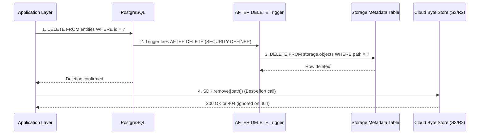

# Reconciliation, Drift Healing & Asset Lifecycle

## The Inevitability of Storage Drift

In modern cloud applications, object stores (S3, R2, Supabase Storage, GCS) and relational databases operate in completely separate failure domains. **Distributed ACID transactions across databases and object storage do not exist.**

As a result, storage systems naturally develop **drift**:
1. **Orphaned Storage Objects**: An image or track is uploaded to cloud storage, but the subsequent database write fails, crashes, or rolls back. The file remains in the bucket indefinitely, silently consuming budget.
2. **Broken Database References**: A file in cloud storage is deleted (by an admin, lifecycle rule, or network failure), but the database row remains, causing 404 image errors and broken playback.
3. **Quota Ledger Skew**: The denormalized `used_bytes` counter diverges from the physical sum of stored files over time due to uncaught errors or direct dashboard deletions.

---

## Deletion Ordering & The Dual Cleanup Strategy

When deleting an entity with associated media (e.g. deleting an album, song, user account, or product listing), the execution order dictates failure behavior.

### DB-First Deletion vs Storage-First Deletion

```
┌─────────────────────────────────────────────────────────────┬─────────────────────────────────────────────────────────────┐
│                    DATABASE-FIRST (RECOMMENDED)             │                     STORAGE-FIRST (RISKY)                   │
├─────────────────────────────────────────────────────────────┼─────────────────────────────────────────────────────────────┤
│ 1. DELETE FROM database WHERE id = ?                        │ 1. DELETE FROM bucket WHERE path = ?                        │
│ 2. DELETE FROM bucket WHERE path = ? (Best-effort / async)  │ 2. DELETE FROM database WHERE id = ?                        │
│                                                             │                                                             │
│ ⚠️ Failure consequence: If step 2 fails, an orphaned file   │ ⚠️ Failure consequence: If step 2 fails, the database row   │
│ sits inert in storage. User experience is UNBROKEN.         │ survives pointing to a deleted file. UI shows BROKEN IMAGES │
│ Storage can be cleaned up later by background workers.      │ and playback crashes permanently!                           │
└─────────────────────────────────────────────────────────────┴─────────────────────────────────────────────────────────────┘
```

> [!IMPORTANT]
> **Always delete the database record first, then delete the storage object.** An orphaned file in storage wastes a few megabytes; a ghost database row pointing to a missing file breaks application UX.

---

### The Dual Cleanup Protocol

To achieve instant database consistency while preventing permanent storage leaks, use a **two-tier cleanup strategy**:



1. **Database Triggers (Primary Cleanup)**:
   An `AFTER DELETE` trigger on the entity table executes a `SECURITY DEFINER` function that removes the storage metadata record. Because this runs within the database transaction, metadata cleanup is atomic with the entity deletion.
2. **Application SDK Call (Secondary Best-Effort Cleanup)**:
   After confirming the database deletion, the server action or worker calls the cloud storage SDK to delete the physical byte payload.
3. **Idempotent 404 Handling**:
   If the trigger already purged the object or the file was missing, the cloud SDK returns a `404 Not Found`. The application must catch and treat 404 as a success.

---

## The 3 Types of Reconciliation

```
                        RECONCILIATION TAXONOMY
  ┌────────────────────────┬────────────────────────┬────────────────────────┐
  │ 1. Ledger Balance Sync │  2. Bucket-to-DB Scan  │  3. DB-to-Bucket Audit │
  ├────────────────────────┼────────────────────────┼────────────────────────┤
  │ Resynchronizes cached  │ Finds orphaned files   │ Detects broken URLs    │
  │ counters with DB rows  │ missing from database  │ (missing files)        │
  ├────────────────────────┼────────────────────────┼────────────────────────┤
  │ Frequency: Daily/Weekly│ Frequency: Weekly/Month│ Frequency: Monthly     │
  │ Impact: O(N) DB rows   │ Impact: O(N) S3 objects│ Impact: S3 HeadObject  │
  └────────────────────────┴────────────────────────┴────────────────────────┘
```

---

### 1. Fast Ledger Balance Synchronization

For systems using materialized counters or ledger tables, periodically recalculate the counter against active database records:

```sql
-- Recalculate tenant usage from active assets
UPDATE public.tenant_storage_quotas tsq
SET 
  used_bytes = COALESCE(sub.actual_sum, 0),
  updated_at = NOW()
FROM (
  SELECT tenant_id, SUM(size_bytes) AS actual_sum
  FROM public.assets
  WHERE deleted_at IS NULL
  GROUP BY tenant_id
) sub
WHERE tsq.tenant_id = sub.tenant_id
  AND tsq.used_bytes != sub.actual_sum;
```

---

### 2. Two-Way Drift Detection (Bucket ↔ Database)

```
           [ Cloud Storage Bucket ]                [ Relational Database ]
                     │                                         │
          List paginated objects                     Select all active keys
          (Key, Size, LastModified)                  (Key, Size, DeletedAt)
                     │                                         │
                     ▼                                         ▼
              [ Set: Bucket Keys ]                     [ Set: DB Keys ]
                     │                                         │
                     ├─────────── Difference (Bucket - DB) ────┤
                     │            = ORPHANED OBJECTS           │
                     │            (Candidates for Quarantine)  │
                     │                                         │
                     ├─────────── Difference (DB - Bucket) ────┤
                     │            = BROKEN ASSET RECORDS       │
                     ▼            (Missing physical files)     ▼
```

### The Safe Quarantine Protocol (Preventing Race Conditions)

> [!CAUTION]
> **NEVER immediately delete an object discovered during a bucket scan if its `LastModified` timestamp is less than 24 hours old.**
> In-flight uploads whose database transactions have not yet completed will appear as "orphans" and be destroyed.

```typescript
// cron/reconcile-orphans.ts
export async function reconcileOrphanedObjects({ bucket, minAgeHours = 24 }: ReconcileOptions) {
  const cutoffTime = new Date(Date.now() - minAgeHours * 3600 * 1000);
  let continuationToken: string | undefined;

  do {
    const s3Page = await s3Client.send(new ListObjectsV2Command({
      Bucket: bucket,
      ContinuationToken: continuationToken,
      MaxKeys: 1000,
    }));

    const pageKeys = s3Page.Contents?.map(obj => ({
      key: obj.Key!,
      size: obj.Size!,
      lastModified: obj.LastModified!,
    })) ?? [];

    // Filter out recently created files to prevent race conditions with in-flight uploads
    const candidateKeys = pageKeys.filter(obj => obj.lastModified < cutoffTime);

    if (candidateKeys.length > 0) {
      const existingAssets = await db.asset.findMany({
        where: { fileKey: { in: candidateKeys.map(c => c.key) } },
        select: { fileKey: true },
      });

      const existingSet = new Set(existingAssets.map(a => a.fileKey));
      const orphans = candidateKeys.filter(c => !existingSet.has(c.key));

      for (const orphan of orphans) {
        // Tag for deletion or move to quarantine prefix
        await s3Client.send(new PutObjectTaggingCommand({
          Bucket: bucket,
          Key: orphan.key,
          Tagging: {
            TagSet: [
              { Key: "status", Value: "orphan" },
              { Key: "purge_after", Value: new Date(Date.now() + 7 * 86400000).toISOString() },
            ],
          },
        }));
      }
    }

    continuationToken = s3Page.NextContinuationToken;
  } while (continuationToken);
}
```

---

## Asset Lifecycle & Mutative Operations

### 1. In-Place Entity Updates (Replacing Assets)
When replacing an existing asset (e.g. updating an album cover or avatar):
- Calculate size delta: $\Delta = \text{new\_size} - \text{old\_size}$.
- Verify $(\text{current\_usage} + \Delta) \le \text{quota}$ before executing upload.
- Upload new asset to a new timestamped/UUID path (never overwrite in place).
- Update the database pointer to the new path.
- Remove old asset asynchronously or via trigger.

### 2. Soft Deletes vs Quotas
- **The Rule**: Assets in "Trash" (soft-deleted: `deleted_at IS NOT NULL`) **MUST count towards the user's storage quota**. If trash does not consume quota, users exploit soft-deletion to park hundreds of gigabytes indefinitely while continuing to upload.
- **The Lifecycle Policy**:
  - Soft-deleted items retain quota weight for **30 days**.
  - Users can manually empty trash to instantly free quota headroom.
  - A daily background job permanently purges objects whose `deleted_at < NOW() - INTERVAL '30 days'` from both the database and object storage.

### 3. Deduplication (Content-Addressable Storage - CAS)
If multiple users upload identical documents or stock media:
- Compute the SHA-256 hash of the file payload.
- Store objects under `cas/{sha256}`.
- Create multiple logical database records pointing to the same physical object key.
- Maintain a reference counter on the physical object record (`ref_count`). Only delete from cloud storage when `ref_count == 0`.
- **Billing Guideline**: Charge users based on **logical size** (perceived fair use) rather than physical deduplicated storage to keep pricing intuitive.

---

## Automated Cloud Lifecycle Rules

Offload cold-data management and incomplete upload cleanups directly to cloud infrastructure policies:

| Lifecycle Action                    | Recommended Cloud Setting         | Why It Matters                                 |
| ----------------------------------- | --------------------------------- | ---------------------------------------------- |
| **Abort Incomplete Multipart**      | Expire after 7 days               | Cleans up abandoned multi-GB upload chunks     |
| **Noncurrent Version Expiration**   | Expire old versions after 30 days | Prevents bucket versioning storage bloat       |
| **Transition to Infrequent Access** | Move after 90 days of inactivity  | Reduces S3/GCS cost by ~50% for legacy records |
| **Deep Glacier / Archive**          | Transition after 365 days         | Compliance records retained at minimal cost    |
