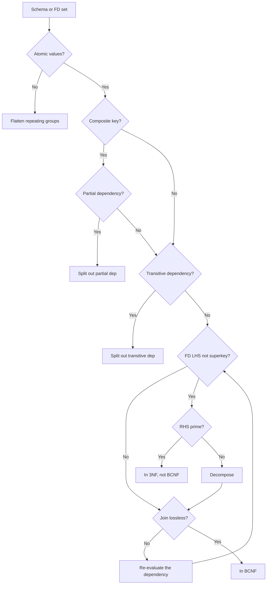

# Database Normalisation Theory

Codd's relational model and the functional dependency theory behind it, up to BCNF.

## When to use

  * A schema needs checking or raising to 2NF, 3NF, or BCNF.
  * Update, insertion, or deletion anomalies appear.
  * Keys or prime attributes must be found from FDs.
  * A decomposition needs a lossless join and dependency check.
  * A denormalised design needs justifying.

## Decision flow

## Quick reference

| Concept | Rule of thumb |
| :------ | :------------ |
| 1NF | One atomic value per attribute. No arrays or groups. |
| 2NF | Non-prime attributes depend on the whole key, not part of it. |
| 3NF | Non-trivial FD has a superkey LHS or a prime attribute on the RHS. |
| BCNF | Superkey LHS on every non-trivial FD. Drops the prime-RHS allowance. |
| Superkey | $K$ where $K^+ = R$. Candidate key: minimal. |
| Prime attribute | In a candidate key. |
| Lossless (binary) | $(R_1 \cap R_2) \rightarrow R_1$ or $R_2$. |
| 3NF synthesis | Lossless, dependency preserving. Polynomial. |
| BCNF decomposition | Lossless, not dependency preserving. Polynomial. |

## Reference files

  * [foundations.md](foundations.md) — Sections 1, 2, 3: history, sets, domains, Cartesian product, schema versus instance, degree and cardinality, FD definitions, Armstrong's axioms, rules 4 to 6.
  * [normal-forms.md](normal-forms.md) — Section 5: 1NF, 2NF, 3NF, BCNF definitions, examples, diagrams.
  * [algorithms.md](algorithms.md) — Sections 4, 6: attribute closure, keys, prime attributes, lossless join theorem, 3NF synthesis, BCNF decomposition, table.
  * [modern-practice.md](modern-practice.md) — Sections 1, 7, 8: Codd 1970 and data independence, hierarchical and network models, columnar stores, CAP theorem, document stores, NewSQL, when denormalisation is correct.
  * [references.md](references.md) — References.

## Common mistakes

  * Computing $F^+$ in full. It is exponential. Use attribute closures.
  * Forgetting attributes that appear in no dependency at all. They cannot be derived, so they belong in every candidate key.
  * Testing 3NF as "LHS is a superkey" only. That is the BCNF test.
  * Assuming normalisation is free. Every decomposition needs both checks.
  * Applying a rule before stating keys. Keys come first.
