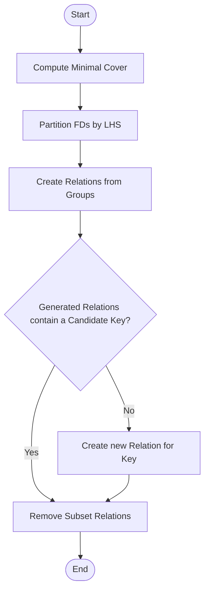

# 4 - Algorithms for Structural Analysis

Before we can normalise a relation, we must identify its Candidate Keys. This requires calculating the closure of attribute sets.

## 4.1 - Attribute Closure Algorithm ($X^+$)

Given a set of attributes $X$ and a set of dependencies $F$, the closure $X^+$ is the set of all attributes $A$ such that $X \rightarrow A$ is in $F^+$.

**Algorithm 4.1: Compute Attribute Closure**

  * **Initialise:** $Result \leftarrow X$
  * **Repeat** until $Result$ stops changing:
      * For each FD $Y \rightarrow Z$ in $F$:
          * If $Y \subseteq Result$, then $Result \leftarrow Result \cup Z$.
  * **Return** $Result$.

**Worked Example:**
Let $R = \{A, B, C, D, E, G\}$ and $F = \{ AB \rightarrow C, C \rightarrow B, AB \rightarrow E, E \rightarrow G \}$.

Attribute $D$ appears on neither side of any dependency in $F$. No dependency can therefore add $D$ to a closure, so $D$ must be supplied in the starting set. We test $\{A, B, D\}$:

  * **Iteration 0:** $Result = \{A, B, D\}$
  * **Iteration 1:**
      * Check $AB \rightarrow C$: $AB \subseteq \{A, B, D\}$. Add $C$. $Result = \{A, B, C, D\}$.
      * Check $C \rightarrow B$: $C \subseteq \{A, B, C, D\}$. $B$ is already in set. No change.
      * Check $AB \rightarrow E$: $AB \subseteq \{A, B, C, D\}$. Add $E$. $Result = \{A, B, C, D, E\}$.
      * Check $E \rightarrow G$: $E \subseteq \{A, B, C, D, E\}$. Add $G$. $Result = \{A, B, C, D, E, G\}$.
  * **Iteration 2:** Re-checking $F$ yields no new attributes.
  * **Final Result:** $\{A, B, D\}^+ = \{A, B, C, D, E, G\} = R$.

Since the closure contains all attributes in $R$, $\{A, B, D\}$ is a Superkey.

## 4.2 - Candidate Keys and Prime Attributes

  * **Superkey:** Any set $K$ where $K^+ = R$.
  * **Candidate Key:** A minimal Superkey. A set $K$ is a candidate key if $K$ is a superkey and no proper subset $S \subset K$ is a superkey.
  * **Prime Attribute:** An attribute that belongs to any candidate key.
  * **Non-Prime Attribute:** An attribute that is not part of any candidate key.

Identifying candidate keys is the first step in checking Normal Forms 2NF, 3NF, and BCNF.

# 6 - Decomposition Algorithms

Decomposition is not arbitrary. Randomly splitting attributes can result in Lossy Joins (where $R_1 \bowtie R_2 \supset R$, creating "phantom" tuples) or Loss of Dependencies (where constraints can no longer be checked within a single relation).

## 6.1 - The Binary Lossless Join Theorem

A decomposition $D = \{R_1, R_2, \dots, R_k\}$ is lossless if the natural join of all $R_i$ returns exactly the original relation $R$.

**Theorem (Binary Decomposition):** A decomposition of $R$ into two relations $R_1$ and $R_2$ is lossless with respect to the set of functional dependencies $F$ if and only if:
$$(R_1 \cap R_2) \rightarrow R_1 \quad \text{or} \quad (R_1 \cap R_2) \rightarrow R_2$$

That is, the intersection (common attributes) must be a superkey for at least one of the decomposed relations.

This theorem covers the two-relation case only. The Chase test generalises it to $k$-way decompositions: it starts from a tableau of distinguished and non-distinguished symbols, applies the row-marking rules for each FD in $F$ and each row, and the decomposition is lossless exactly when some row becomes entirely distinguished. For the binary case the marking process reduces precisely to the intersection test above.

## 6.2 - 3NF Synthesis (Bernstein's Algorithm)

Rather than decomposing a large relation, we can synthesise a 3NF schema directly from the functional dependencies. This algorithm, proposed by Philip Bernstein (1976), guarantees a Lossless Join and Dependency Preservation.

**Minimal Cover.** $F_{min}$ is obtained from $F$ by applying three operations until none of them changes $F$:

  * **Split composite left-hand sides.** For each FD $\alpha \rightarrow \beta$ with $|\alpha| > 1$, replace it with $|\alpha|$ single-attribute dependencies, one per attribute of $\alpha$ (for example $AB \rightarrow CD$ becomes $A \rightarrow CD$ and $B \rightarrow CD$).
  * **Remove extraneous attributes.** For each side of each FD, drop any attribute that can be inferred from the remainder of that side using $F$. If all attributes on the right-hand side are extraneous, the dependency itself is removed.
  * **Remove redundant dependencies.** After the two steps above, drop any FD whose right-hand side is already implied by the remaining set. Test each FD by computing the closure of its left-hand side over $F_{min}$ minus that FD; if the closure already contains the right-hand side, the FD is redundant. Repeat all three steps until the set stops changing.

**Algorithm 6.2: 3NF Synthesis**

1.  **Minimal Cover:** Compute the minimal cover $F_{min}$ of the functional dependencies.
2.  **Cluster:** Partition $F_{min}$ into groups where the LHS is identical. For each group, create a relation schema comprising the attributes in the FD.
3.  **Key Check:** If none of the generated relations contains a candidate key of the original relation $R$, create a new relation $R_{key}$ consisting of attributes forming a candidate key.
4.  **Refine:** Remove any relation that is a subset of another.

**Example Application:**
$R(A, B, C, D, E)$, $F = \{ A \rightarrow B, A \rightarrow C, C \rightarrow E \}$.

  * **Minimal Cover:** Every LHS is a single attribute, so no splitting is needed. Every RHS attribute ($B$, $C$, $E$) is needed to express the dependency, so no attribute is extraneous. No dependency is redundant. $F_{min} = F$.
  * **Groups:**
      * $G_1 (LHS=A): \{ A \rightarrow B, A \rightarrow C \} \Rightarrow R_1(A, B, C)$.
      * $G_2 (LHS=C): \{ C \rightarrow E \} \Rightarrow R_2(C, E)$.
  * **Key Check:**
      * Compute Key of $R$: $A \rightarrow B, C$ and $C \rightarrow E$, so $A$ determines $A, B, C, E$. Attribute $D$ appears in no dependency, so it must be added. Attribute $A$ is not extraneous, since $D^+ = \{D\}$.
      * Candidate Key: $\{A, D\}$.
      * Neither $R_1$ nor $R_2$ contains $\{A, D\}$.
      * Create $R_3(A, D)$.
  * **Final Schema:** $\{ R_1(A, B, C), R_2(C, E), R_3(A, D) \}$.

## 6.3 - BCNF Decomposition Algorithm

This algorithm guarantees BCNF and Lossless Join, but not Dependency Preservation. It is recursive.

**Algorithm 6.3: BCNF Decomposition**

1.  Set $Result = \{R\}$.
2.  While any relation $R_i \in Result$ is not in BCNF:
      * Identify a non-trivial FD $\alpha \rightarrow \beta$ holding on $R_i$ where $\alpha$ is not a superkey.
      * Decompose $R_i$ into:
          * $R_{i1} = \alpha \cup \beta$
          * $R_{i2} = R_i - (\beta - \alpha)$
      * Update $Result = (Result - \{R_i\}) \cup \{R_{i1}, R_{i2}\}$.
3.  Return $Result$.

**Termination.** Each split strictly shrinks the schema it operates on, so the recursion cannot run forever. Because $\alpha$ is not a superkey, the relation cannot have been $\{ \alpha \}$ to begin with; because the dependency is non-trivial, $\beta - \alpha$ is non-empty, so $R_{i2} = R_i - (\beta - \alpha)$ is a strict subset of $R_i$ and $R_{i1}$ is non-empty. Both outputs are therefore smaller than their parent, and the number of steps is bounded.

**Lossless.** $R_{i1} \cap R_{i2} = \alpha$, and $\alpha$ determines $\beta$, so $\alpha$ determines $R_{i1}$ in the original relation. The binary lossless-join theorem in Section 6.1 therefore applies and every split is lossless.

**Comparison:**
Table 6.1 compares the outcomes of the two major algorithmic approaches.

**Table 6.1: Synthesis vs Decomposition**

| Feature                    | 3NF Synthesis                       | BCNF Decomposition                  |
| :------------------------- | :---------------------------------- | :---------------------------------- |
| **Input**                  | A schema and its dependency set $F$ | A schema and its dependency set $F$ |
| **Resulting Normal Form**  | 3NF                                 | BCNF                                |
| **Lossless Join?**         | Yes                                 | Yes                                 |
| **Dependency Preserving?** | Always Yes                          | Not Guaranteed                      |
| **Complexity**             | Polynomial                          | Polynomial                          |

Both algorithms take the same input, a schema and its dependency set. The recursion makes at most $O(|R|)$ splits, and each violation test is polynomial, so BCNF decomposition is polynomial overall. What is hard is choosing which violating FD to split on. Finding a dependency-preserving BCNF decomposition is NP-hard.
