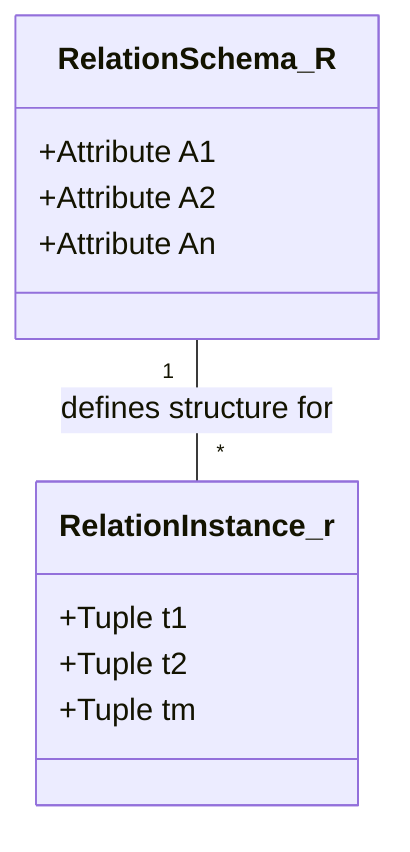
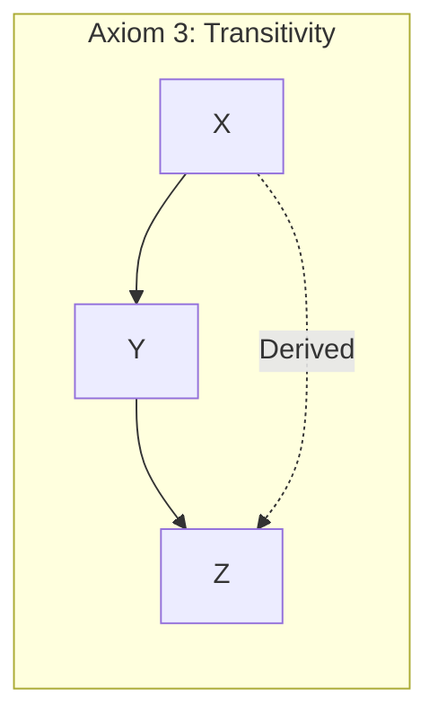

# 2 - Mathematical Preliminaries: Set Theory and Relations

To manipulate data with the precision Codd envisioned, one must abandon the intuitive notion of a "table" and embrace the formal definition of a relation. The relational model is built upon discrete mathematics, specifically set theory.

## 2.1 - Sets, Domains, and Cartesian Products

The fundamental unit of data is the atomic value. A domain $D$ is a set of such values, characterised by a specific data type and format. For example, the domain of semester codes might be $D_{sem} = \{ \text{Fall2024}, \text{Spring2025}, \dots \}$.

Consider a collection of $n$ domains $D_1, D_2, \dots, D_n$. The Cartesian product of these domains, denoted $D_1 \times D_2 \times \dots \times D_n$, is the set of all possible ordered $n$-tuples $(d_1, d_2, \dots, d_n)$ such that $d_1 \in D_1, d_2 \in D_2, \dots, d_n \in D_n$.

In standard set theory, the Cartesian product is binary and associative, producing pairs of pairs. However, the relational model defines the product as creating flattened tuples. An $n$-tuple combined with an $m$-tuple results in an $(n+m)$-tuple, not a nested pair.

**Equation 2.1: Cardinality of Cartesian Product**
$$|D_1 \times D_2 \times \dots \times D_n| = |D_1| \cdot |D_2| \cdot \dots \cdot |D_n|$$

This magnitude explains why we cannot simply store the Cartesian product; it represents every possible combination of data, valid or invalid. We need a subset of this product: the relation.

## 2.2 - The Relation and its Schema

A relation $r$ is a finite subset of the Cartesian product of its domains.
$$r \subseteq D_1 \times D_2 \times \dots \times D_n$$

We distinguish between the Relation Schema $R$, which is the intentional definition (the metadata), and the Relation Instance $r(R)$, which is the extensional data (the set of tuples at time $t$).

  * **Degree:** The number of domains (attributes) $n$ in $R$.
  * **Cardinality:** The number of tuples in the instance $r$.

A tuple $t$ is an element of $r$. Formally, $t = (v_1, v_2, \dots, v_n)$. Because identifying values by position is error-prone, we assign attributes $A_1, A_2, \dots, A_n$ to the domains. Thus, $R$ is denoted as $R(A_1, A_2, \dots, A_n)$.

It is crucial to note that $r$ is a set, not a list. Consequently, there is no inherent ordering of tuples. Two relations are identical if they contain the same tuples, regardless of presentation order. This abstraction allows the database management system (DBMS) to optimise physical storage (e.g., heaps, B-Trees) without affecting the logical validity of queries.

# 3 - The Core Theory: Functional Dependencies

The engine of normalisation is the Functional Dependency (FD). FDs allow us to constrain the legal instances of a relation based on real-world semantics. They are the mathematical translation of business rules.

## 3.1 - Formal Definition

Let $R$ be a relation schema, and let $\alpha \subseteq R$ and $\beta \subseteq R$ be subsets of attributes. A functional dependency $\alpha \rightarrow \beta$ holds on $R$ if and only if for any legal relation instance $r(R)$, the following condition is satisfied for all pairs of tuples $t_1, t_2 \in r$:

**Equation 3.1: The Functional Dependency Condition**
$$\text{If } t_1[\alpha] = t_2[\alpha], \text{ then } t_1[\beta] = t_2[\beta]$$

Here, $t[\alpha]$ denotes the projection of tuple $t$ onto the attributes in $\alpha$. The dependency states that the value of $\alpha$ uniquely determines the value of $\beta$. This is not a probabilistic relationship; it is absolute.

## 3.2 - Trivial vs. Non-Trivial Dependencies

  * **Trivial FD:** An FD $\alpha \rightarrow \beta$ is trivial if $\beta \subseteq \alpha$. For example, knowing a student's ID and Name allows one to determine their ID. This provides no semantic constraint but is mathematically valid.
  * **Non-Trivial FD:** An FD is non-trivial if $\beta \not\subseteq \alpha$. This implies a constraint on the data. A "bad" non-trivial FD is often the target of normalisation.

## 3.3 - Armstrong's Axioms

To reason about dependencies (to determine if a specific design is valid or if a set of attributes forms a key) we require a system of inference. In 1974, William W. Armstrong proved that a specific set of three axioms is both sound (generates only correct FDs) and complete (generates all correct FDs).

Let $X, Y, Z$ be sets of attributes within $R$.

**Axiom 1: Reflexivity**
If $Y \subseteq X$, then $X \rightarrow Y$.
(This generates all trivial dependencies.)

**Axiom 2: Augmentation**
If $X \rightarrow Y$, then $XZ \rightarrow YZ$.
(Adding the same attributes to both sides does not break the dependency. The weaker form $XZ \rightarrow Y$ is not a simplification of this rule: it is strictly weaker, and it is complete only in combination with Rule 6, pseudo-transitivity.)

**Axiom 3: Transitivity**
If $X \rightarrow Y$ and $Y \rightarrow Z$, then $X \rightarrow Z$.
(This allows chains of dependency, which are often the source of update anomalies.)

**Derived Inference Rules**
From these three axioms, we can derive secondary rules that simplify manual calculation.

**Rule 4: Union (Additivity)**
If $X \rightarrow Y$ and $X \rightarrow Z$, then $X \rightarrow YZ$.
*Proof:*
$X \rightarrow Y$ (Given)
$X \rightarrow Z$ (Given)
$X \rightarrow XY$ (Augmentation of 1 with $X$)
$XY \rightarrow YZ$ (Augmentation of 2 with $Y$)
$X \rightarrow YZ$ (Transitivity of 3 and 4). $\blacksquare$

**Rule 5: Decomposition (Projectivity)**
If $X \rightarrow YZ$, then $X \rightarrow Y$ and $X \rightarrow Z$.
*Proof:*
$X \rightarrow YZ$ (Given)
$YZ \rightarrow Y$ (Reflexivity, since $Y \subseteq YZ$)
$X \rightarrow Y$ (Transitivity of 1 and 2). $\blacksquare$

**Rule 6: Pseudo-transitivity**
If $X \rightarrow Y$ and $YZ \rightarrow W$, then $XZ \rightarrow W$.
*Proof:*
$X \rightarrow Y$ (Given)
$XZ \rightarrow YZ$ (Augmentation of 1 with $Z$)
$YZ \rightarrow W$ (Given)
$XZ \rightarrow W$ (Transitivity of 2 and 3). $\blacksquare$

## 3.4 - The Closure of Functional Dependencies ($F^+$)

The set of all FDs that can be inferred from a given set $F$ is called the closure of $F$, denoted as $F^+$. Calculating $F^+$ is theoretically interesting but computationally expensive (exponential in the number of attributes). In practice, we rarely need the full set $F^+$; we usually need to know if a specific dependency holds or if a specific set of attributes is a key. For this, we use the Attribute Closure algorithm (see `algorithms.md`, Section 4.1).
