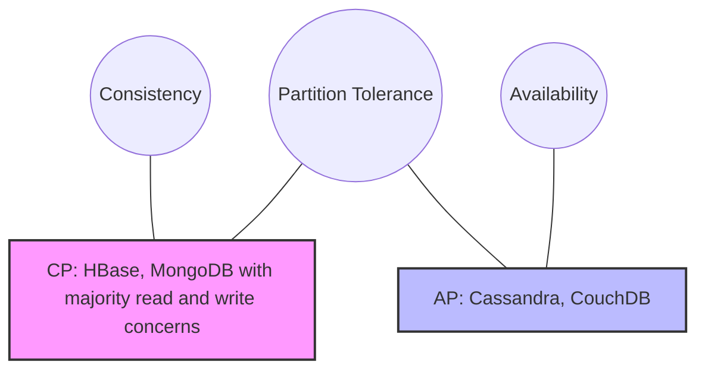

# 1 - Introduction and Historical Context

The management of data within large-scale computational systems stands as one of the foundational challenges of computer science. Before the advent of the relational model in 1970, data management was dominated by the hierarchical and network models. These early paradigms, while functional, suffered from severe rigidity; they required the physical structure of the data (how it was stored on disk) to be intimately known by the application programmer. This coupling meant that a minor change in the storage format necessitated a complete rewrite of the application software, a problem known as the lack of data independence.

In his seminal 1970 paper, "A Relational Model of Data for Large Shared Data Banks," Edgar F. Codd proposed a radical shift. He argued that users should interact with data via a logical model based on mathematical relations, decoupling the user's view from the internal machine representation. This proposal was not merely an engineering improvement but a shift towards a rigorous mathematical foundation rooted in set theory and first-order predicate logic.

The process of normalisation emerged from this theoretical framework as a systematic method to evaluate and restructure logical schemas. Its primary objective is to minimise data redundancy (the unnecessary duplication of information) and to eliminate update anomalies, which threaten the integrity of the database during transactional operations. While redundancy might appear benign, in a shared data bank it leads to inconsistency; if a fact is stored in two places, the system must ensure both are updated simultaneously, a complex task in concurrent environments.

# 7 - Comparative Analysis: Alternative Models

To fully appreciate the relational model's contribution, one must contrast it with its predecessors and successors.

## 7.1 - Pre-Relational: Hierarchical and Network Models

In the 1960s, the Hierarchical Model (e.g., IBM IMS) organised data into tree structures. A record (segment) had exactly one parent.

  * **Navigation:** Accessing data required traversing pointers from the root. To find an Order, the program had to "walk" from Customer to Order.
  * **The Problem:** This was efficient for known queries (e.g., "Get orders for Customer X") but catastrophic for symmetric queries (e.g., "Get the customer for Order Y"). Achieving the latter required scanning all trees or maintaining expensive auxiliary indices.

The Relational Model solved this via associative addressing. We request data by value (e.g., WHERE OrderID = Y), and the DBMS determines the most efficient path (index scan, table scan) to retrieve it. Normalisation is what makes these associative links (Foreign Keys) possible in the first place: separating entities into their own relations is the step that creates the referencing relationship.

## 7.2 - Post-Relational: NoSQL and Columnar Stores

The rise of "Big Data" in the 2000s challenged the supremacy of BCNF.

**Columnar Stores (e.g., Snowflake, BigQuery):**

  * These systems physically store data by column rather than row.
  * **Impact on Normalisation:** In a row store, we normalise to avoid storing the string "London" 1,000,000 times (saving space). In a columnar store, "London" is stored once in a dictionary and referenced by integer tokens, or compressed via Run-Length Encoding (RLE).
  * **Denormalisation:** Because compression is so efficient, the space penalty of redundancy is negligible. Consequently, designers often prefer denormalised wide tables (Star Schemas) to avoid the CPU cost of joining tables. Here, performance trumps the anomaly protection of BCNF.

**NoSQL and CAP Theorem:**
The CAP Theorem (Gilbert and Lynch) states that when a network partition occurs, a distributed system must choose between returning an answer that is consistent with the latest state (Consistency) and returning an answer to every request that arrives (Availability). The trade-off bites only under partition; with no partition a system can offer both.

  * **Document Stores (e.g., MongoDB):** Often use schemas that violate 1NF by nesting related data (e.g., embedding Orders inside the Customer document).
  * **Trade-off:** This provides high Partition Tolerance (all data for a customer is on one node, no distributed joins needed). A single document update is still atomic. The real cost is consistency across a fan-out write: if a product name changes, updating every Customer document that embeds it means any document missed by the write stays stale until it is rewritten. This is a calculated regression to pre-relational hierarchies to achieve horizontal scale.

**NewSQL (e.g., CockroachDB, Spanner):**
These systems offer a synthesis: the scalability of NoSQL with the ACID guarantees of Relational.

  * **Keys:** Unlike traditional BCNF schemas which might use sequential integers as keys, NewSQL systems often require UUIDs or hashed keys to prevent "hotspotting" (writing all new records to a single range-partition). The logical normalisation remains BCNF, but the physical implementation is distributed.

## 7.3 - When Denormalisation Is Correct

Denormalisation is a deliberate trade, not a shortcut. Each of the following justifies departing from BCNF:

  * **Measured join cost.** The join is on a hot read path, profiling shows it dominates latency, and the normalised form has been tested first.
  * **Read-far-more-than-write.** Data is written once and read constantly, so the duplication cost is paid once while the join saving is paid every read.
  * **Physical-layer isolation.** The redundancy lives in a view, a materialised view, or a cache, not in the authoritative tables.
  * **Storage makes duplication cheap.** Columnar engines and compression absorb the space cost (see 7.2).
  * **The relation is transient.** The denormalised shape is a query result or an intermediate stage, not a persisted contract.

None of these hold automatically. A "schema-less" design is usually a schema with hidden, unmanaged dependencies.

# 8 - Conclusion

Relational database normalisation is a discipline rooted in mathematical rigour. Starting from the basic axioms of set theory, it builds a framework of Functional Dependencies to prove properties about data integrity.

* 1NF ensures structural simplicity (relations, not graphs).
* 2NF and 3NF eliminate redundancy caused by partial and transitive dependencies.
* BCNF provides a robust defence against anomalies arising from overlapping keys.

While the modern landscape of distributed systems and columnar analytics often necessitates denormalisation, this deviation is only safe when performed by an architect who understands the rules they are breaking. A "schema-less" approach is often just a schema with hidden, unmanaged dependencies.
