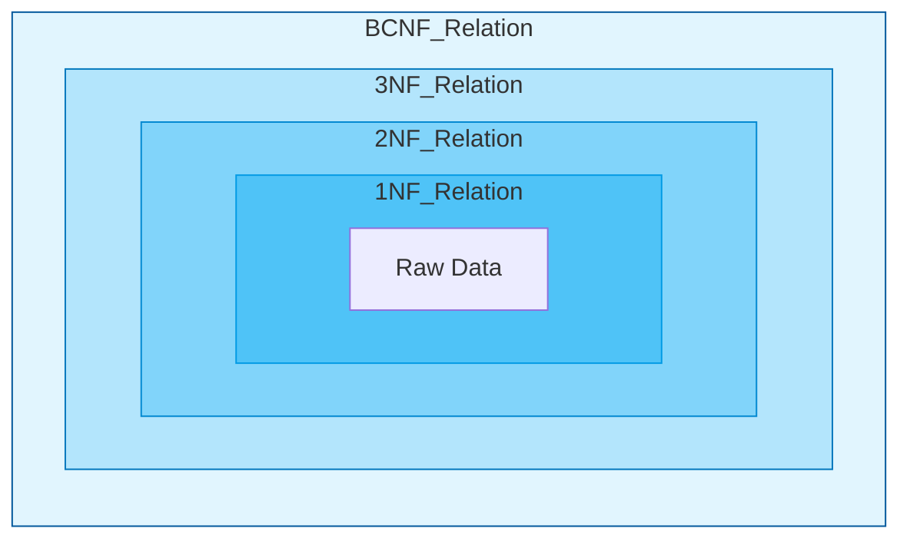
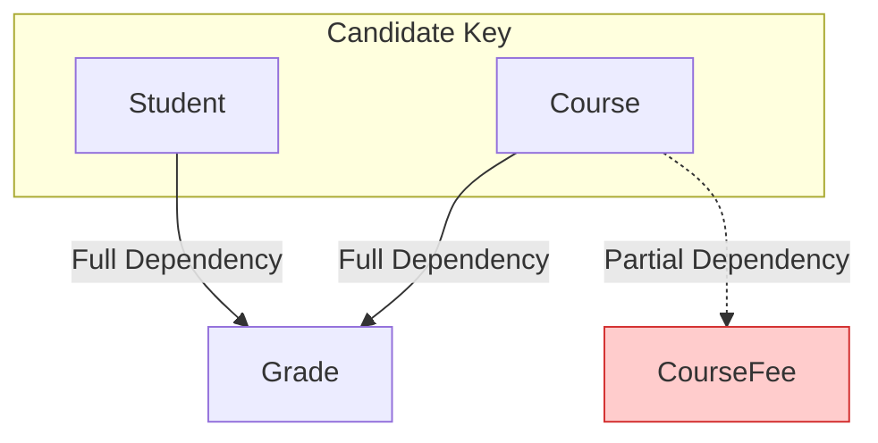
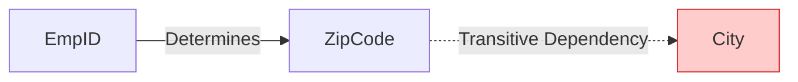

# 5 - The Hierarchy of Normal Forms

Normal forms form a nested hierarchy. Every relation in BCNF is also in 3NF, in 2NF and in 1NF. The reverse does not hold: a relation in a given normal form need not be in any higher one. The process of normalisation involves decomposing a relation that violates a normal form into smaller relations that satisfy it.

Two cautions apply to the whole hierarchy. First, normalisation is not automatically free: a decomposition may be lossy or may fail to preserve dependencies, so both properties must be checked (see `algorithms.md`, Section 6). Second, the nesting is strict but the definitions differ at the top: a relation can be in 3NF without being in BCNF, because 3NF tolerates a non-trivial dependency whose right-hand side is prime. Section 5.4 works that case through in full.

## 5.1 - First Normal Form (1NF): Atomicity

**Definition:** A relation is in 1NF if and only if every attribute domain contains only atomic (indivisible) values. There are no repeating groups, arrays, or nested relations.

**Mathematical Rationale:**
The relational algebra operators (Selection $\sigma$, Projection $\pi$) rely on the predicate logic assumption that $t[A]$ returns a single value. If $t[A]$ returned a set, the complexity of the query language would increase exponentially, requiring logic to traverse nested structures.

**Step-by-Step Example:**
Consider an unnormalised relation Student\_Subjects:
$$( \text{ID: } 101, \text{ Name: } \text{Alan}, \text{ Subjects: } \{ \text{Maths, Physics} \} )$$
This violates 1NF because "Subjects" is a set, not an atom. To normalise, we flatten the relation by taking the Cartesian product of the atomic attributes with the repeating group.

**Normalised to 1NF:**
$(101, \text{Alan}, \text{Maths})$
$(101, \text{Alan}, \text{Physics})$

**Consequence:** We have introduced redundancy. The name "Alan" is repeated. This redundancy is addressed in subsequent forms.

## 5.2 - Second Normal Form (2NF): Full Functional Dependency

**Definition:** A relation is in 2NF if it is in 1NF and every non-prime attribute is fully functionally dependent on every candidate key.

The phrase is "every candidate key", not "the candidate key", because a relation may have several. With two overlapping candidate keys a relation can satisfy the condition for one of them and violate it for the other, so all of them must be tested.

**Violation (Partial Dependency):**
A partial dependency occurs when a non-prime attribute is determined by only a part of a composite candidate key.
Formally: $X \subset K$ and $X \rightarrow A$ (where $A$ is non-prime).

**Step-by-Step Mock Calculation:**
Let $R = \{ \text{Student}, \text{Course}, \text{Grade}, \text{CourseFee} \}$.

  * **FDs:**
      * $\{ \text{Student}, \text{Course} \} \rightarrow \text{Grade}$
      * $\text{Course} \rightarrow \text{CourseFee}$
  * **Candidate Key:** $\{ \text{Student}, \text{Course} \}$.

**Analysis:**

  * **Grade:** Depends on the whole key. (Full dependency).
  * **CourseFee:** Depends on $\text{Course}$. Since $\text{Course} \subset \{ \text{Student}, \text{Course} \}$, this is a Partial Dependency.

**Decomposition:**
We split the relation to isolate the partial dependency.

  * $R_1(\text{Course}, \text{CourseFee})$
  * $R_2(\text{Student}, \text{Course}, \text{Grade})$

**Result:** The redundancy of storing the fee for every student in the course is eliminated.

## 5.3 - Third Normal Form (3NF): Transitive Dependency

**Definition:** A relation is in 3NF if it is in 2NF and no non-prime attribute is transitively dependent on the candidate key.

That phrasing is intuition, not strict equivalence to the formal test below, which is stated over every non-trivial FD in $F^+$ rather than over one dependency chain. Apply the formal test when checking a schema.

**Formal Definition:** A relation $R$ is in 3NF if for every non-trivial FD $\alpha \rightarrow \beta$ in $F^+$, at least one of the following holds:

1.  $\alpha$ is a superkey of $R$.
2.  $\beta$ is a prime attribute (part of some candidate key).

**Violation (Transitive Dependency):**
Occurs when $Key \rightarrow X \rightarrow Y$, where $Y$ is non-prime.

**Step-by-Step Mock Calculation:**
Let $R = \{ \text{EmpID}, \text{Name}, \text{ZipCode}, \text{City} \}$.

  * **FDs:**
      * $\text{EmpID} \rightarrow \{ \text{Name}, \text{ZipCode} \}$
      * $\text{ZipCode} \rightarrow \text{City}$
  * **Candidate Key:** $\text{EmpID}$.

**Analysis:**

  * FD1 is valid (LHS is superkey).
  * FD2: $\text{ZipCode} \rightarrow \text{City}$.
      * Is $\text{ZipCode}$ a superkey? No.
      * Is $\text{City}$ prime? No.
  * **Violation:** This is a transitive dependency ($\text{EmpID} \rightarrow \text{ZipCode} \rightarrow \text{City}$).

**Decomposition:**

  * $R_1(\text{ZipCode}, \text{City})$
  * $R_2(\text{EmpID}, \text{Name}, \text{ZipCode})$

**Advantage:** If all employees move out of a specific ZipCode, we do not lose the knowledge that the ZipCode belongs to that City (Deletion Anomaly solved).

## 5.4 - Boyce-Codd Normal Form (BCNF)

BCNF was introduced by Codd and Raymond F. Boyce to address anomalies that 3NF allows. 3NF is permissible if the dependent attribute is prime. BCNF removes this allowance.

**Definition:** A relation $R$ is in BCNF if for every non-trivial FD $\alpha \rightarrow \beta$ in $F^+$, $\alpha$ is a superkey.

**The Key Difference:** BCNF does not care if $\beta$ is prime or non-prime. If the LHS is not a superkey, the dependency is invalid (unless trivial). BCNF handles anomalies in relations with multiple overlapping candidate keys.

**Step-by-Step Analysis of the Classic "Student-Instructor" Anomaly:**
Consider $R(\text{Student}, \text{Course}, \text{Instructor})$.

**Semantic Rules:**

  * A student can take many courses.
  * An instructor teaches only one course.
  * A student typically has one instructor per course.

**FDs:**

1.  $\{ \text{Student}, \text{Course} \} \rightarrow \text{Instructor}$
2.  $\text{Instructor} \rightarrow \text{Course}$

**Candidate Keys:**

  * Key 1: $\{ \text{Student}, \text{Course} \}$
  * Key 2: $\{ \text{Student}, \text{Instructor} \}$ (derived from FD2: if we know Student and Instructor, we know Course).

**Attributes Status:**

  * **Prime:** Student, Course, Instructor. (All attributes are prime).
  * **Non-Prime:** None.

**3NF Test:**

  * FD1: LHS is superkey. Pass.
  * FD2 ($\text{Instructor} \rightarrow \text{Course}$):
      * LHS ($\text{Instructor}$) is NOT a superkey (cannot identify Student).
      * RHS ($\text{Course}$) IS prime.
  * **Result:** Passes 3NF.

**BCNF Test:**

  * FD2 ($\text{Instructor} \rightarrow \text{Course}$):
      * LHS ($\text{Instructor}$) is NOT a superkey.
  * **Result:** Violates BCNF.

**The Anomaly:**
Because of this violation, we cannot record the fact that "Dr. Smith teaches Maths" unless there is at least one student enrolled (Insertion Anomaly). If the last student drops the course, we delete Dr. Smith's association with Maths (Deletion Anomaly).

**BCNF Decomposition:**
We decompose based on the violating FD: $\text{Instructor} \rightarrow \text{Course}$.

  * $R_1 = (\text{Instructor}, \text{Course})$
  * $R_2 = (\text{Student}, \text{Instructor})$

Both relations are in BCNF. The key of $R_1$ is $\text{Instructor}$, so its only non-trivial FD has a superkey left-hand side. The key of $R_2$ is $\{\text{Student}, \text{Instructor}\}$, and neither of its FDs is non-trivial, so $R_2$ is trivially in BCNF. The join is lossless because $R_1 \cap R_2 = \{\text{Instructor}\}$, and $\text{Instructor}$ determines $\text{Course}$, giving $R_1$ by the binary lossless-join theorem in `algorithms.md`, Section 6.1. The schema is free of the anomalies.
