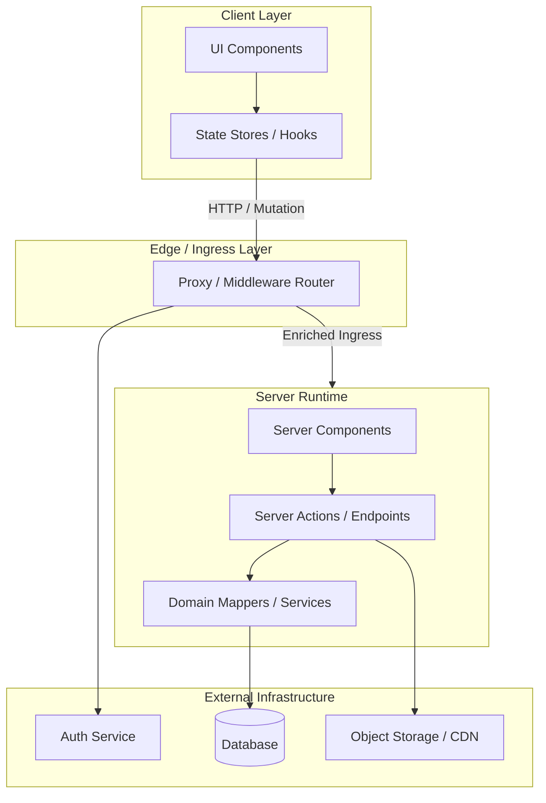
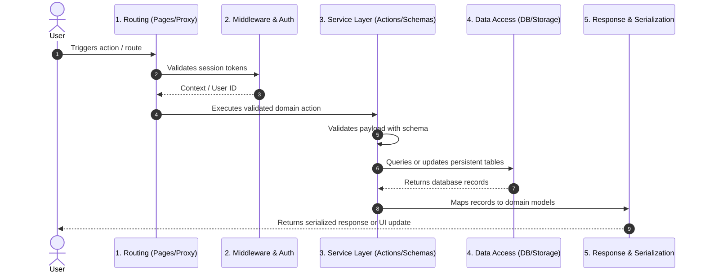
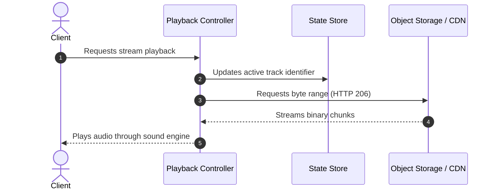

# Codebase Explanation: Diagrams and Flow Templates

Use these Mermaid templates to visually explain system architectures, runtime relationships, and execution sequences.

## 1. Top-Level System Topology

Show client runtimes, edge proxies, server layers, database systems, and external service boundaries.

## 2. Five-Stage Pipeline Sequence

Trace end-to-end request cycles using structured sequence diagrams.

## 3. Asynchronous Streaming / Media Flow

Use for media playback, event-driven streams, or background processing.

