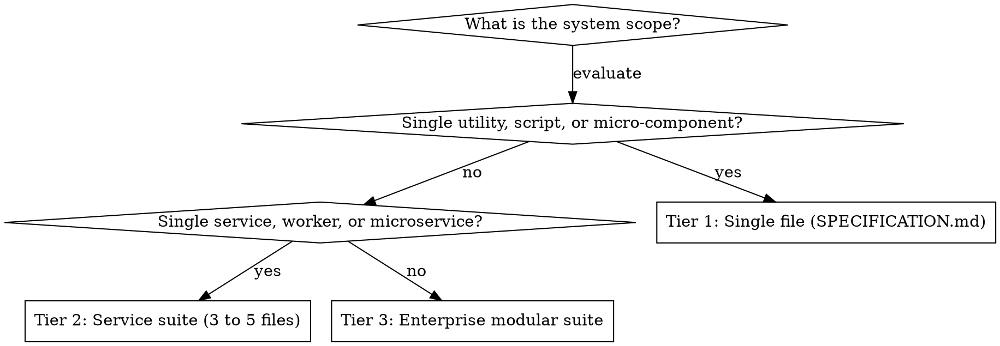

# Writing Technical Specifications

## Overview

A technical specification defines what software does and how components interact. It is independent of specific implementation languages or frameworks.

## When to Use

- Reverse-engineering an existing codebase for migration, audit, or documentation.
- Specifying a new software system from a Product Requirements Document (PRD), RFC, or user brief.
- Defining component boundaries, data models, state machines, and API contracts before coding.
- Verifying behavioural parity between a legacy system and a replacement.

**When NOT to Use:**
- Writing user-facing product requirements (use `writing-product-requirements`).
- Creating operational runbooks, infrastructure provisioning, CI/CD pipelines, or deployment guides.
- Writing simple inline code comments, docstrings, or function summaries (use `documentation-writer`).
- Writing general project overview readmes (use `writing-readmes`).

---

## Specification Sizing Decision

Match document structure to domain complexity. Do not write bloated specifications.

See **references/structure-and-suites.md** for detailed section layouts.

---

## Core Discipline Rules

Follow these mandatory rules. If you violate them, delete the invalid content and rewrite.

| Rule | Requirement | Action on Violation |
|---|---|---|
| **No Inventions** | Never invent missing business rules, database columns, or endpoints. | Mark as `Unresolved` and log an open question in `16-open-questions.md`. |
| **No Infrastructure Code** | Do not write Dockerfiles, Kubernetes YAML, Terraform scripts, or CI/CD pipelines. | Delete the infrastructure code. Describe interface contracts only. |
| **ASD-STE100 Style** | Write short sentences (max 20 words for instructions, max 25 words for descriptions). | Split compound sentences. Remove filler words. |
| **Epistemic Label** | Annotate substantive claims with `Confirmed`, `Inferred`, or `Unresolved`. | Add evidence citations and confidence labels to all claims. |
| **Proportional Size** | Do not create empty files or force 16 files for simple tools. | Combine sections into a smaller tier. |
| **Language** | Use British English spelling throughout. | Correct American spellings. |

---

## Quick Reference

| Task | Workflow / Reference |
|---|---|
| Reverse-engineer an existing codebase | See **references/workflows.md#workflow-a-reverse-engineering-an-existing-system** |
| Specify a new greenfield system | See **references/workflows.md#workflow-b-greenfield-specification-for-a-new-system** |
| Document sizing and file structure | See **references/structure-and-suites.md** |
| ASD-STE100 rules and word replacement | See **references/asd-ste100-guide.md** |
| Evidence syntax and traceability tables | See **references/evidence-and-traceability.md** |
| Concrete example specification | See **references/example-tier1-spec.md** |

---

## Core Workflows Summary

### Workflow A: Reverse-Engineering Existing Systems
1. **Inventory:** Catalog all production files, endpoints, and schemas. Exclude generated and runtime files.
2. **Evidence Model:** Code is primary truth. Tests are behavioural truth. Comments are intent only.
3. **Architecture:** Decompose into logical components (`COMP-xxx`). Map data flows and hidden state.
4. **Requirements & Rules:** Extract atomic functional requirements (`FR-xxx`) and business rules (`BR-xxx`).
5. **Data & Interfaces:** Specify field dictionaries, schemas, API contracts (`API-xxx`), and error codes (`ERR-xxx`).
6. **Acceptance Tests:** Create language-independent test scenarios (`AT-xxx`) and traceability matrices.
7. **Parity & Gaps:** Build a reimplementation parity checklist and log open questions (`OQ-xxx`).

### Workflow B: Specifying New Greenfield Systems
1. **Input Ingestion:** Read PRD, RFC, or user brief. Identify objectives and non-goals.
2. **Clarification:** Ask clarifying questions for missing boundaries, volume targets, or user roles.
3. **Sizing:** Choose Tier 1, Tier 2, or Tier 3. Never create empty files.
4. **Context & Boundaries:** Define actors, external systems, and system boundaries.
5. **Architecture:** Divide system into cohesive logical components (`COMP-xxx`).
6. **Requirements & Workflows:** Formulate normative requirements (`FR-xxx`) and workflows (`WF-xxx`).
7. **Data & APIs:** Design entity models, state transitions, API payloads, and error contracts.
8. **Tests & Questions:** Write acceptance criteria (`AT-xxx`) and register open questions (`OQ-xxx`).

---

## Common Rationalizations and Red Flags

| Excuse | Reality |
|---|---|
| *"The user told me to hurry, so I invented reasonable defaults."* | Never invent domain facts. Label every default as `[ASSUMPTION]` and record an open question. |
| *"More files and pages make the specification look professional."* | Unnecessary length hides critical facts. Match document tier to actual domain complexity. |
| *"I will just generate 15 empty file skeletons so the user has something now."* | Do not scaffold empty files. Resolve scope and sizing before creating files. |
| *"Deployment manifests and CI pipelines belong in a complete spec."* | Software specifications define behaviour and contracts, not infrastructure operations. |
| *"I should provide sample Dockerfiles or Helm charts as runtime configuration examples."* | Do not provide container files or cluster manifests. Specify environment variables and port contracts only. |
| *"I should write full production code so engineers can copy it."* | Specifications define contracts, data invariants, and logic pseudocode, not runtime code. |
| *"Complex systems require formal, multi-clause academic prose."* | Dense prose causes bugs. Use ASD-STE100 short sentences and active voice. |

## Red Flags — STOP and Start Over

- Creating empty or near-empty specification files just to match a template list.
- Increasing the sizing tier to satisfy a user request for file count rather than actual domain complexity.
- Including Docker, Kubernetes, Terraform, or CI/CD configurations in architecture documents.
- Stating an assumption as a confirmed fact without an evidence citation.
- Sentences exceeding 25 words or containing hype words ("seamless", "robust", "game-changing").
- Proceeding on ambiguous greenfield requirements without asking clarifying questions.
