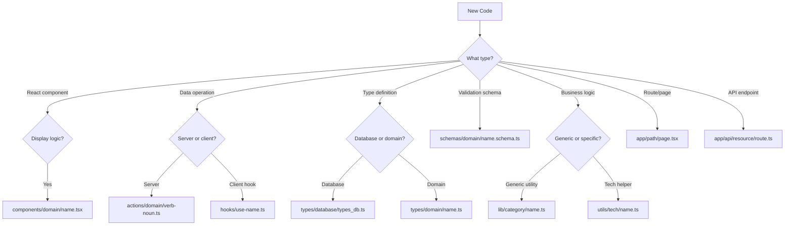
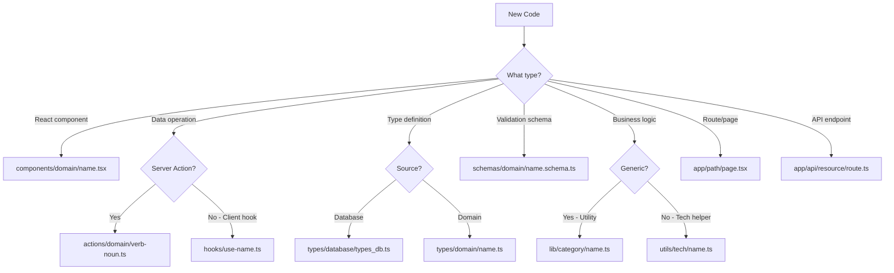

# Structuring Next.js Projects

## Overview

**Domain-first organization with strict conventions:** One export per file, absolute imports only, no barrel exports, kebab-case naming. Each concern (types, actions, components, schemas) lives in its own top-level folder with domain subfolders.

**Core principle:** Predictable structure beats convenience. Explicit imports beat clever re-exports.

## When to Use

Use this skill when:
- Creating new files in a Next.js App Router project
- Deciding where to place types, actions, components, or schemas
- Structuring imports and exports
- Organizing by feature/domain
- Setting up test structure
- Migrating from Pages Router or unstructured projects

**Prerequisites:** Project uses Next.js App Router (not Pages Router), TypeScript with strict mode enabled (`"strict": true` in tsconfig.json), and has `@/*` path alias configured.

**Related skills:**
- `centralised-routes` - Route management (referenced, not duplicated here)
- `typescript-environment-variables` - Env var validation (referenced, not duplicated here)

## Critical Rules

### NO BARREL EXPORTS

```typescript
// ❌ NEVER create index.ts files
// types/comment/index.ts
export * from './comment';
export * from './comment-with-author';

// ✅ ALWAYS import directly
import type { Comment } from '@/types/comment/comment';
import type { CommentWithAuthor } from '@/types/comment/comment-with-author';
```

**Why:** Tree-shaking, explicit dependencies, monorepo compatibility, no circular dependency issues.

### ABSOLUTE IMPORTS ONLY

```typescript
// ❌ NEVER use relative imports (even within same folder)
import type { Comment } from './comment';
import { getComments } from '../actions/get-comments';

// ✅ ALWAYS use @/* alias
import type { Comment } from '@/types/comment/comment';
import { getComments } from '@/actions/comment/get-comments';
```

**Why:** Consistency, refactoring safety, clear boundaries.

### DOMAIN ORGANIZATION REQUIRED

```
// ❌ NEVER flat structure
types/
  comment.ts
  comment-with-author.ts
  song.ts
  album.ts

// ✅ ALWAYS domain subfolders
types/
  comment/
    comment.ts
    comment-with-author.ts
  song/
    song.ts
    song-with-album.ts
  album/
    album.ts
    album-with-artists.ts
```

**Why:** Scales to large codebases, clear ownership, easier navigation.

### TYPESCRIPT STRICT MODE REQUIRED

```typescript
// ❌ NEVER use `any` type
export async function getComments(songId: any): any { ... }
export function processData(data: any) { ... }

// ✅ ALWAYS use explicit types
export async function getComments(songId: string): Promise<Comment[]> { ... }
export function processData(data: unknown): ProcessedData { ... }
```

**Why:** Type safety, catch errors at compile time, better IDE support. Project MUST have `"strict": true` in tsconfig.json.

## File Placement Decision Tree



## Quick Reference



### Directory Structure

| Folder | Purpose | Example |
|--------|---------|---------|
| `actions/[domain]/` | Server Actions only | `actions/comment/get-comments.ts` |
| `types/[domain]/` | TypeScript types/interfaces | `types/comment/comment-with-author.ts` |
| `components/[domain]/` | React components | `components/comment/comment-list.tsx` |
| `schemas/[domain]/` | Zod validation schemas | `schemas/comment/create-comment.schema.ts` |
| `hooks/` | Custom React hooks (flat) | `hooks/use-player.ts` |
| `lib/` | Business logic, utilities | `lib/mappers/comment.ts` |
| `utils/` | Infrastructure clients | `utils/supabase/server.ts` |
| `providers/` | React Context providers | `providers/modal-provider.tsx` |
| `app/` | Routing + special files ONLY | `app/songs/[id]/page.tsx` |
| `__tests__/[category]/` | Tests (mirror structure) | `__tests__/actions/getComments.test.ts` |

### File Naming

| Type | Pattern | Example |
|------|---------|---------|
| Components | kebab-case → PascalCase export | `comment-form.tsx` → `CommentForm` |
| Actions | kebab-case, verb-noun | `get-comments.ts`, `delete-comment.ts` |
| Types | kebab-case, descriptive | `comment-with-author.ts`, `song.ts` |
| Schemas | kebab-case + `.schema.ts` | `create-comment.schema.ts` |
| Hooks | kebab-case, `use-` prefix | `use-favourite.ts` |
| Tests | camelCase + `.test.ts` | `getComments.test.ts` |

### Exports Per File

| File Type | Export Pattern | Example |
|-----------|----------------|---------|
| Server Action | Single default export | `export default getComments;` |
| Component | Single default or named export | `export default CommentList;` or `export const CommentList` |
| Type | Single named export | `export type Comment = {...}` |
| Schema | Single named export | `export const createCommentSchema = z.object(...)` |
| Hook | Single default export | `export default usePlayer;` |

### Import Order

```typescript
// 1. React/Next.js
import { useState } from 'react';
import { revalidatePath } from 'next/cache';

// 2. External packages
import { z } from 'zod';

// 3. Local - order: actions → hooks → types → components
import { getComments } from '@/actions/comment/get-comments';
import usePlayer from '@/hooks/use-player';
import type { CommentWithAuthor } from '@/types/comment/comment-with-author';
import { CommentList } from '@/components/comment/comment-list';
```

### Client vs Server Components

```typescript
// ❌ Server component with client features (will fail)
export default function CommentForm() {
  const [value, setValue] = useState(''); // Error: useState in server component
}

// ✅ Client component with directive
'use client';

export default function CommentForm() {
  const [value, setValue] = useState(''); // Works
}

// ✅ Server component (default)
export default async function CommentList() {
  const comments = await getComments(); // Can await directly
}
```

**Rule:** Add `"use client"` if component uses: state, effects, event handlers, browser APIs, or context.

### Server Actions Pattern

```typescript
// ✅ Required pattern
'use server';

import { z } from 'zod';
import { revalidatePath } from 'next/cache';

const schema = z.object({ ... });

export default async function createComment(data: unknown) {
  // 1. Validate
  const validated = schema.safeParse(data);
  if (!validated.success) return { error: 'Invalid' };

  // 2. Execute
  const result = await db.insert(...);
  
  // 3. Revalidate
  revalidatePath('/songs/[id]');
  
  return result;
}
```

**Note:** Server actions are OPTIONAL. If project doesn't use them, skip this pattern. Never force server action usage.

## Detailed References

See these files for comprehensive details:

- **directory-structure.md** - Complete folder hierarchy, when to use each, cross-domain shared code
- **file-conventions.md** - Naming rules, export patterns, import rules, edge cases
- **examples.md** - Complete working examples of feature scaffolding

## Common Mistakes

| Mistake | Why It's Wrong | Fix |
|---------|----------------|-----|
| Creating `index.ts` barrel exports | Breaks tree-shaking, adds indirection | Import directly from files |
| Relative imports (`./comment`) | Inconsistent, breaks on refactor | Use `@/types/comment/comment` |
| Flat structure (`types/comment.ts`) | Doesn't scale | Use `types/comment/comment.ts` |
| Multiple exports per file | Unclear ownership | One export per file |
| PascalCase file names | Convention mismatch | Use kebab-case |
| Business logic in `app/` folder | Routing folder, not logic | Move to `lib/` or `utils/` |
| Wrong test naming (kebab-case) | Convention violation | Use camelCase: `getComments.test.ts` |
| Forgetting `"use client"` | Server component can't use hooks | Add directive at top |
| Absolute imports without alias | Breaks on path changes | Always use `@/*` |

## Decision Flowchart

```dot
digraph file_location {
    rankdir=TD;
    
    "What are you creating?" [shape=diamond];
    "React component?" [shape=diamond];
    "Data transformation?" [shape=diamond];
    "Validation schema?" [shape=diamond];
    "Server action?" [shape=diamond];
    "Custom hook?" [shape=diamond];
    "React Context provider?" [shape=diamond];
    
    "components/[domain]/[name].tsx" [shape=box];
    "types/[domain]/[name].ts" [shape=box];
    "lib/mappers/[domain].ts" [shape=box];
    "lib/[name].ts" [shape=box];
    "schemas/[domain]/[name].schema.ts" [shape=box];
    "actions/[domain]/[name].ts" [shape=box];
    "hooks/use-[name].ts" [shape=box];
    "providers/[name]-provider.tsx" [shape=box];
    
    "What are you creating?" -> "React component?" [label="yes"];
    "React component?" -> "React Context provider?" [label="yes"];
    "React Context provider?" -> "providers/[name]-provider.tsx" [label="yes"];
    "React Context provider?" -> "components/[domain]/[name].tsx" [label="no"];
    
    "What are you creating?" -> "Server action?" [label="server action"];
    "Server action?" -> "actions/[domain]/[name].ts" [label="yes"];
    
    "What are you creating?" -> "Custom hook?" [label="hook"];
    "Custom hook?" -> "hooks/use-[name].ts" [label="yes"];
    
    "What are you creating?" -> "Validation schema?" [label="schema"];
    "Validation schema?" -> "schemas/[domain]/[name].schema.ts" [label="yes"];
    
    "What are you creating?" -> "Data transformation?" [label="utility"];
    "Data transformation?" -> "lib/mappers/[domain].ts" [label="DB row → UI type"];
    "Data transformation?" -> "lib/[name].ts" [label="other util"];
    
    "What are you creating?" -> "types/[domain]/[name].ts" [label="type/interface"];
}
```



## Real-World Impact

**Before structure:**
- Agent created 12 `index.ts` barrel files
- Mixed relative/absolute imports
- Flat type organization (80+ files in one folder)
- Components in `app/` folder

**After structure:**
- Zero barrel exports
- 100% absolute imports
- Clear domain boundaries
- Navigable with jump-to-definition
