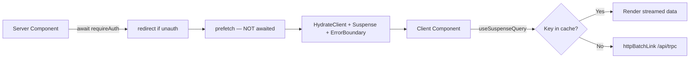

# Server Components: prefetch, streaming SSR, `cache()`

> **In this repo** (Nodebase): snippets marked "repo" match `trpc/server.tsx`, `features/workflows/server/prefetch.ts`, `app/(dashboard)/(rest)/workflows/page.tsx`.

## The streaming SSR contract

1. Server Component **prefetches** queries into the QueryClient (fire-and-forget — never awaited, or streaming stalls).
2. `HydrateClient` dehydrates that cache into the client.
3. The Client Component reads the same data with `useSuspenseQuery` — matching query keys mean zero network round-trip; anything missed falls through to `httpBatchLink`.



## `trpc/server.tsx` (repo)

```ts
import "server-only"; // <-- ensure this file cannot be imported from the client
import { dehydrate, HydrationBoundary } from "@tanstack/react-query";
import { createTRPCOptionsProxy, type TRPCQueryOptions } from "@trpc/tanstack-react-query";
import { cache } from "react";
import { createTRPCContext } from "./init";
import { makeQueryClient } from "./query-client";
import { appRouter } from "./routers/_app";

export const getQueryClient = cache(makeQueryClient);

export const trpc = createTRPCOptionsProxy({
  ctx: createTRPCContext,
  router: appRouter,
  queryClient: getQueryClient,
});

export const caller = appRouter.createCaller(createTRPCContext);

export function prefetch<T extends ReturnType<TRPCQueryOptions<any>>>(queryOptions: T) {
  const queryClient = getQueryClient();
  if (queryOptions.queryKey[1]?.type === "infinite") {
    void queryClient.prefetchInfiniteQuery(queryOptions as any);
  } else {
    void queryClient.prefetchQuery(queryOptions);
  }
}

export function HydrateClient({ children }: { children: React.ReactNode }) {
  const queryClient = getQueryClient();
  return <HydrationBoundary state={dehydrate(queryClient)}>{children}</HydrationBoundary>;
}
```

Key points:
- `import "server-only"` — the file must never be imported from client code.
- `getQueryClient = cache(makeQueryClient)` — **one QueryClient per request**, stable across the render pass. (Client has its own module-level singleton.)
- `createTRPCOptionsProxy` produces `trpc.<router>.<proc>.queryOptions(input)` — a plain TanStack `queryOptions` object with the tRPC-typed query key. No network happens here.
- `prefetch` returns `undefined`; call it fire-and-forget (do not await).
- `caller` is for in-process server-side calls (server actions, route handlers, tests). It is detached from the QueryClient cache. Never call `appRouter.createCaller` inside a procedure.
- `shouldDehydrateQuery` includes `pending` status (see `setup.md`) so in-flight queries stream instead of being dropped.

## Page pattern (repo, `workflows/page.tsx`)

```tsx
const Page = async ({ searchParams }: Props) => {
  await requireAuth();                        // 1. auth gate first (redirects)
  const params = await workflowsParamsLoader(searchParams);
  prefetchWorkflows(params);                  // 2. fire-and-forget, NOT awaited

  return (
    <WorkflowsContainer>
      <HydrateClient>                          // 3. dehydrate boundary
        <ErrorBoundary fallback={<WorkflowsError />}>   // 4. render errors
          <Suspense fallback={<WorkflowsLoading />}>    // 5. loading state
            <WorkflowsList />                   // 6. client component reads cache
          </Suspense>
        </ErrorBoundary>
      </HydrateClient>
    </WorkflowsContainer>
  );
};
```

- `await requireAuth()` **before** prefetch — unauthenticated users redirect before any data work. **REQUIRED:** see `better-auth-nextjs` skill for `requireAuth` details.
- `HydrateClient` wraps `ErrorBoundary` (react-error-boundary) → `Suspense` → list. Errors in render go to the boundary; loading goes to the fallback.

## Feature prefetch helpers (repo, `features/workflows/server/prefetch.ts`)

```ts
import type { inferInput } from "@trpc/tanstack-react-query";
import { prefetch, trpc } from "@/trpc/server";

type Input = inferInput<typeof trpc.workflows.getMany>;

export const prefetchWorkflows = (params: Input) => {
  return prefetch(trpc.workflows.getMany.queryOptions(params));
};

export const prefetchWorkflow = (id: string) => {
  return prefetch(trpc.workflows.getOne.queryOptions({ id }));
};
```

- `inferInput<typeof trpc.x.y>` gives the procedure's input type — the helper and the page's `nuqs` params stay in sync.
- Prefetch helpers are pure wrappers: call `prefetch(trpc.<router>.<proc>.queryOptions(input))`, never touch the QueryClient directly.

**Inputless procedures** — `queryOptions()` with zero args works (pattern; this repo has no inputless prefetch yet):

```ts
export const prefetchSubscriptionStatus = () => {
  return prefetch(trpc.subscriptions.getStatus.queryOptions());
};
```

## Client-side contract

The client hook must use the **same** `queryOptions` call with the **same** input so the query key matches what was prefetched:

```ts
// client component
const trpc = useTRPC();
const [params] = useWorkflowsParams();
return useSuspenseQuery(trpc.workflows.getMany.queryOptions(params));
```

If keys match → hydration renders immediately. If not → suspense falls back to a network fetch.
