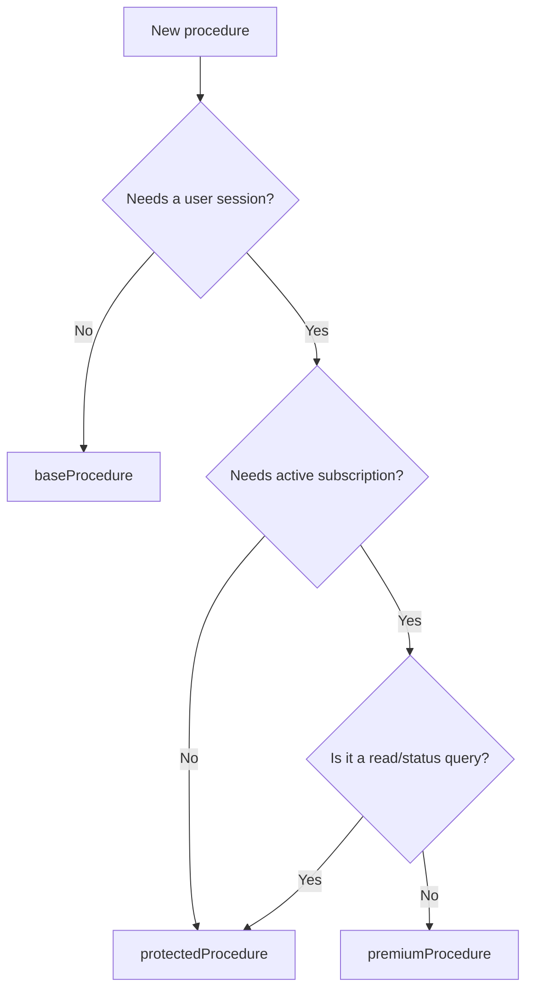

# Setup: init, context, procedure tiers, providers, transport

> **In this repo** (Nodebase): all snippets below marked "repo" are exact patterns from `trpc/init.ts`, `trpc/client.tsx`, `trpc/query-client.ts`, `app/api/trpc/[trpc]/route.ts`, `app/layout.tsx`. Anything marked "general" is the docs pattern.

## File map

| File                           | Responsibility                                                                                                                                                                   |
| ------------------------------ | -------------------------------------------------------------------------------------------------------------------------------------------------------------------------------- |
| `trpc/init.ts`                 | `initTRPC.create({ transformer: superjson })`; `createTRPCContext`; exports `createTRPCRouter`, `createCallerFactory`, `baseProcedure`, `protectedProcedure`, `premiumProcedure` |
| `trpc/query-client.ts`         | `makeQueryClient()` — staleTime 30s, dehydrate includes `pending`, superjson serialize/deserialize                                                                               |
| `trpc/client.tsx`              | `'use client'`; `createTRPCContext<AppRouter>()` factory → `{ TRPCProvider, useTRPC }`; `TRPCReactProvider`; `httpBatchLink`; browser singleton                                  |
| `app/api/trpc/[trpc]/route.ts` | `fetchRequestHandler` for GET and POST                                                                                                                                           |
| `app/layout.tsx`               | mounts `TRPCReactProvider`                                                                                                                                                       |

## `trpc/init.ts` — init once, export helpers

Repo pattern (comments trimmed):

```ts
import { initTRPC, TRPCError } from "@trpc/server";
import { headers } from "next/headers";
import { cache } from "react";
import superjson from "superjson";
import { auth } from "@/lib/auth";
import { env } from "@/lib/env";
import { polarClient } from "@/lib/polar";

export const createTRPCContext = cache(async () => {
  return { userId: "user_123" }; // type-only stub — NEVER read ctx.userId
});

const t = initTRPC.create({ transformer: superjson });

export const createTRPCRouter = t.router;
export const createCallerFactory = t.createCallerFactory;
export const baseProcedure = t.procedure;
```

Rules:
- `initTRPC.create` **exactly once**; export helpers, never the `t` object.
- Transformer is **required on the server init** (superjson here) or Date/Map/Set break the wire format.
- `createTRPCContext` wrapped in `React.cache()` — all tRPC calls in one render pass share context.

## Procedure tiers

**`protectedProcedure`** — injects `ctx.auth` from the Better Auth session. **REQUIRED:** see `better-auth-nextjs` skill for session handling.

Repo pattern (note: test-mode bypass + `user_123` fallback exist for Vitest):

```ts
export const protectedProcedure = baseProcedure.use(async ({ ctx, next }) => {
  const session = await auth.api.getSession({ headers: await headers() });

  if (!session && process.env.NODE_ENV !== "test") {
    throw new TRPCError({ code: "UNAUTHORIZED", message: "Unathorized" });
  }

  const authSession = session || (ctx as any).auth || { user: { id: "user_123" } };

  return next({ ctx: { ...ctx, auth: authSession } });
});
```

General (docs) pattern — same shape, no test bypass:

```ts
export const protectedProcedure = baseProcedure.use(async ({ ctx, next }) => {
  const session = await auth.api.getSession({ headers: await headers() });
  if (!session) throw new TRPCError({ code: "UNAUTHORIZED" });
  return next({ ctx: { ...ctx, auth: session } });
});
```

**`premiumProcedure`** — extends `protectedProcedure` (auth first, then subscription). Repo pattern:

```ts
export const premiumProcedure = protectedProcedure.use(async ({ ctx, next }) => {
  if (
    env.NEXT_PUBLIC_ENABLE_POLAR !== "true" ||
    (process.env.NODE_ENV === "test" && (ctx as any).customer)
  ) {
    return next({ ctx: { ...ctx, customer: (ctx as any).customer || null } });
  }

  const customer = await polarClient.customers.getStateExternal({
    externalId: ctx.auth.user.id,
  });

  if (!customer.activeSubscriptions || customer.activeSubscriptions.length === 0) {
    throw new TRPCError({ code: "FORBIDDEN", message: "Active subscription required" });
  }

  return next({ ctx: { ...ctx, customer } });
});
```

General pattern: check billing state in middleware, throw `FORBIDDEN` when absent. **REQUIRED:** see `attribute-based-access-control` skill if gating is attribute-based rather than subscription-based.

Tier decision:



**Shared middleware logic** — if a query must re-implement logic that also lives in a middleware (e.g. a `getStatus` query re-deriving the same subscription state as `premiumProcedure`), extract that logic into one shared exported helper and call it from both middleware and procedure — the query result can then never disagree with the gate. One shared function; no DI machinery.

## Query client (`trpc/query-client.ts`)

Repo pattern — `staleTime: 30_000`, dehydrate includes `pending` (required for streaming SSR), superjson on both hydrate directions:

```ts
import { defaultShouldDehydrateQuery, QueryClient } from "@tanstack/react-query";
import superjson from "superjson";

export function makeQueryClient() {
  return new QueryClient({
    defaultOptions: {
      queries: { staleTime: 30 * 1000 },
      dehydrate: {
        serializeData: superjson.serialize,
        shouldDehydrateQuery: (query) =>
          defaultShouldDehydrateQuery(query) || query.state.status === "pending",
      },
      hydrate: { deserializeData: superjson.deserialize },
    },
  });
}
```

## Client provider (`trpc/client.tsx`)

- `createTRPCContext<AppRouter>()` from `@trpc/tanstack-react-query` returns `{ TRPCProvider, useTRPC }` — this factory is **unrelated** to the server's `createTRPCContext` function (name collision only).
- `TRPCReactProvider` = `QueryClientProvider` + `TRPCProvider`. Mount once in root layout.
- `httpBatchLink` carries the transformer: **REQUIRED** on the client too.

Repo pattern (condensed):

```tsx
"use client";
import { QueryClientProvider } from "@tanstack/react-query";
import { createTRPCClient, httpBatchLink } from "@trpc/client";
import { createTRPCContext } from "@trpc/tanstack-react-query";
import { useState } from "react";
import superjson from "superjson";
import { makeQueryClient } from "./query-client";
import type { AppRouter } from "./routers/_app";

export const { TRPCProvider, useTRPC } = createTRPCContext<AppRouter>();

let browserQueryClient: QueryClient;
function getQueryClient() {
  if (typeof window === "undefined") return makeQueryClient();
  if (!browserQueryClient) browserQueryClient = makeQueryClient();
  return browserQueryClient;
}

function getUrl() {
  const base = (() => {
    if (typeof window !== "undefined") return "";
    if (env.VERCEL_URL) return `https://${env.VERCEL_URL}`;
    return "http://localhost:3000";
  })();
  return `${base}/api/trpc`;
}

export function TRPCReactProvider({ children }: { children: React.ReactNode }) {
  const queryClient = getQueryClient(); // NOT useState — React discards state on suspend
  const [trpcClient] = useState(() =>
    createTRPCClient<AppRouter>({
      links: [httpBatchLink({ transformer: superjson, url: getUrl() })],
    }),
  );
  return (
    <QueryClientProvider client={queryClient}>
      <TRPCProvider trpcClient={trpcClient} queryClient={queryClient}>
        {children}
      </TRPCProvider>
    </QueryClientProvider>
  );
}
```

Key details:
- Browser `browserQueryClient` singleton — avoids re-creating the client when React suspends during initial render.
- `useState` initializer for the tRPC client, `getQueryClient()` (not state) for the QueryClient.

Root layout mount (repo):

```tsx
<TRPCReactProvider>
  <NuqsAdapter>
    <Provider>{children}<Toaster /></Provider>
  </NuqsAdapter>
</TRPCReactProvider>
```

## Route handler (`app/api/trpc/[trpc]/route.ts`)

Repo pattern:

```ts
import { fetchRequestHandler } from "@trpc/server/adapters/fetch";
import { createTRPCContext } from "@/trpc/init";
import { appRouter } from "@/trpc/routers/_app";

const handler = (req: Request) =>
  fetchRequestHandler({
    endpoint: "/api/trpc",
    req,
    router: appRouter,
    createContext: createTRPCContext,
  });

export { handler as GET, handler as POST };
```
