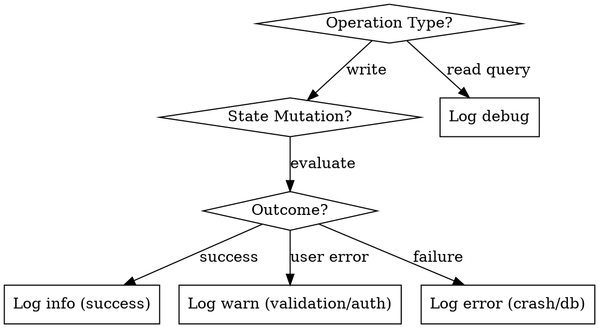

# Next.js LogTape Logging

## Overview

Structured, non-blocking application telemetry for Next.js App Router using LogTape. Enforces perfectly aligned terminal columns, clear severity hierarchies, zero PII leakage, and clean separation between mutation events and query traces.

---

## When to Use

- Initializing or standardizing logging across a Next.js (App Router, TypeScript) codebase.
- Server actions, mutations, or background jobs need observable operational telemetry.
- Terminal logs appear unaligned, noisy, inconsistent, or unreadable.
- Need non-blocking logging in web runtimes without breaking Vitest/Jest test suites.
- Need standard `LOG_LEVEL` environment variable control (`debug`, `info`, `warn`, `error`).

## When NOT to Use

- Standalone Node.js scripts without Next.js framework conventions (use vanilla LogTape directly).
- Client-only Single Page Applications (SPAs) where all telemetry is handled by browser APM vendors.
- Python, Go, or non-TypeScript backend services.

---

## Target Visual Standard

Every log line follows an uncompromised, fixed-width columnar layout:

```text
18:49:17.266  DEBUG    app·middleware            │  Refreshing Supabase session for '/songs'
18:49:17.267  DEBUG    app·middleware            │  Session correctly synced for '/songs'
18:49:17.268  DEBUG    app·actions·song          │  Fetching all songs
18:49:17.269  INFO     app·actions·song          │  Song created successfully (id: "song_abc123")
18:49:17.270  WARNING  app·storage               │  Storage approaching quota limit (85% used)
18:49:17.271  ERROR    app·actions·song          │  Failed to delete song: database constraint error
```

---

## Quick Reference & Cheatsheet

| Element | Specification | Rationale |
|---|---|---|
| **Timestamp** | `HH:mm:ss.SSS` (Dimmed) | Fast chronological tracking without date clutter |
| **Level** | 7 chars (`DEBUG  `, `INFO   `, `WARNING`, `ERROR  `) | Padded to match `WARNING` (7 chars) so category column starts at fixed position |
| **Category** | 24 chars (`app·actions·song       `) | Domain-grouped array joined with `·` and padded to 24 characters |
| **Delimiter** | `  │  ` (Dimmed) | Clean visual divider separating telemetry metadata from message text |
| **Console Sink** | `nonBlocking: !isTest` | Asynchronous buffering in server runtime; synchronous in test runners |
| **Meta Logger** | `lowestLevel: "warning"` | Silences LogTape startup diagnostic banner |
| **Mutations** | `info` on success, `warn` on user error, `error` on crash | Actionable state-change telemetry |
| **Queries** | `debug` on run, `error` on failure | Prevents terminal flooding during RSC navigation |

---

## Core Logger Blueprint (`lib/logger.ts`)

```typescript
import {
  configureSync,
  getAnsiColorFormatter,
  getConsoleSink,
  getLogger as getLogTapeLogger,
  type LogLevel,
} from "@logtape/logtape";
import { env } from "@/lib/env";

let initialized = false;
const DIM = "\x1b[2m";
const RESET = "\x1b[0m";

const consoleFormatter = getAnsiColorFormatter({
  timestamp: "time",
  level: "FULL",
  categoryStyle: "dim",
  timestampStyle: "dim",
  format({ timestamp, level, category, message, record }) {
    const rawCategory = record.category.join("·");
    const padLength = Math.max(0, 24 - rawCategory.length);
    const paddedCategory = category + " ".repeat(padLength);
    const levelStr = record.level.toUpperCase();
    const levelPad = " ".repeat(Math.max(0, 7 - levelStr.length));
    return `${timestamp}  ${level}${levelPad}  ${paddedCategory}  ${DIM}│${RESET}  ${message}`;
  },
});

export function configureLoggingSync(): void {
  if (initialized) return;
  const isTest =
    typeof process !== "undefined" &&
    (process.env.NODE_ENV === "test" || Boolean(process.env.VITEST));

  try {
    configureSync({
      sinks: {
        console: getConsoleSink({
          formatter: consoleFormatter,
          nonBlocking: !isTest,
        }),
      },
      loggers: [
        { category: ["logtape", "meta"], lowestLevel: "warning", sinks: ["console"] },
        { category: ["app"], lowestLevel: (env.LOG_LEVEL || "info") as LogLevel, sinks: ["console"] },
      ],
    });
    initialized = true;
  } catch {
    initialized = true;
  }
}

export function getLogger(
  ...args: Parameters<typeof getLogTapeLogger>
): ReturnType<typeof getLogTapeLogger> {
  if (!initialized) configureLoggingSync();
  return getLogTapeLogger(...args);
}
```

---

## Action-Level Rules (Mutations vs. Queries)



1. **Mutations (`create*`, `update*`, `delete*`)**:
   - `info`: Successful creation, update, or deletion with non-sensitive ID (e.g. `Song created (id: {id})`).
   - `warn`: Expected user errors, validation rejections, unauthorized requests.
   - `error`: Database transaction errors, storage deletions, unexpected exceptions.
2. **Queries (`get*`, `fetch*`)**:
   - `debug`: Query start/parameters. Never use `info` for queries in Next.js Server Components.
   - `error`: Failed queries.
3. **Privacy**: Never log passwords, tokens, full request bodies, or user emails. Log only entity IDs.

---

## Red Flags - STOP and Fix

- 🚩 **Direct Client DB Mutations**: Component does `supabase.from("table").insert(...)` in `"use client"` instead of dispatching to a Server Action. (Fix: Wrap mutation in `"use server"` action so server logs capture the event).
- 🚩 **Client-to-Server Forwarders**: Adding custom `/api/log` POST route to pipe browser console messages. (Fix: Delete custom forwarders; log where actions execute on the server).
- 🚩 **Queries logged at `info`**: Server components flood console on every page transition. (Fix: Demote query logs to `debug`).
- 🚩 **Proprietary env variables**: Adding `DEBUG_ACTIONS=true` instead of using standard `LOG_LEVEL`. (Fix: Use `LOG_LEVEL=debug`).
- 🚩 **Unaligned columns**: Variable-width log levels shifting column positions. (Fix: Pad levels to 7 characters and categories to 24 characters).
- 🚩 **Turbopack export mismatch**: Mixing named export with default import. (Fix: Standardize on `export default <action>` across all server actions).

---

## Detailed References

- [setup-and-formatting.md](setup-and-formatting.md) - Exact ANSI formatting implementation, level and category padding logic, non-blocking console sinks, and meta logger suppression.
- [server-actions-logging.md](server-actions-logging.md) - Server action mutation and query templates, error handling, PII prevention, and Turbopack export compatibility.
- [middleware-and-routes.md](middleware-and-routes.md) - Middleware session tracking, matcher configuration, Route Handlers (webhooks/APIs), and React Server Component guidelines.
- [environment-and-testing.md](environment-and-testing.md) - Zod schema validation for `LOG_LEVEL`, `warn` vs `warning` normalization, and Vitest/Jest runner compatibility.
- [antipatterns.md](antipatterns.md) - In-depth catalog of logging antipatterns and architectural anti-models to eliminate.

