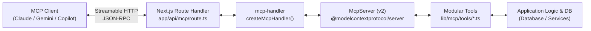

# MCP + Next.js

## Overview

Hosting a Model Context Protocol (MCP) server inside Next.js exposes application data, business logic, and database operations directly to AI clients (Claude, Gemini, Cursor, Copilot) via Web-standard Streamable HTTP. Using `mcp-handler` with `@modelcontextprotocol/server` (v2.x) eliminates standalone server infrastructure by embedding the MCP server directly into standard App Router Route Handlers.

**Core principle:** Treat the MCP server as a standard Next.js Route Handler adapter. Keep tools modular by domain in `lib/mcp/tools/`, validate arguments with Standard Schema / Zod v4, and serve stateless Streamable HTTP at `/api/mcp`.

---

## When to Use

- Building or turning a Next.js web application into an MCP server accessible by AI assistants.
- Exposing internal application data (e.g. portfolio items, CRM records, analytics, CMS blogs) as AI-queryable tools.
- Replacing legacy stdio-only MCP bridges with remote, Web-standard Streamable HTTP endpoints.
- Securing remote MCP tools with Bearer token authentication and RFC 9728 challenges.
- Writing unit and route handler integration tests for MCP tools using Vitest.

## Not For

- Stdio-only desktop tools with no web application (use a standalone Node/Python CLI).
- Pure WebSocket bidirectional push streams where the client does not speak MCP (use WebSockets or Server-Sent Events directly).

---

## Quick Start

### 1. Install Dependencies
```bash
yarn add mcp-handler@^2 @modelcontextprotocol/server@^2 zod@^4
```

### 2. Create Route Handler
```typescript
// app/api/mcp/route.ts
import { createMcpHandler } from "mcp-handler";
import { z } from "zod";

const handler = createMcpHandler(
  (server) => {
    server.registerTool(
      "echo",
      {
        title: "Echo Tool",
        description: "Echoes the provided message back.",
        inputSchema: z.object({
          message: z.string(),
        }),
      },
      async ({ message }) => ({
        content: [{ type: "text", text: `Echo: ${message}` }],
      }),
    );
  },
  {
    serverInfo: {
      name: "my-nextjs-mcp",
      version: "1.0.0",
    },
  },
);

export { handler as GET, handler as POST };
```

---

## Core Architecture



### Recommended Directory Structure

```text
app/
└── api/
    └── mcp/
        └── route.ts            # Route handler (GET & POST)
lib/
└── mcp/
    ├── helpers.ts              # formatToolResponse helper
    ├── register-tools.ts       # Tool aggregation registry
    ├── server.ts               # createMcpHandler configuration
    └── tools/                  # Domain-specific tool modules
        ├── about.ts
        ├── projects.ts
        └── skills.ts
```

---

## Quick Reference

| Task | Pattern | Detailed Guide |
| :--- | :--- | :--- |
| **Tool Registration** | `server.registerTool("name", { inputSchema: z.object({...}) }, handler)` | [Tools & Resources](references/tools-and-resources.md) |
| **No-arg Tools** | Pass `inputSchema: z.object({})` | [Tools & Resources](references/tools-and-resources.md) |
| **Resources** | `server.registerResource("name", "uri://...", meta, handler)` | [Tools & Resources](references/tools-and-resources.md) |
| **Authentication** | `withMcpAuth(handler, verifyToken, { required: true })` | [Auth & Security](references/authentication-and-security.md) |
| **Claude Desktop** | `npx -y mcp-remote http://localhost:3000/api/mcp` | [Client Config](references/client-configuration.md) |
| **VS Code Copilot** | Add `"type": "http"` entry in `.vscode/mcp.json` | [Client Config](references/client-configuration.md) |
| **Testing Route** | Send `POST` with `Accept: application/json, text/event-stream` | [Testing & Debugging](references/testing-and-debugging.md) |

---

## Common Pitfalls & Mistakes

### 1. `406 Not Acceptable` Error
- **Symptom**: Client requests to `/api/mcp` fail with HTTP 406.
- **Cause**: The MCP Streamable HTTP specification mandates that the client `Accept` header contains both `application/json` and `text/event-stream`.
- **Fix**: In tests and client configurations, always specify:
  ```http
  Accept: application/json, text/event-stream
  ```

### 2. `405 Method Not Allowed` on GET
- **Symptom**: Calling `GET /api/mcp` returns 405 error with message `Method not allowed`.
- **Cause**: The 2026-07-28 stateless MCP protocol operates over stateless POST requests. GET endpoints for persistent session listeners answer 405 when running in stateless mode.
- **Fix**: Send JSON-RPC requests via POST.

### 3. Zod v4 Standard Schema Changes
- **Symptom**: Type errors or invalid schema definitions when passing raw shapes.
- **Cause**: `@modelcontextprotocol/server` v2 requires a complete schema object satisfying Standard Schema (`z.object({ ... })`), not a bare object map (`{ field: z.string() }`).
- **Fix**: Always wrap parameters with `z.object({ ... })`.

### 4. Monolithic Route Files
- **Symptom**: `app/api/mcp/route.ts` bloated with thousands of lines of database logic and schemas.
- **Fix**: Decompose into domain files (`lib/mcp/tools/*.ts`) and aggregate via `registerAllTools(server)`.

---

## Detailed References

- [Tools, Resources, and Prompts Guide](references/tools-and-resources.md) — Comprehensive API syntax and schema examples.
- [Authentication and Security Guide](references/authentication-and-security.md) — Token validation, CIMD, and RFC 9728 challenges.
- [Client Configuration Guide](references/client-configuration.md) — Connecting Claude Desktop, Gemini CLI, VS Code Copilot, Cursor, and Windsurf.
- [Testing and Debugging Guide](references/testing-and-debugging.md) — Vitest test suites, curl commands, and troubleshooting common HTTP codes.
