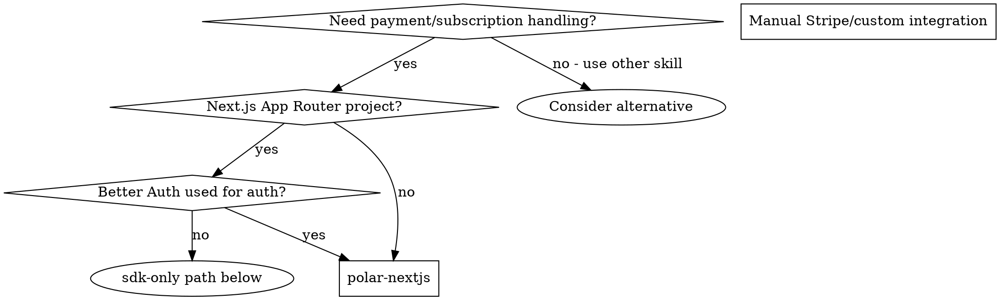

# Polar + Next.js

## Overview

[Polar.sh](https://docs.polar.sh) is a Merchant of Record (MoR) for payments and subscriptions. It handles tax collection, fraud prevention, chargebacks, and invoicing. The application never stores billing data locally — Polar is the sole source of truth.

**Core principle:** All API calls must be server-side. Organisation Access Tokens (OAT) must never reach the browser. Customer lookups use `externalId` mapped from your auth user ID — no local subscription tables needed.



## When to Use

- Adding subscription-based paid features to a Next.js app
- Setting up hosted checkout or customer portal
- Implementing tRPC procedure gates behind an active subscription
- Handling Polar webhook events in route handlers
- Switching between sandbox and production environments
- Fixing `TRPCError FORBIDDEN` that needs an active subscription

## Don't Use For

- One-time purchases without recurring subscriptions (simpler flow, still valid but less covered)
- Custom payment processing where you want full control (use Stripe directly)
- In-app purchases or mobile store billing

## Key Concepts

| Concept | Description |
|---------|-------------|
| **Product** | Selling unit — one-time purchase or recurring subscription |
| **Subscription** | Customer's recurring product with interval (monthly/yearly) |
| **Customer** | Polar entity tied to your user via `externalId` |
| **Checkout** | Hosted Polar payment page — redirect flow |
| **Portal** | Hosted self-service management — cancel, update card, view invoices |
| **Webhook** | Event delivery for state synchronization |
| **OAT** | Organisation Access Token (`polar_oat_...`) — server-side only |
| **Sandbox** | Test mode with fake cards, isolated data |

## Quick Setup Flow

```markdown
1. Install packages → `@polar-sh/sdk` + `@polar-sh/better-auth` + `zod`
2. Add env vars → `POLAR_ACCESS_TOKEN`, `POLAR_PRODUCT_ID`, `NEXT_PUBLIC_ENABLE_POLAR`
3. Create SDK singleton → `lib/polar.ts`
4. Configure Better Auth plugin → `lib/auth.ts`
5. Add client plugin → `lib/auth-client.ts`
6. Build premiumProcedure → `trpc/init.ts`
7. Create subscription hooks → `features/subscriptions/hooks/use-subscription.ts`
8. Add upgrade modal → `components/upgrade-modal.tsx`
9. Handle webhooks → auto-handled by @polar-sh/better-auth at `/api/auth/[...all]`
```

See [setup.md](./setup.md) for step-by-step instructions.

## Premium Procedure Pattern

Gate tRPC operations behind subscription check using `customers.getStateExternal`:

```ts
import { TRPCError } from "@trpc/server";
import { polarClient } from "@/lib/polar";
import { protectedProcedure } from "./init";

export const premiumProcedure = protectedProcedure.use(async ({ ctx, next }) => {
  if (env.NEXT_PUBLIC_ENABLE_POLAR !== "true") {
    return next({ ctx: { ...ctx, customer: null } });
  }

  const customer = await polarClient.customers.getStateExternal({
    externalId: ctx.auth.user.id,
  });

  if (!customer.activeSubscriptions?.length) {
    throw new TRPCError({ code: "FORBIDDEN", message: "Active subscription required" });
  }

  return next({ ctx: { ...ctx, customer } });
});
```

Downstream consumers receive `customer` in context for reading benefits, meter balances, etc.

## Client-Side Patterns

Read customer state from React components using `authClient.customer.state()`:

```ts
const { data: customerState, isLoading } = useQuery({
  queryKey: ["subscription"],
  queryFn: async () => {
    const { data } = await authClient.customer.state();
    return data;
  },
  enabled: env.NEXT_PUBLIC_ENABLE_POLAR === "true",
});

const hasActive = customerState?.activeSubscriptions?.length > 0;
```

Trigger checkout from any component:

```tsx
authClient.checkout({ slug: env.NEXT_PUBLIC_POLAR_PRODUCT_SLUG });
```

Redirect to customer portal:

```tsx
authClient.customer.portal();
```

## Common Pitfalls

| Pitfall | Solution |
|---------|----------|
| OAT leaks to client → revoked by GitHub scanning | Always create `new Polar()` in a server module only |
| Webhook handler parses JSON before validation | Read raw body — signature validation happens first |
| Using `server: "production"` in dev → real charges | Hardcode `server: "sandbox"` in development builds |
| Caching customer portal URL → stale session | Generate fresh customer session on every portal click |
| Payment method updates via API → blocked by PCI | Always redirect to hosted portal for card changes |
| Single subscription limit blocks upgrades | Toggle "Allow multiple subscriptions" in org settings |
| Billing interval change breaks after creation | Create separate products for different intervals |
| Cloudflare Bot Fight Mode blocks webhooks | Disable or add WAF exclusion rule for `/api/auth/*` |
| Redirects treated as failures by Polar | Configure exact final URL — no intermediate 3xx |
| Rate limit exceeded (500 req/min prod, 100 sandbox) | Cache customer state; batch events ingestion |
| Sandbox emails not delivered to non-members | Use sub-address aliases: `you+test@example.com` |
| Using `req.json()` in webhook endpoint → signature mismatch | Use `await req.text()` for raw body reading |

**Violating the letter of these rules is violating the spirit of the rules.** If a workaround feels necessary, document the ceiling and upgrade path with a `ponytail:` comment.

See [integration-better-auth.md](./integration-better-auth.md) for plugin configuration details.
