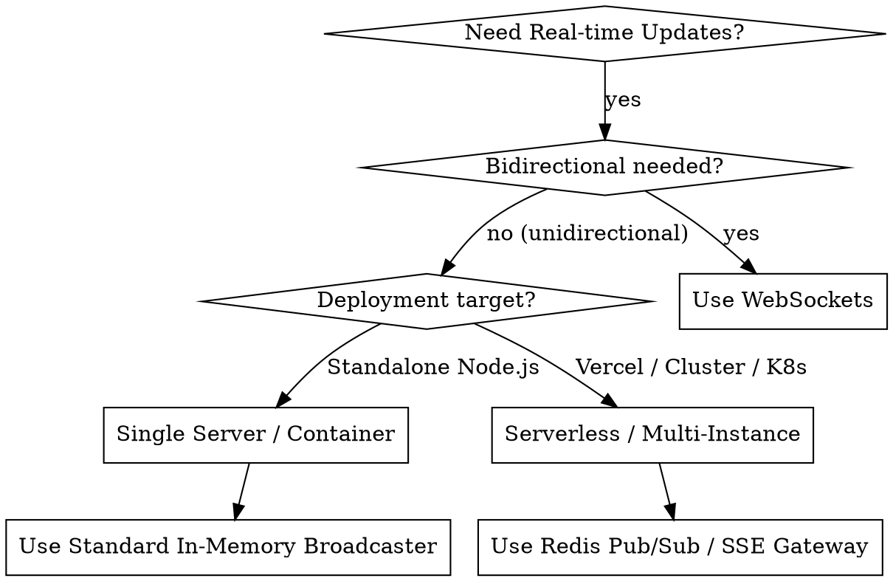

# Server-Sent Events (SSE) in Next.js

## Overview

Server-Sent Events (SSE) is a lightweight, standard HTTP streaming protocol (W3C / WHATWG) for unidirectional server-to-client real-time communication. In Next.js App Router, SSE is implemented using web standard `ReadableStream` within Route Handlers (`app/api/.../route.ts`).

**Core principle:** SSE is plain HTTP text with `text/event-stream` MIME type over long-lived HTTP/1.1 or HTTP/2 connections. Keep route handlers stateless or backed by a pub/sub layer, disable proxy buffering via headers, and emit periodic heartbeat comments to keep intermediate gateways alive.

## When to Use

- Live notification feeds, activity logs, or status dashboards (e.g. system health, CI/CD pipelines, order tracking)
- Real-time stock tickers, sports scores, or financial market ticks
- AI chat streaming and token generation (unless using full Vercel AI SDK wrappers)
- Background job progress bars and long-running task status updates
- Unidirectional server-to-client updates where WebSockets add unnecessary protocol and infrastructure overhead

## When NOT to Use

- Bidirectional real-time messaging (e.g. collaborative whiteboards, multiplayer games, chat typing indicators) — use WebSockets (`ws`, Socket.io) or WebRTC
- Binary streaming at high frequency (video/audio frames) — use WebRTC or chunked media endpoints
- Ephemeral short-lived updates where simple polling or HTTP caching is sufficient
- Environments with rigid 10s-30s gateway execution caps where background webhook queues (e.g. Inngest) are better suited

## Comparison Matrix

| Feature | Server-Sent Events (SSE) | WebSockets | HTTP Long Polling |
|---------|--------------------------|------------|-------------------|
| **Direction** | Server → Client (1-way) | Bidirectional (2-way) | Server → Client (1-way simulated) |
| **Protocol** | Standard HTTP/1.1 or HTTP/2 | `ws://` / `wss://` (TCP upgrade) | Standard HTTP request cycles |
| **Browser Support** | Native `EventSource` (All modern) | Native `WebSocket` (All modern) | Standard `fetch` / `xhr` |
| **Reconnection** | Built-in native auto-reconnect | Custom implementation required | Native new request loop |
| **HTTP/2 Multiplexing** | Yes (shares single TCP connection) | No (separate TCP socket) | Yes |
| **Proxy / Firewall Friendliness** | High (standard HTTP port 80/443) | Medium (requires proxy upgrade support) | High |
| **Overhead** | Very low (plain text frames) | Low (binary framing) | High (repeated request headers) |

---

## Quick Start (App Router)

### 1. Server Route Handler

```typescript
// app/api/sse/route.ts
export const dynamic = "force-dynamic";
export const runtime = "nodejs"; // or "edge"

export async function GET(request: Request) {
  const encoder = new TextEncoder();

  const stream = new ReadableStream({
    start(controller) {
      // 1. Initial connection payload
      controller.enqueue(encoder.encode(": connected\n\n"));

      // 2. Periodic heartbeat (prevents proxy timeouts)
      const heartbeatTimer = setInterval(() => {
        try {
          controller.enqueue(encoder.encode(": ping\n\n"));
        } catch {
          clearInterval(heartbeatTimer);
        }
      }, 15_000);

      // 3. Emit sample event
      const eventTimer = setInterval(() => {
        try {
          const payload = JSON.stringify({ time: new Date().toISOString() });
          controller.enqueue(
            encoder.encode(`event: timestamp\ndata: ${payload}\n\n`)
          );
        } catch {
          clearInterval(eventTimer);
        }
      }, 3_000);

      // 4. Teardown on client abort
      request.signal.addEventListener("abort", () => {
        clearInterval(heartbeatTimer);
        clearInterval(eventTimer);
        try {
          controller.close();
        } catch {
          // Controller may already be closed
        }
      });
    },
  });

  return new Response(stream, {
    headers: {
      "Content-Type": "text/event-stream",
      "Cache-Control": "no-cache, no-transform",
      Connection: "keep-alive",
      "X-Accel-Buffering": "no", // Disables NGINX / Cloudflare buffering
    },
  });
}
```

### 2. Client React Hook

```typescript
// hooks/use-sse.ts
"use client";

import { useEffect, useState } from "react";

export function useSSE<T>(url: string, eventName = "message") {
  const [data, setData] = useState<T | null>(null);
  const [status, setStatus] = useState<"connecting" | "open" | "closed">("connecting");

  useEffect(() => {
    const es = new EventSource(url);
    setStatus("connecting");

    es.onopen = () => setStatus("open");
    es.onerror = () => setStatus("closed");

    const handleEvent = (event: MessageEvent) => {
      try {
        setData(JSON.parse(event.data));
      } catch {
        setData(event.data as unknown as T);
      }
    };

    if (eventName === "message") {
      es.onmessage = handleEvent;
    } else {
      es.addEventListener(eventName, handleEvent);
    }

    return () => {
      es.close();
      setStatus("closed");
    };
  }, [url, eventName]);

  return { data, status };
}
```

---

## Wire Protocol Reference

Every SSE frame consists of UTF-8 text ending with two consecutive newlines (`\n\n`).

| Field | Syntax | Description |
|-------|--------|-------------|
| **`data`** | `data: <content>\n` | The message payload. Multiline data uses repeated `data:` prefixes. |
| **`event`** | `event: <name>\n` | Custom event name. Triggers `es.addEventListener('<name>')` on client. Defaults to `'message'`. |
| **`id`** | `id: <value>\n` | Sets client's `Last-Event-ID`. Browser transmits this in header on auto-reconnect. |
| **`retry`** | `retry: <ms>\n` | Configures client reconnection interval (in milliseconds). |
| **Comment** | `: <text>\n` | Ignored by client parser. Used for keep-alive heartbeats and initial ping. |

```text
: initial connection ping

event: order-update
id: evt-10492
retry: 5000
data: {"orderId":"ord_992","status":"SHIPPED"}

```

---

## Architecture Decision Guide



---

## Common Pitfalls & Solutions

| Symptom / Error | Root Cause | Solution |
|-----------------|------------|----------|
| **Stream buffers until connection closes** | Intermediate proxy (NGINX, Cloudflare, corporate proxy) buffering chunks | Add headers: `Cache-Control: no-cache, no-transform` and `X-Accel-Buffering: no`. |
| **Connection drops every 30–60s** | Gateway/load balancer idle timeout disconnects inactive socket | Send heartbeat comments (`: ping\n\n`) every 15–25 seconds. |
| **Next.js static optimization freezes route** | Route statically generated or cached at build time | Add `export const dynamic = 'force-dynamic'` to the route file. |
| **Max 6 concurrent streams per domain** | HTTP/1.1 browser domain connection limit exhausted | Serve over HTTP/2 (HTTPS) or use domain sharding / consolidated SSE topic streams. |
| **`EventSource` cannot send `Authorization` header** | W3C `EventSource` standard does not support custom headers | Use cookie authentication, query token exchange, or `@microsoft/fetch-event-source`. |
| **Memory leak on server** | Controllers not pruned when clients disconnect | Listen to `request.signal.addEventListener('abort', ...)` and clean up subscriptions. |

---

## Detailed Reference Guides

- [Route Handlers & Engine Reference](route-handlers.md) — Comprehensive Next.js App Router streaming, headers, heartbeats, wire framing, and Edge vs Node runtime.
- [Client Consumption & React Hooks](client-consumption.md) — Native `EventSource`, `fetch-event-source`, custom hooks, reconnection exponential backoff, and Zustand state integration.
- [Architecture & Multi-Instance Scaling](architecture-and-scaling.md) — In-memory singleton vs Redis Pub/Sub, horizontal scaling, HTTP/2 multiplexing, and serverless duration constraints.
- [Authentication & Security](auth-and-security.md) — HttpOnly cookies, token exchange ticket patterns, CORS, CSRF, and connection rate limiting.
- [Testing & Debugging](testing-and-debugging.md) — Vitest unit & integration testing, mocking `ReadableStream` & `EventSource`, curl recipes, and Chrome DevTools stream inspection.

