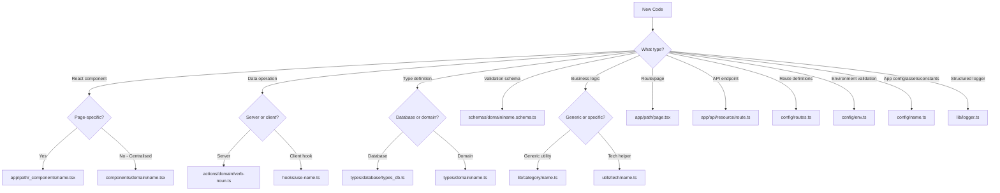
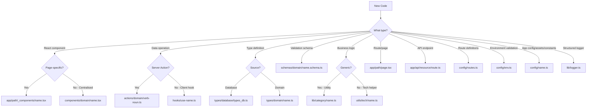
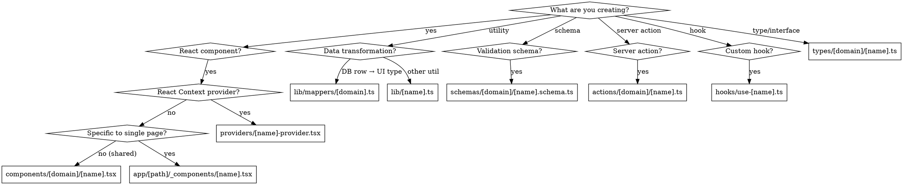

# Structuring Next.js Projects

## Overview

**Domain-first organization with strict conventions:** One export per file, absolute imports only, no barrel exports, kebab-case naming. Each concern (types, actions, components, schemas) lives in its own top-level folder with domain subfolders. Folders like `enums/` or `enum/` are also permitted for enums.

**Core principle:** Predictable structure beats convenience. Explicit imports beat clever re-exports.

## When to Use

Use this skill when:
- Creating new files in a Next.js App Router project
- Deciding where to place types, actions, components, or schemas
- Structuring imports and exports
- Organizing by feature/domain
- Setting up test structure
- Migrating from Pages Router or unstructured projects

**Prerequisites:** Project uses Next.js App Router (not Pages Router), TypeScript with strict mode enabled (`"strict": true` in tsconfig.json), Biome by default for linting and formatting (`biome.json`), and has `@/*` path alias configured.

**Related skills:**
- `centralised-routes` - Routes must be centralised under a `./config` folder (e.g., `config/routes.ts`). See `centralised-routes` skill for full details.
- `typescript-environment-variables` - Environment variables and validation must be centralised under `./config` (e.g., `config/env.ts`). See `typescript-environment-variables` skill for full details.
- `logtape-nextjs` - Structured telemetry and logging setup (`lib/logger.ts`). See `logtape-nextjs` skill for full details.
- `migrating-eslint-prettier-to-biome` - Biome is used by default for linting and formatting (replaces ESLint/Prettier). See `migrating-eslint-prettier-to-biome` skill for full details.

## Critical Rules

### NO BARREL EXPORTS

```typescript
// ❌ NEVER create index.ts files
// types/comment/index.ts
export * from './comment';
export * from './comment-with-author';

// ✅ ALWAYS import directly
import type { Comment } from '@/types/comment/comment';
import type { CommentWithAuthor } from '@/types/comment/comment-with-author';
```

**Why:** Tree-shaking, explicit dependencies, monorepo compatibility, no circular dependency issues.

### ABSOLUTE IMPORTS ONLY

```typescript
// ❌ NEVER use relative imports (even within same folder)
import type { Comment } from './comment';
import { getComments } from '../actions/get-comments';

// ✅ ALWAYS use @/* alias
import type { Comment } from '@/types/comment/comment';
import { getComments } from '@/actions/comment/get-comments';
```

**Why:** Consistency, refactoring safety, clear boundaries.

### DOMAIN ORGANIZATION REQUIRED

```
// ❌ NEVER flat structure
types/
  comment.ts
  comment-with-author.ts
  song.ts
  album.ts

// ✅ ALWAYS domain subfolders
types/
  comment/
    comment.ts
    comment-with-author.ts
  song/
    song.ts
    song-with-album.ts
  album/
    album.ts
    album-with-artists.ts
```

**Why:** Scales to large codebases, clear ownership, easier navigation.

### TYPESCRIPT STRICT MODE REQUIRED

```typescript
// ❌ NEVER use `any` type
export async function getComments(songId: any): any { ... }
export function processData(data: any) { ... }

// ✅ ALWAYS use explicit types
export async function getComments(songId: string): Promise<Comment[]> { ... }
export function processData(data: unknown): ProcessedData { ... }
```

**Why:** Type safety, catch errors at compile time, better IDE support. Project MUST have `"strict": true` in tsconfig.json.

### ONE EXPORT PER FILE

Each file for **actions, types, interfaces, enums, components, pages, and hooks** must only have **one export**.
- **Internal helpers allowed:** Multiple functions, types, interfaces, or constants can live in the same file as long as they are NOT exported.
- **Allowed exceptions:** Infrastructure or utility files (e.g., `lib/logger.ts`, client initializers, or configuration registries) are allowed to have multiple exports.

```typescript
// ❌ NEVER export multiple items from one file
// types/comment/comment.ts
export interface Comment { ... }
export interface CommentWithAuthor { ... }

// ✅ Multiple internal functions/types are allowed as long as they are NOT exported
// actions/comment/get-comments.ts
type QueryFilter = { songId: string };      // Internal helper type (unexported)
function validateFilter(f: unknown) { ... } // Internal helper function (unexported)

export default async function getComments() { ... } // Single export
```

### REQUIRED ROOT APP FILES & DYNAMIC ROUTE NOT-FOUND

`not-found.tsx`, `loading.tsx`, and `error.tsx` **must exist** in the root of the `./app` directory.

- **Root requirements:** Every project must include `app/not-found.tsx`, `app/loading.tsx`, and `app/error.tsx` alongside `app/layout.tsx` and `app/page.tsx` for consistent global error boundaries, suspense loading, and 404 handling.
- **Dynamic routes:** For dynamic routes (e.g., `app/songs/[id]/`), include a route-level `not-found.tsx` to handle when the specific entity or record does not exist (triggered via `notFound()` from `next/navigation`). This provides clear contextual feedback that the specific item was not found.

## File Placement Decision Tree



## Quick Reference



### Directory Structure

| Folder | Purpose | Example |
|--------|---------|---------|
| `actions/[domain]/` | Server Actions only | `actions/comment/get-comments.ts` |
| `types/[domain]/` | TypeScript types/interfaces | `types/comment/comment-with-author.ts` |
| `enums/` or `enum/` | TypeScript enums (allowed folder) | `enums/car/car-status.ts`, `enum/role.ts` |
| `components/[domain]/` | Shared React components (centralised) | `components/comment/comment-list.tsx` |
| `app/path/_components/` | Page-specific components ONLY | `app/songs/[id]/_components/song-details.tsx` |
| `schemas/[domain]/` | Zod validation schemas | `schemas/comment/create-comment.schema.ts` |
| `config/` | Centralised routes, env, assets, constants & config | `config/routes.ts`, `config/env.ts`, `config/assets.ts` |
| `hooks/` | Custom React hooks (flat) | `hooks/use-player.ts` |
| `lib/` | Business logic, utilities, logging | `lib/mappers/comment.ts`, `lib/logger.ts` |
| `utils/` | Infrastructure clients | `utils/supabase/server.ts` |
| `providers/` | React Context providers | `providers/modal-provider.tsx` |
| `app/` | Routing + special files ONLY (must include root `not-found.tsx`, `loading.tsx`, `error.tsx`) | `app/songs/[id]/page.tsx`, `app/not-found.tsx` |
| `__tests__/[category]/` | Tests (always at project root, mirrors structure) | `__tests__/actions/getComments.test.ts` |

### File Naming

| Type | Pattern | Example |
|------|---------|---------|
| Components | kebab-case → PascalCase export | `comment-form.tsx` → `CommentForm` |
| Actions | kebab-case, verb-noun | `get-comments.ts`, `delete-comment.ts` |
| Types | kebab-case, descriptive | `comment-with-author.ts`, `song.ts` |
| Enums | kebab-case, descriptive | `car-status.ts`, `role.ts` |
| Schemas | kebab-case + `.schema.ts` | `create-comment.schema.ts` |
| Hooks | kebab-case, `use-` prefix | `use-favourite.ts` |
| Tests | camelCase + `.test.ts` | `getComments.test.ts` |

### Exports Per File

| File Type | Export Pattern | Example |
|-----------|----------------|---------|
| Server Action | Single default export | `export default getComments;` |
| Component | Single default or named export | `export default CommentList;` or `export const CommentList` |
| Page | Single default export | `export default function SongPage()` |
| Type / Interface | Single named export | `export type Comment = {...}` or `export interface Comment {...}` |
| Enum | Single named export | `export enum CarStatus { ... }` |
| Schema | Named export (schema + type) | `export const createCommentSchema = z.object(...)` |
| Hook | Single default export | `export default usePlayer;` |
| Utility / Logger | Named export(s) (allowed exception) | `export function formatDuration()`, `export function getLogger()` |

> **Rule:** Each file for actions, types, interfaces, enums, components, pages, and hooks must only have **one export**. Multiple internal functions, types, or helpers can exist in the file as long as they are NOT exported. Infrastructure/utility files (like loggers) are allowed to have multiple exports.

### Import Order

```typescript
// 1. React/Next.js
import { useState } from 'react';
import { revalidatePath } from 'next/cache';

// 2. External packages
import { z } from 'zod';

// 3. Local - order: actions → hooks → types → components
import { getComments } from '@/actions/comment/get-comments';
import usePlayer from '@/hooks/use-player';
import type { CommentWithAuthor } from '@/types/comment/comment-with-author';
import { CommentList } from '@/components/comment/comment-list';
```

### Client vs Server Components

```typescript
// ❌ Server component with client features (will fail)
export default function CommentForm() {
  const [value, setValue] = useState(''); // Error: useState in server component
}

// ✅ Client component with directive
'use client';

export default function CommentForm() {
  const [value, setValue] = useState(''); // Works
}

// ✅ Server component (default)
export default async function CommentList() {
  const comments = await getComments(); // Can await directly
}
```

**Rule:** Add `"use client"` if component uses: state, effects, event handlers, browser APIs, or context.

### Server Actions Pattern

```typescript
// ✅ Required pattern
'use server';

import { z } from 'zod';
import { revalidatePath } from 'next/cache';

const schema = z.object({ ... });

export default async function createComment(data: unknown) {
  // 1. Validate
  const validated = schema.safeParse(data);
  if (!validated.success) return { error: 'Invalid' };

  // 2. Execute
  const result = await db.insert(...);
  
  // 3. Revalidate
  revalidatePath('/songs/[id]');
  
  return result;
}
```

**Note:** Server actions are OPTIONAL. If project doesn't use them, skip this pattern. Never force server action usage.

## Detailed References

See these files for comprehensive details:

- **directory-structure.md** - Complete folder hierarchy, when to use each, cross-domain shared code
- **file-conventions.md** - Naming rules, export patterns, import rules, edge cases
- **examples.md** - Complete working examples of feature scaffolding

## Common Mistakes

| Mistake | Why It's Wrong | Fix |
|---------|----------------|-----|
| Creating `index.ts` barrel exports | Breaks tree-shaking, adds indirection | Import directly from files |
| Relative imports (`./comment`) | Inconsistent, breaks on refactor | Use `@/types/comment/comment` |
| Flat structure (`types/comment.ts`) | Doesn't scale | Use `types/comment/comment.ts` |
| Multiple exports per file | Unclear ownership | One export per file |
| PascalCase file names | Convention mismatch | Use kebab-case |
| Business logic in `app/` folder | Routing folder, not logic | Move to `lib/` or `utils/` |
| Shared components in `app/` | Violates separation, hard to reuse | Only page-specific in `_components/`; centralise shared in `./components` |
| Wrong test naming (kebab-case) | Convention violation | Use camelCase: `getComments.test.ts` |
| Nesting `__tests__/` in subdirectories | Inconsistent test discovery and structure | Always place `__tests__/` at project root |
| Hardcoding/scattering raw route strings | Hard to maintain and refactor | Centralise routes under `./config` (e.g. `config/routes.ts`) |
| Scattering env vars or putting `env.ts` in `lib/` | Inconsistent validation and configuration | Centralise in `./config` (e.g. `config/env.ts`) |
| Hardcoding asset paths or scattering app constants | Difficult maintenance and asset updates | Centralise in `./config` (e.g. `config/assets.ts`, `config/constants.ts`) |
| Scattering raw `console.log` calls | Unstructured, noisy terminal output | Use structured logger in `lib/logger.ts` (see `logtape-nextjs`) |
| Forgetting `"use client"` | Server component can't use hooks | Add directive at top |
| Absolute imports without alias | Breaks on path changes | Always use `@/*` |
| Missing root `not-found.tsx`, `loading.tsx`, or `error.tsx` | Inconsistent fallback UI, uncaught errors, or missing loading states | Root of `./app` MUST contain `not-found.tsx`, `loading.tsx`, and `error.tsx` |
| Omitting `not-found.tsx` in dynamic routes | Generic or unhelpful 404 when specific resource is not found | Add route-level `not-found.tsx` in dynamic route (e.g. `app/songs/[id]/not-found.tsx`) |

## Decision Flowchart



## Real-World Impact

**Before structure:**
- Agent created 12 `index.ts` barrel files
- Mixed relative/absolute imports
- Flat type organization (80+ files in one folder)
- Components in `app/` folder

**After structure:**
- Zero barrel exports
- 100% absolute imports
- Clear domain boundaries
- Navigable with jump-to-definition
