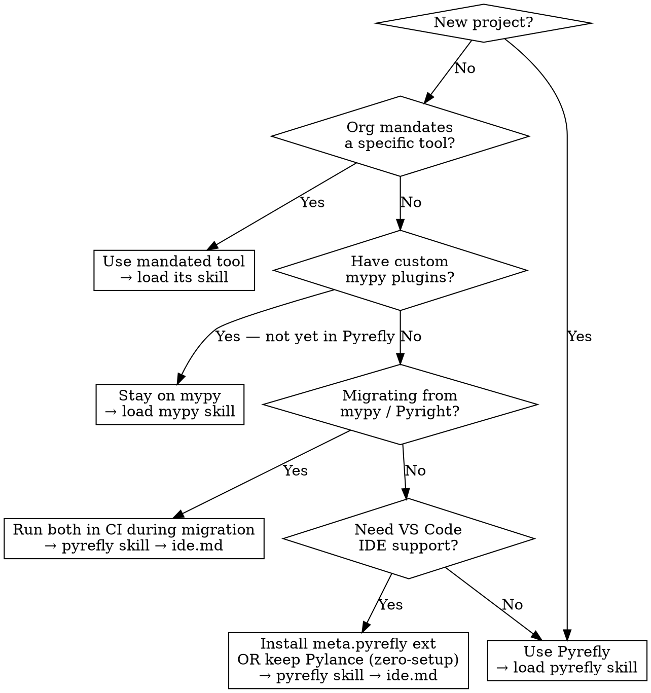

# Python Typing Ecosystem

Navigator skill — explains how the four sub-skills relate and routes to the right one.

## Overview

Three tools: **mypy** (Python), **Pyright/Pylance** (TypeScript, powers VS Code), **Pyrefly** (Rust, Meta's all-in-one).

**Pyrefly = mypy + Pyright in one tool** — static CLI checker (replaces mypy) and language server (replaces Pylance). One config, no plugins for Pydantic/Django/attrs.

> Pyrefly is NOT a reimplementation — diagnostics will differ.

## Tool Comparison

| Dimension | mypy | Pyright | Pyrefly |
|---|---|---|---|
| Language | Python | TypeScript | Rust |
| Speed (pandas codebase) | 18.3s | 8.8s | 1.5s |
| Spec conformance | 74.8% | 93.4% | 96.9% |
| Language server | No | Yes (Pylance) | Yes |
| Pydantic support | Plugin required | Partial | Built-in |
| Auto-annotate | No | No | `pyrefly infer` |

## Decision Flowchart

## Strict Mode Warning

`strict = true` (mypy), `typeCheckingMode = "strict"` (Pyright), `preset = "strict"` (Pyrefly) — each enables a **different bundle of checks**. Never assume equivalence.

## House Style Divergence

Sub-skills were written against different repos:
- `pyrefly` skill (python-rag-service) → `Optional[int]` from `typing`
- `mypy` / `pydantic-v2` skills → PEP 604 `int | None`

Follow the style of the file being edited — do not copy annotations across skills.

## Cross-Skill Navigation

| Task | Load skill |
|---|---|
| Configure Pyrefly | `pyrefly` |
| Configure mypy | `mypy` |
| Configure Pyright / Pylance | `pyright` |
| Write Pydantic models | `pydantic-v2` |
| mypy + Pydantic plugin | `mypy` → `pydantic-plugin.md` |
| Migrate mypy → Pyrefly | `pyrefly` → `ide.md` |
| Migrate Pyright → Pyrefly | `pyrefly` → `ide.md` |
| Choose which checker to use | **THIS skill** |
| Understand annotation patterns | `mypy` → `types.md` or `pyrefly` → `types.md` |
| Fix type errors | `mypy`/`pyrefly` → `error-codes.md` or `pyright` → `common-errors.md` |

## Key Caveats

**Migration is incremental.** `pyrefly init` converts `mypy.ini` / `pyrightconfig.json` into a Pyrefly config without deleting the originals, so both checkers keep working in CI. The VS Code extension's `auto` mode also reads those files in-memory if no Pyrefly config exists. Drop the old tool once the team accepts diagnostic differences.

**Pydantic integration:** Pyrefly — built-in (v2 only; Pydantic v1 not supported); mypy — `plugins = ["pydantic.mypy"]` (see `mypy` skill); Pyright — partial via `dataclass_transform`. Load `pydantic-v2` skill for model authoring regardless of checker.
