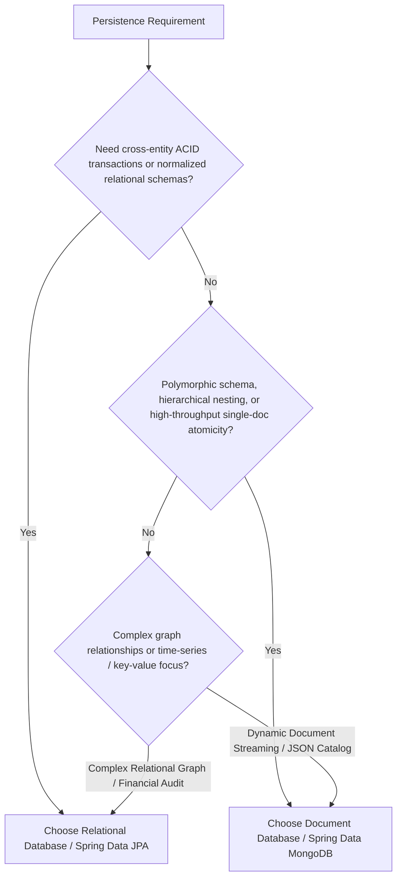

# Spring Boot Database Access Architecture

## Overview

High-throughput, resilient persistence layers in Spring Boot (3.x and 4.0 / Spring Data 2023+ and 2024+) require strict separation of concerns, defensive entity and document design, predictable query boundaries, automated schema evolution, and real-engine container testing.

This skill governs best practices across two primary database paradigms:
1. **Relational Database Management Systems (RDBMS)**: Built on Jakarta Persistence (`jakarta.persistence.*`), Hibernate 6/7, and Spring Data JPA. Focuses on strict relational integrity, ACID consistency, batching, and eliminating N+1 fetch degradation.
2. **Document Databases (NoSQL)**: Built on Spring Data MongoDB, BSON mapping, and MongoDB Java Driver. Focuses on document atomicity, hierarchical data modeling (embedding vs. referencing), aggregate pipelines, and the Equality-Sort-Range (ESR) indexing paradigm.

---

## Database Selection Decision Framework

Choose the database paradigm based on data relations, consistency invariants, access patterns, and transactional boundaries:

### Paradigm Decision Matrix

| Dimension | Relational (JPA / PostgreSQL / MySQL) | Document (MongoDB) |
|---|---|---|
| **Data Integrity** | Strict foreign keys, unique constraints, referential integrity enforced by DB. | Application-level validation, document validation rules, eventual consistency across collections. |
| **Transaction Scope** | Multi-table ACID transactions, distributed 2PC/XA when necessary. | Single-document ACID default; multi-document transactions possible but require replica sets and have higher latency. |
| **Relationships** | Joins (`JOIN FETCH`, `@ManyToOne`, `@OneToMany`), Normalized (3NF/BCNF). | Embedded subdocuments for 1:1 and 1:Few; Referenced IDs for 1:Many (unbounded) and Many:Many. |
| **Schema Evolution** | Structured, versioned migration scripts via Flyway. | Flexible schema, progressive field evolution with migration converters. |
| **Query Pattern** | Set-based relational algebra, JPQL, Criteria API, Window Functions. | JSON-based query filters, Aggregation Pipelines (`$match`, `$group`, `$lookup`, `$project`). |
| **Primary Engine Scale** | Scale up (vertical) + Read replicas + Connection pooling (HikariCP). | Scale out (horizontal sharding) + Replica set secondary reads. |

---

## Quick Reference

| Requirement / Task | Recommended Pattern | Detailed Guide |
|---|---|---|
| JPA Entity Mapping & Auditing | `GenerationType.SEQUENCE`, `@Version`, Business Key `equals()`/`hashCode()` | [references/jpa-and-relational.md](references/jpa-and-relational.md) |
| Solving JPA N+1 Query Problems | `JOIN FETCH`, `@EntityGraph`, or Record DTO Projections | [references/jpa-and-relational.md](references/jpa-and-relational.md) |
| Transaction & Connection Tuning | `@Transactional(readOnly = true)`, HikariCP pool sizing, JDBC batching | [references/jpa-and-relational.md](references/jpa-and-relational.md) |
| MongoDB Document Modeling | Embedded objects for 1:Few, `@DocumentReference` / IDs for unbounded, 16MB cap | [references/mongodb-and-document.md](references/mongodb-and-document.md) |
| MongoDB Indexing & Aggregation | Equality-Sort-Range (ESR) rule, `@CompoundIndex`, `MongoTemplate` Aggregations | [references/mongodb-and-document.md](references/mongodb-and-document.md) |
| Relational Schema Migration | Flyway `V__` scripts, `ddl-auto: validate`, Expand & Contract zero-downtime | [references/schema-migrations-flyway.md](references/schema-migrations-flyway.md) |
| Database Slice & Integration Tests | Testcontainers, `@ServiceConnection`, `@DataJpaTest`, `@DataMongoTest` | [references/database-testing-guide.md](references/database-testing-guide.md) |
| Modern Mocking in Tests (SB 3.4+) | `@MockitoBean` and `@MockitoSpyBean` replacing legacy `@MockBean` | [references/database-testing-guide.md](references/database-testing-guide.md) |

---

## Golden Rules & Core Invariants

### 1. Relational & JPA Invariants
- **Never use `GenerationType.IDENTITY` for high-volume entities**: `IDENTITY` forces immediate insert execution upon `persist()`, disabling Hibernate JDBC batching. Use `GenerationType.SEQUENCE` with an appropriate `allocationSize` (e.g., 50).
- **Enforce Business Key / Class Check in `equals()` and `hashCode()`**: Never rely on database-generated surrogate primary keys (`id`) for `equals()` because unsaved transient entities share a `null` ID. Use non-null business identifiers (UUID/slug) or consistent entity identity checks (`getClass() != Hibernate.getClass(o)`).
- **Prohibit `FetchType.EAGER` on relationships**: EAGER loading is impossible to disable dynamically at query time and causes Cartesian explosion or N+1 queries across queries. All `@OneToMany`, `@ManyToOne`, `@ManyToMany`, and `@OneToOne` associations must be `FetchType.LAZY`. Fetch explicitly via `JOIN FETCH` or `@EntityGraph`.
- **Default to `@Transactional(readOnly = true)` at Class Level**: Class-level read-only transactions configure Hibernate session flush mode to `FlushMode.MANUAL`, avoid snapshot dirty-checking memory overhead, and route queries to read-replicas when configured. Mark mutating methods explicitly with `@Transactional`.
- **Disable Open EntityManager in View (OSIV)**: Set `spring.jpa.open-in-view=false`. OSIV holds database connections open through web filter/view rendering layers, causing connection pool exhaustion under load.

### 2. MongoDB & Document Invariants
- **Adhere to the Equality-Sort-Range (ESR) Indexing Rule**: Order compound index keys strictly by:
  1. **E**quality: Fields queried with exact matching (`key: value`).
  2. **S**ort: Fields defining ordering (`sort({ date: -1 })`).
  3. **R**ange: Fields queried with range operators (`$gt`, `$lt`, `$in`).
- **Respect the 16MB BSON Document Boundary**: Never embed unbounded collections (e.g., order events, log streams, comment threads) inside a single document. Keep growing 1:Many relationships referenced via separate collections.
- **Differentiate Embedded vs Referenced Modeling**:
  - **Embed**: Data that is accessed together, has a bounded lifecycle owned exclusively by the root document, and does not grow infinitely (e.g., Address inside Customer, LineItems inside Order).
  - **Reference**: Data accessed independently, shared across multiple entities, or having an unbounded growth pattern (e.g., Audit logs, User accounts in Organization).
- **Avoid Overusing Multi-Document Transactions**: Document databases are optimized for single-document atomicity. Multi-document transactions require replica set coordination and degrade throughput. Model aggregates so mutations are contained within a single document wherever feasible.

### 3. Schema Evolution Invariants
- **Never rely on `spring.jpa.hibernate.ddl-auto=update` in Production**: Hibernate auto-DDL cannot rename columns safely, cannot handle zero-downtime deprecations, and risks data destruction. Set `ddl-auto: validate` (or `none`) and drive all schema changes via Flyway.
- **Implement the Expand and Contract Pattern**: Never drop columns, rename fields, or change constraints in a single release.
  1. *Expand*: Add new nullable column/field; write dual writes or forward-compatible logic.
  2. *Migrate*: Backfill existing data asynchronously.
  3. *Contract*: Point reads to new field, stop writing to old field, and drop old structure in a subsequent deployment.
- **Disable Flyway Clean in Production**: Set `spring.flyway.clean-disabled=true` to prevent catastrophic accidental drops.

### 4. Database Testing Invariants
- **Prefer Testcontainers over H2 / Embedded DBs for Persistence Tests**: H2 and Fongo/embedded-mongo do not replicate PostgreSQL/MySQL dialect specifics, JSONB operations, sequences, locking semantics, or MongoDB aggregation operators. Use official database Docker containers managed via Testcontainers.
- **Use `@ServiceConnection` for Dynamic Properties**: Replace verbose `@DynamicPropertySource` blocks with Spring Boot 3.1+ `@Container @ServiceConnection` to automatically wire connection strings and credentials.
- **Adopt `@MockitoBean` for Spring Boot 3.4+ / 4.0**: Avoid deprecated `@MockBean` / `@SpyBean`. Use `@MockitoBean` and `@MockitoSpyBean` to mock downstream dependencies in repository slice tests without reloading application context.

---

## Common Pitfalls & Rationalization Table

| Developer Rationalization | Engineering Reality | Mandatory Correct Practice |
|---|---|---|
| *"Using `FetchType.EAGER` is convenient because I always need child items in the response."* | EAGER loading triggers queries for every entity loaded, creating uncontrollable N+1 cascades and preventing pagination optimization. | Set all associations to `FetchType.LAZY`. Use JPQL `JOIN FETCH`, `@EntityGraph`, or Record DTO projections to load specific relationship graphs per use case. |
| *"H2 in-memory DB is fast and sufficient for JPA unit tests."* | H2 uses different SQL dialect parsing, lacks native JSONB/Array/Sequence support, ignores database-specific lock behaviors, and causes false confidence. | Use Testcontainers with `@ServiceConnection` against production-identical database engines (e.g., `PostgreSQLContainer`, `MongoDBContainer`). |
| *"I can just run `repo.findAll()` and filter results in a Java Stream."* | Pulls the entire database table into JVM heap, saturating network I/O, overwhelming memory, and causing `OutOfMemoryError` in production. | Write filtered JPQL / MongoDB queries with indexed predicates, limit results via `Pageable`, and use keyset pagination for large offsets. |
| *"I'll embed all historical audit records in the parent MongoDB document."* | Documents quickly exceed the 16MB BSON size limit and cause severe memory fragmentation and write contention on the parent document. | Create a dedicated `audit_events` collection with references to the parent document ID and an index on `parentId, timestamp`. |
| *"I'll just add `@Transactional` to private methods or call them internally from the same class."* | Spring AOP proxies intercept calls from external beans only. Self-invocation (`this.doWork()`) bypasses proxy interception, silently disabling transactions and rollbacks. | Place transactional boundaries on `public` service methods called from external beans, or inject the self-bean / `TransactionTemplate`. |
| *"I don't need Flyway for dev; `ddl-auto=update` is faster."* | Schema drift between developer machines, CI, and staging environments makes production migrations unpredictable and error-prone. | Use Flyway migration scripts from day one. Run migrations automatically on boot against ephemeral test containers. |
| *"I don't need compound index ordering; MongoDB will figure it out."* | MongoDB index scans require exact prefix ordering. Placing a range filter before an equality filter forces in-memory index filtering and degrades query latency. | Strictly order compound index fields using the **Equality-Sort-Range (ESR)** rule. |

---

## Red Flags Checklist

Review your database implementation against these red flags. If any item is present, remediate immediately before deploying to production:

- [ ] Any JPA entity association with `FetchType.EAGER` or default `@ManyToOne`/`@OneToOne` without explicit `fetch = FetchType.LAZY`.
- [ ] Primary key generation using `GenerationType.IDENTITY` while bulk inserting entities with Spring Data JPA.
- [ ] `equals()` or `hashCode()` in JPA entities calling `getId()` on transient entities or omitting proper type comparison.
- [ ] `spring.jpa.open-in-view` left enabled (`true` or missing).
- [ ] `spring.jpa.hibernate.ddl-auto` set to `create`, `create-drop`, or `update` in production configurations.
- [ ] Unbounded array fields in MongoDB documents that grow indefinitely over time.
- [ ] MongoDB queries lacking indexes, visible as `COLLSCAN` in `.explain("executionStats")`.
- [ ] Tests using deprecated `@MockBean` / `@SpyBean` instead of Spring Boot 3.4+ / 4.0 `@MockitoBean` / `@MockitoSpyBean`.
- [ ] Database integration tests running against in-memory H2 instead of Testcontainers for production DB dialects.
- [ ] Mutating database operations inside methods annotated with `@Transactional(readOnly = true)`.
- [ ] Missing `@Version` optimistic locking field on concurrent high-contention entities or documents.

