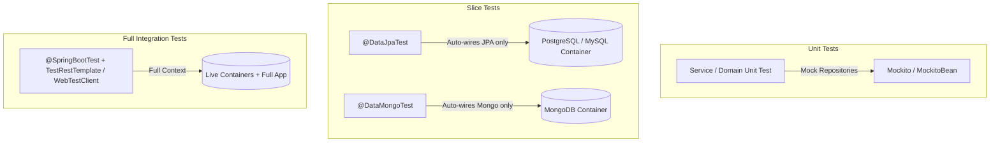

# Spring Boot Database Testing Reference Guide

An authoritative, production-grade guide for testing relational and document persistence layers with **Spring Boot 3.1+**, **3.4.x**, and **4.0** using **Testcontainers**, **@ServiceConnection**, slice testing annotations (`@DataJpaTest`, `@DataMongoTest`), and modern Spring test framework utilities (including `@MockitoBean` / `@MockitoSpyBean`).

---

## Table of Contents
1. [Test Boundary Hierarchy & Testing Strategy](#1-test-boundary-hierarchy--testing-strategy)
   - [Unit vs Slice vs Integration Test Boundaries](#unit-vs-slice-vs-integration-test-boundaries)
   - [When to Use H2/Embedded vs Testcontainers](#when-to-use-h2embedded-vs-testcontainers)
2. [Modern Testcontainers Setup with `@ServiceConnection`](#2-modern-testcontainers-setup-with-serviceconnection)
   - [Spring Boot 3.1+ `@ServiceConnection` Mechanism](#spring-boot-31-serviceconnection-mechanism)
   - [`@ServiceConnection` vs Legacy `@DynamicPropertySource`](#serviceconnection-vs-legacy-dynamicpropertysource)
   - [PostgreSQL Container Configuration](#postgresql-container-configuration)
   - [MySQL Container Configuration](#mysql-container-configuration)
   - [MongoDB Container Configuration](#mongodb-container-configuration)
   - [Reusable Base Container Abstract Classes](#reusable-base-container-abstract-classes)
3. [Repository Slice Testing](#3-repository-slice-testing)
   - [JPA Slice Testing with `@DataJpaTest`](#jpa-slice-testing-with-datajpatest)
   - [MongoDB Slice Testing with `@DataMongoTest`](#mongodb-slice-testing-with-datamongotest)
   - [Customizing Auto-Configuration Filters](#customizing-auto-configuration-filters)
4. [Mocking & Beans: Spring Boot 3.4+ / 4.0 Migration](#4-mocking--beans-spring-boot-34--40-migration)
   - [Deprecation of `@MockBean` / `@SpyBean`](#deprecation-of-mockbean--spybean)
   - [Adopting `@MockitoBean` and `@MockitoSpyBean`](#adopting-mockitobean-and-mockitospybean)
5. [Test Data Fixtures & Seeding Strategies](#5-test-data-fixtures--seeding-strategies)
   - [SQL Script Initialization with `@Sql`](#sql-script-initialization-with-sql)
   - [State Management with `TestEntityManager`](#state-management-with-testentitymanager)
   - [Programmatic MongoDB Seeding & Fixtures](#programmatic-mongodb-seeding--fixtures)
6. [Transaction & Isolation Semantics Across RDBMS and NoSQL](#6-transaction--isolation-semantics-across-rdbms-and-nosql)
   - [`@DataJpaTest` Automatic Rollback Mechanics](#datajpatest-automatic-rollback-mechanics)
   - [`@DataMongoTest` Non-Transactional Cleanup Patterns](#datamongotest-non-transactional-cleanup-patterns)
   - [Flushing and Dirty Reads in Test Scenarios](#flushing-and-dirty-reads-in-test-scenarios)
7. [Comprehensive End-to-End Test Examples](#7-comprehensive-end-to-end-test-examples)
   - [Complete JPA / PostgreSQL Test Suite](#complete-jpa--postgresql-test-suite)
   - [Complete MongoDB Test Suite](#complete-mongodb-test-suite)

---

## 1. Test Boundary Hierarchy & Testing Strategy

### Unit vs Slice vs Integration Test Boundaries



| Layer                | Annotation                            | Context Scope                                             | Backing Datastore                  | Typical Execution Time | Purpose                                                                 |
| -------------------- | ------------------------------------- | --------------------------------------------------------- | ---------------------------------- | ---------------------- | ----------------------------------------------------------------------- |
| **Unit Test**        | `@ExtendWith(MockitoExtension.class)` | None (plain Java / JUnit 5)                               | None (Mocked repository)           | < 50ms                 | Pure business logic, validation, edge branch calculation.               |
| **Data JPA Slice**   | `@DataJpaTest`                        | Entities, Repositories, `EntityManager`, Flyway/Liquibase | Real RDBMS via Testcontainers      | 300ms - 1.5s           | Custom JPQL, `@Query`, specifications, native queries, entity mappings. |
| **Data Mongo Slice** | `@DataMongoTest`                      | Mongo Repositories, `MongoTemplate`, Converters           | Real MongoDB via Testcontainers    | 300ms - 1.5s           | Document aggregation pipelines, indices, custom converters.             |
| **Integration Test** | `@SpringBootTest`                     | Full Application Context, Controllers, Services           | Real Datastores via Testcontainers | 2s - 10s               | End-to-end transactional workflows, HTTP endpoints, security filters.   |

### When to Use H2/Embedded vs Testcontainers

> **Rule:** Never use in-memory H2/HSQLDB or Flapdoodle Embedded Mongo to test production code intended for PostgreSQL, MySQL, CockroachDB, or MongoDB replica sets.

- **In-Memory H2 Discrepancies:** H2 dialect differences hide subtle syntax issues in native SQL, JSON/JSONB operators (`->`, `@>`), window functions, enum types, full-text search, and lock escalation semantics (`FOR UPDATE SKIP LOCKED`).
- **Embedded Mongo Flapdoodle Discrepancies:** Deprecated in modern Spring Boot ecosystems; does not accurately reflect wiredTiger storage engine constraints, multi-document transactions, or vector search pipelines.
- **Testcontainers Advantage:** Tests run against the exact containerized image version deployed to production, ensuring 100% dialect, concurrency, and constraint fidelity.

---

## 2. Modern Testcontainers Setup with `@ServiceConnection`

### Spring Boot 3.1+ `@ServiceConnection` Mechanism

Starting in Spring Boot 3.1 (and refined in 3.4 / 4.0), `@ServiceConnection` eliminates boilerplate `@DynamicPropertySource` methods. Spring Boot inspects the container type (`PostgreSQLContainer`, `MySQLContainer`, `MongoDBContainer`) and automatically injects all necessary connection properties (`spring.datasource.url`, `spring.datasource.username`, `spring.data.mongodb.uri`, etc.) into the `Environment`.

### `@ServiceConnection` vs Legacy `@DynamicPropertySource`

#### Legacy Approach (Spring Boot < 3.1)
```java
// LEGACY: Verbose and prone to property naming typos
@Container
static PostgreSQLContainer<?> postgres = new PostgreSQLContainer<>("postgres:16-alpine");

@DynamicPropertySource
static void configureProperties(DynamicPropertyRegistry registry) {
    registry.add("spring.datasource.url", postgres::getJdbcUrl);
    registry.add("spring.datasource.username", postgres::getUsername);
    registry.add("spring.datasource.password", postgres::getPassword);
}
```

#### Modern Standard (Spring Boot 3.1, 3.4+, 4.0)
```java
// MODERN: Auto-configures all JDBC, R2DBC, or NoSQL connection properties
@Container
@ServiceConnection
static PostgreSQLContainer<?> postgres = new PostgreSQLContainer<>("postgres:16-alpine");
```

---

### PostgreSQL Container Configuration

```java
package com.example.testing.containers;

import org.springframework.boot.testcontainers.service.connection.ServiceConnection;
import org.testcontainers.containers.PostgreSQLContainer;
import org.testcontainers.junit.jupiter.Container;
import org.testcontainers.junit.jupiter.Testcontainers;
import org.testcontainers.utility.DockerImageName;

@Testcontainers
public abstract class AbstractPostgresContainerBaseTest {

    @Container
    @ServiceConnection
    protected static final PostgreSQLContainer<?> POSTGRES = 
            new PostgreSQLContainer<>(DockerImageName.parse("postgres:16-alpine"))
                    .withDatabaseName("testdb")
                    .withUsername("testuser")
                    .withPassword("testpass")
                    .withReuse(true); // Speeds up local test execution across runs
}
```

---

### MySQL Container Configuration

```java
package com.example.testing.containers;

import org.springframework.boot.testcontainers.service.connection.ServiceConnection;
import org.testcontainers.containers.MySQLContainer;
import org.testcontainers.junit.jupiter.Container;
import org.testcontainers.junit.jupiter.Testcontainers;
import org.testcontainers.utility.DockerImageName;

@Testcontainers
public abstract class AbstractMysqlContainerBaseTest {

    @Container
    @ServiceConnection
    protected static final MySQLContainer<?> MYSQL = 
            new MySQLContainer<>(DockerImageName.parse("mysql:8.4"))
                    .withDatabaseName("testdb")
                    .withUsername("testuser")
                    .withPassword("testpass")
                    .withReuse(true);
}
```

---

### MongoDB Container Configuration

```java
package com.example.testing.containers;

import org.springframework.boot.testcontainers.service.connection.ServiceConnection;
import org.testcontainers.containers.MongoDBContainer;
import org.testcontainers.junit.jupiter.Container;
import org.testcontainers.junit.jupiter.Testcontainers;
import org.testcontainers.utility.DockerImageName;

@Testcontainers
public abstract class AbstractMongoContainerBaseTest {

    @Container
    @ServiceConnection
    protected static final MongoDBContainer MONGO = 
            new MongoDBContainer(DockerImageName.parse("mongo:7.0"))
                    .withReuse(true);
}
```

---

### Reusable Base Container Abstract Classes

By defining single static container instances in abstract base classes, JUnit 5 shares the same container lifecycle across all test classes in the test suite, preventing container churn and drastically reducing execution time.

```
Base Test Hierarchy:
AbstractPostgresContainerBaseTest (Static Container with @ServiceConnection)
   ├── OrderRepositoryDataJpaTest
   ├── CustomerRepositoryDataJpaTest
   └── OrderProcessingIntegrationTest
```

---

## 3. Repository Slice Testing

Slice testing isolates the persistence tier, loading only database-relevant components and avoiding expensive initialization of web servers, security filter chains, or external integrations.

### JPA Slice Testing with `@DataJpaTest`

`@DataJpaTest` by default replaces configured datasources with an embedded in-memory database (like H2). When using Testcontainers, you **must** set `@AutoConfigureTestDatabase(replace = AutoConfigureTestDatabase.Replace.NONE)` to prevent Spring Boot from attempting to override your Testcontainer datasource.

```java
package com.example.repository;

import com.example.domain.model.Account;
import com.example.domain.model.AccountStatus;
import com.example.testing.containers.AbstractPostgresContainerBaseTest;
import org.junit.jupiter.api.DisplayName;
import org.junit.jupiter.api.Test;
import org.springframework.beans.factory.annotation.Autowired;
import org.springframework.boot.test.autoconfigure.jdbc.AutoConfigureTestDatabase;
import org.springframework.boot.test.autoconfigure.orm.jpa.DataJpaTest;
import org.springframework.boot.test.autoconfigure.orm.jpa.TestEntityManager;

import java.math.BigDecimal;
import java.util.Optional;

import static org.assertj.core.api.Assertions.assertThat;

@DataJpaTest
@AutoConfigureTestDatabase(replace = AutoConfigureTestDatabase.Replace.NONE)
class AccountRepositoryDataJpaTest extends AbstractPostgresContainerBaseTest {

    @Autowired
    private AccountRepository accountRepository;

    @Autowired
    private TestEntityManager entityManager;

    @Test
    @DisplayName("Should find active accounts with positive balance")
    void shouldFindActiveAccountsWithPositiveBalance() {
        // Arrange
        Account account = new Account(
                "ACC-1001",
                new BigDecimal("2500.00"),
                AccountStatus.ACTIVE
        );
        entityManager.persistAndFlush(account);

        // Act
        Optional<Account> found = accountRepository.findByAccountNumber("ACC-1001");

        // Assert
        assertThat(found).isPresent();
        assertThat(found.get().getBalance()).isEqualByComparingTo("2500.00");
        assertThat(found.get().getStatus()).isEqualTo(AccountStatus.ACTIVE);
    }
}
```

---

### MongoDB Slice Testing with `@DataMongoTest`

`@DataMongoTest` loads MongoDB repositories, `MongoTemplate`, and custom Mongo converters while excluding all JPA, MVC, and web components.

```java
package com.example.repository;

import com.example.domain.model.AuditEventDocument;
import com.example.testing.containers.AbstractMongoContainerBaseTest;
import org.junit.jupiter.api.AfterEach;
import org.junit.jupiter.api.DisplayName;
import org.junit.jupiter.api.Test;
import org.springframework.beans.factory.annotation.Autowired;
import org.springframework.boot.test.autoconfigure.data.mongo.DataMongoTest;
import org.springframework.data.mongodb.core.MongoTemplate;

import java.time.Instant;
import java.util.List;

import static org.assertj.core.api.Assertions.assertThat;

@DataMongoTest
class AuditEventRepositoryDataMongoTest extends AbstractMongoContainerBaseTest {

    @Autowired
    private AuditEventRepository auditEventRepository;

    @Autowired
    private MongoTemplate mongoTemplate;

    @AfterEach
    void cleanUp() {
        mongoTemplate.dropCollection(AuditEventDocument.class);
    }

    @Test
    @DisplayName("Should retrieve events by principal within time window")
    void shouldRetrieveEventsByPrincipalWithinTimeWindow() {
        // Arrange
        Instant now = Instant.now();
        AuditEventDocument event1 = new AuditEventDocument("usr-42", "LOGIN_SUCCESS", now.minusSeconds(100));
        AuditEventDocument event2 = new AuditEventDocument("usr-42", "TRANSFER_EXECUTE", now.minusSeconds(50));
        AuditEventDocument event3 = new AuditEventDocument("usr-99", "LOGIN_SUCCESS", now.minusSeconds(10));

        auditEventRepository.saveAll(List.of(event1, event2, event3));

        // Act
        List<AuditEventDocument> results = auditEventRepository.findByPrincipalAndTimestampBetween(
                "usr-42",
                now.minusSeconds(120),
                now
        );

        // Assert
        assertThat(results).hasSize(2)
                .extracting(AuditEventDocument::getEventType)
                .containsExactlyInAnyOrder("LOGIN_SUCCESS", "TRANSFER_EXECUTE");
    }
}
```

---

## 4. Mocking & Beans: Spring Boot 3.4+ / 4.0 Migration

### Deprecation of `@MockBean` / `@SpyBean`

In Spring Boot 3.4.0 (and mandatory in 4.0+), the legacy annotations `org.springframework.boot.test.mock.mockito.MockBean` and `org.springframework.boot.test.mock.mockito.SpyBean` are officially deprecated in favor of Spring Framework 6.2's first-class annotations:

- `org.springframework.test.context.bean.override.mockito.MockitoBean`
- `org.springframework.test.context.bean.override.mockito.MockitoSpyBean`

### Adopting `@MockitoBean` and `@MockitoSpyBean`

#### Key Migration Differences
1. **Package Location:** Moved from Spring Boot test mockito package to Spring Framework core test context override package.
2. **Behavior:** `@MockitoBean` overrides existing bean definitions in the `ApplicationContext` or registers a new mock bean if none exists.
3. **Reset Semantics:** Mocks are automatically reset after each test method by default.

#### Comparison Matrix

```java
// =========================================================================
// DEPRECATED (Spring Boot < 3.4)
// =========================================================================
import org.springframework.boot.test.mock.mockito.MockBean;
import org.springframework.boot.test.mock.mockito.SpyBean;

@SpringBootTest
class LegacyServiceTest {
    @MockBean
    private PaymentGatewayClient paymentGatewayClient;

    @SpyBean
    private AuditLoggingService auditLoggingService;
}

// =========================================================================
// MODERN STANDARD (Spring Boot 3.4+, 4.0)
// =========================================================================
import org.springframework.test.context.bean.override.mockito.MockitoBean;
import org.springframework.test.context.bean.override.mockito.MockitoSpyBean;

@SpringBootTest
class ModernServiceTest {
    @MockitoBean
    private PaymentGatewayClient paymentGatewayClient;

    @MockitoSpyBean
    private AuditLoggingService auditLoggingService;
}
```

---

## 5. Test Data Fixtures & Seeding Strategies

### SQL Script Initialization with `@Sql`

Use `@Sql` to apply deterministic database schema inserts or teardowns before or after test execution.

```java
package com.example.repository;

import com.example.domain.model.Product;
import com.example.testing.containers.AbstractPostgresContainerBaseTest;
import org.junit.jupiter.api.DisplayName;
import org.junit.jupiter.api.Test;
import org.springframework.beans.factory.annotation.Autowired;
import org.springframework.boot.test.autoconfigure.jdbc.AutoConfigureTestDatabase;
import org.springframework.boot.test.autoconfigure.orm.jpa.DataJpaTest;
import org.springframework.test.context.jdbc.Sql;

import java.util.List;

import static org.assertj.core.api.Assertions.assertThat;

@DataJpaTest
@AutoConfigureTestDatabase(replace = AutoConfigureTestDatabase.Replace.NONE)
class ProductRepositorySqlTest extends AbstractPostgresContainerBaseTest {

    @Autowired
    private ProductRepository productRepository;

    @Test
    @DisplayName("Should query high-value inventory preloaded via SQL script")
    @Sql(
        scripts = "/fixtures/seed-high-value-products.sql",
        executionPhase = Sql.ExecutionPhase.BEFORE_TEST_METHOD
    )
    @Sql(
        scripts = "/fixtures/cleanup-products.sql",
        executionPhase = Sql.ExecutionPhase.AFTER_TEST_METHOD
    )
    void shouldFindHighValueInventory() {
        List<Product> products = productRepository.findPremiumProducts();
        assertThat(products).hasSize(3);
    }
}
```

---

### State Management with `TestEntityManager`

`TestEntityManager` provides helper methods specifically designed for tests, avoiding cache illusions (1st level Hibernate cache) by offering explicit flush and clear semantics.

```java
package com.example.repository;

import com.example.domain.model.Customer;
import com.example.testing.containers.AbstractPostgresContainerBaseTest;
import org.junit.jupiter.api.Test;
import org.springframework.beans.factory.annotation.Autowired;
import org.springframework.boot.test.autoconfigure.jdbc.AutoConfigureTestDatabase;
import org.springframework.boot.test.autoconfigure.orm.jpa.DataJpaTest;
import org.springframework.boot.test.autoconfigure.orm.jpa.TestEntityManager;

import static org.assertj.core.api.Assertions.assertThat;

@DataJpaTest
@AutoConfigureTestDatabase(replace = AutoConfigureTestDatabase.Replace.NONE)
class CustomerEntityStateTest extends AbstractPostgresContainerBaseTest {

    @Autowired
    private TestEntityManager testEntityManager;

    @Autowired
    private CustomerRepository customerRepository;

    @Test
    void shouldPersistAndDetachToPreventFirstLevelCacheHits() {
        Customer customer = new Customer("John", "Doe", "john.doe@example.com");

        // Persist to DB and flush SQL INSERT immediately
        Customer persisted = testEntityManager.persistFlushFind(customer);

        // Detach or clear session cache to force repository query to hit SQL SELECT
        testEntityManager.clear();

        Customer loaded = customerRepository.findById(persisted.getId()).orElseThrow();
        assertThat(loaded.getEmail()).isEqualTo("john.doe@example.com");
    }
}
```

---

### Programmatic MongoDB Seeding & Fixtures

Because MongoDB does not use `@Sql` scripts, seed data programmatically via `MongoTemplate` or custom fixture factories.

```java
package com.example.testing.fixtures;

import com.example.domain.model.OrderDocument;
import org.springframework.data.mongodb.core.MongoTemplate;

import java.math.BigDecimal;
import java.time.Instant;
import java.util.List;

public final class MongoDataFixtureUtility {

    private MongoDataFixtureUtility() {}

    public static void seedStandardOrders(MongoTemplate mongoTemplate) {
        List<OrderDocument> orders = List.of(
                OrderDocument.builder()
                        .orderNumber("ORD-1")
                        .customerId("CUST-A")
                        .totalAmount(new BigDecimal("100.00"))
                        .status(OrderStatus.CONFIRMED)
                        .build(),
                OrderDocument.builder()
                        .orderNumber("ORD-2")
                        .customerId("CUST-B")
                        .totalAmount(new BigDecimal("250.00"))
                        .status(OrderStatus.PENDING)
                        .build(),
                OrderDocument.builder()
                        .orderNumber("ORD-3")
                        .customerId("CUST-A")
                        .totalAmount(new BigDecimal("75.50"))
                        .status(OrderStatus.CANCELLED)
                        .build()
        );
        mongoTemplate.insertAll(orders);
    }
}
```

---

## 6. Transaction & Isolation Semantics Across RDBMS and NoSQL

### `@DataJpaTest` Automatic Rollback Mechanics

- **Default Behavior:** Tests annotated with `@DataJpaTest` are implicitly wrapped in a Spring `@Transactional` test boundary.
- **Rollback on Completion:** At the end of every `@Test` method, the transaction is automatically rolled back. No test data remains committed in the containerized database.
- **Disabling Rollback (Debugging only):** Annotating a test with `@Rollback(false)` or `@Commit` commits the transaction to the database container.

```java
@DataJpaTest
@AutoConfigureTestDatabase(replace = AutoConfigureTestDatabase.Replace.NONE)
class TransactionRollbackDemoTest extends AbstractPostgresContainerBaseTest {

    @Autowired
    private CustomerRepository customerRepository;

    @Test
    void test1_InsertCustomer() {
        customerRepository.save(new Customer("Alice", "Smith", "alice@example.com"));
        assertThat(customerRepository.count()).isEqualTo(1);
    }

    @Test
    void test2_VerifyIsolation() {
        // Since test1 rolled back automatically, count is 0
        assertThat(customerRepository.count()).isZero();
    }
}
```

---

### `@DataMongoTest` Non-Transactional Cleanup Patterns

> **Crucial Difference:** MongoDB tests are **not** transactional by default. Changes persisted during a `@Test` method persist inside the MongoDB container for the lifetime of that container unless explicitly cleaned up.

#### Recommended Cleanup Strategies

```java
@DataMongoTest
class OrderMongoRepositoryTest extends AbstractMongoContainerBaseTest {

    @Autowired
    private MongoTemplate mongoTemplate;

    @Autowired
    private OrderRepository orderRepository;

    @BeforeEach
    void setupFixtures() {
        mongoTemplate.dropCollection(OrderDocument.class);
    }

    @AfterEach
    void tearDown() {
        // Ensure isolation for subsequent tests
        mongoTemplate.dropCollection(OrderDocument.class);
    }
}
```

---

### Flushing and Dirty Reads in Test Scenarios

When asserting entity states in JPA tests, beware of Hibernate's write-behind cache. Repository queries using Spring Data `findById()` will first check the 1st level persistence context cache before issuing SQL.

```java
@Test
void demonstrateFlushRequirement() {
    Customer customer = new Customer("Jane", "Doe", "jane@example.com");
    customerRepository.save(customer);

    // WITHOUT flush: SQL INSERT is not yet dispatched to PostgreSQL!
    // Native query or raw JDBC template queries would return 0 rows!

    testEntityManager.flush(); // Forces SQL INSERT execution
    testEntityManager.clear(); // Clears Hibernate session cache
    
    // Now queries are guaranteed to test PostgreSQL constraints & triggers
}
```

---

## 7. Comprehensive End-to-End Test Examples

### Complete JPA / PostgreSQL Test Suite

```java
package com.example.repository;

import com.example.domain.model.Trade;
import com.example.domain.model.TradeStatus;
import org.junit.jupiter.api.DisplayName;
import org.junit.jupiter.api.Test;
import org.springframework.beans.factory.annotation.Autowired;
import org.springframework.boot.test.autoconfigure.jdbc.AutoConfigureTestDatabase;
import org.springframework.boot.test.autoconfigure.orm.jpa.DataJpaTest;
import org.springframework.boot.test.autoconfigure.orm.jpa.TestEntityManager;
import org.springframework.boot.testcontainers.service.connection.ServiceConnection;
import org.testcontainers.containers.PostgreSQLContainer;
import org.testcontainers.junit.jupiter.Container;
import org.testcontainers.junit.jupiter.Testcontainers;
import org.testcontainers.utility.DockerImageName;

import java.math.BigDecimal;
import java.time.Instant;
import java.util.List;

import static org.assertj.core.api.Assertions.assertThat;

@DataJpaTest
@Testcontainers
@AutoConfigureTestDatabase(replace = AutoConfigureTestDatabase.Replace.NONE)
class TradeRepositoryTest {

    @Container
    @ServiceConnection
    private static final PostgreSQLContainer<?> POSTGRES = 
            new PostgreSQLContainer<>(DockerImageName.parse("postgres:16-alpine"));

    @Autowired
    private TradeRepository tradeRepository;

    @Autowired
    private TestEntityManager entityManager;

    @Test
    @DisplayName("Should find settled trades by counterparty")
    void shouldFindSettledTradesByCounterparty() {
        Trade trade1 = new Trade("CP-COMMERZ", new BigDecimal("1000000.00"), TradeStatus.SETTLED, Instant.now());
        Trade trade2 = new Trade("CP-COMMERZ", new BigDecimal("500000.00"), TradeStatus.PENDING, Instant.now());
        Trade trade3 = new Trade("CP-OTHER", new BigDecimal("200000.00"), TradeStatus.SETTLED, Instant.now());

        entityManager.persist(trade1);
        entityManager.persist(trade2);
        entityManager.persist(trade3);
        entityManager.flush();
        entityManager.clear();

        List<Trade> results = tradeRepository.findByCounterpartyAndStatus("CP-COMMERZ", TradeStatus.SETTLED);

        assertThat(results)
                .hasSize(1)
                .first()
                .satisfies(t -> {
                    assertThat(t.getCounterparty()).isEqualTo("CP-COMMERZ");
                    assertThat(t.getNotionalAmount()).isEqualByComparingTo("1000000.00");
                });
    }
}
```

---

### Complete MongoDB Test Suite

```java
package com.example.repository;

import com.example.domain.model.CustomerPreferenceDocument;
import org.junit.jupiter.api.AfterEach;
import org.junit.jupiter.api.BeforeEach;
import org.junit.jupiter.api.DisplayName;
import org.junit.jupiter.api.Test;
import org.springframework.beans.factory.annotation.Autowired;
import org.springframework.boot.test.autoconfigure.data.mongo.DataMongoTest;
import org.springframework.boot.testcontainers.service.connection.ServiceConnection;
import org.springframework.data.mongodb.core.MongoTemplate;
import org.testcontainers.containers.MongoDBContainer;
import org.testcontainers.junit.jupiter.Container;
import org.testcontainers.junit.jupiter.Testcontainers;
import org.testcontainers.utility.DockerImageName;

import java.util.Map;
import java.util.Optional;

import static org.assertj.core.api.Assertions.assertThat;

@DataMongoTest
@Testcontainers
class CustomerPreferenceRepositoryTest {

    @Container
    @ServiceConnection
    private static final MongoDBContainer MONGO = 
            new MongoDBContainer(DockerImageName.parse("mongo:7.0"));

    @Autowired
    private CustomerPreferenceRepository preferenceRepository;

    @Autowired
    private MongoTemplate mongoTemplate;

    @BeforeEach
    @AfterEach
    void cleanUp() {
        mongoTemplate.dropCollection(CustomerPreferenceDocument.class);
    }

    @Test
    @DisplayName("Should upsert and fetch customer notification preferences")
    void shouldUpsertAndFetchPreferences() {
        CustomerPreferenceDocument doc = new CustomerPreferenceDocument(
                "cust-9901",
                "DARK_MODE",
                Map.of("emailAlerts", true, "smsAlerts", false)
        );

        preferenceRepository.save(doc);

        Optional<CustomerPreferenceDocument> fetched = preferenceRepository.findByCustomerId("cust-9901");

        assertThat(fetched).isPresent();
        assertThat(fetched.get().getTheme()).isEqualTo("DARK_MODE");
        assertThat(fetched.get().getChannels()).containsEntry("emailAlerts", true);
    }
}
```

