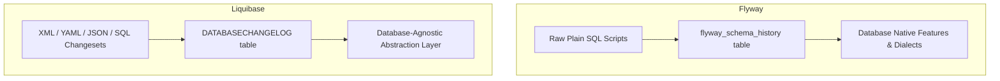
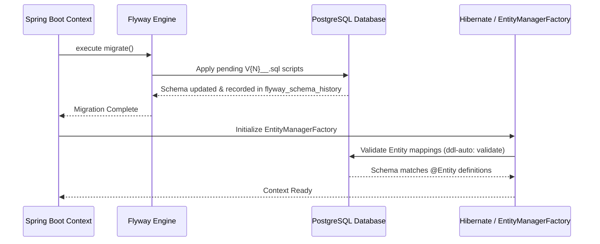
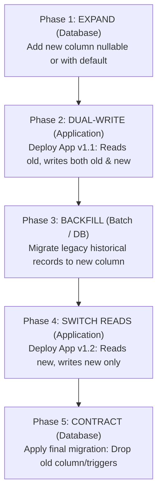

# Flyway Schema Migrations & Zero-Downtime Reference Guide

An authoritative, production-grade reference for relational schema evolution, database version control, and zero-downtime deployment strategies with **Flyway** (and **Liquibase** comparison) on **Spring Boot 3.x / 4.0**.

---

## Table of Contents
1. [Schema Migration Engines: Flyway vs Liquibase](#1-schema-migration-engines-flyway-vs-liquibase)
   - [Architectural Comparison](#architectural-comparison)
   - [Why Flyway for Modern Spring Boot Applications](#why-flyway-for-modern-spring-boot-applications)
2. [Flyway File Naming & Versioning Conventions](#2-flyway-file-naming--versioning-conventions)
   - [Versioned Migrations (`V`)](#versioned-migrations-v)
   - [Repeatable Migrations (`R`)](#repeatable-migrations-r)
   - [Undo Migrations (`U`)](#undo-migrations-u)
   - [Directory Structure & Location Conventions](#directory-structure--location-conventions)
3. [Production Spring Boot YAML Configuration](#3-production-spring-boot-yaml-configuration)
   - [Core Production Safety Settings](#core-production-safety-settings)
   - [Preventing Disaster with `clean-disabled: true`](#preventing-disaster-with-clean-disabled-true)
   - [`baseline-on-migrate` & `out-of-order` Mechanics](#baseline-on-migrate--out-of-order-mechanics)
4. [Safe Integration with Hibernate & JPA](#4-safe-integration-with-hibernate--jpa)
   - [Eliminating `ddl-auto` Race Conditions](#eliminating-ddl-auto-race-conditions)
   - [Lifecycle Execution Order (Flyway vs Hibernate)](#lifecycle-execution-order-flyway-vs-hibernate)
5. [Zero-Downtime Migrations: The Expand & Contract Pattern](#5-zero-downtime-migrations-the-expand--contract-pattern)
   - [The 5-Phase Migration Protocol](#the-5-phase-migration-protocol)
   - [Walkthrough: Non-Destructive Column Rename](#walkthrough-non-destructive-column-rename)
   - [Walkthrough: Changing Column Types & Constraints](#walkthrough-changing-column-types--constraints)
   - [Walkthrough: Table Splitting & Decomposition](#walkthrough-table-splitting--decomposition)
6. [Common Pitfalls & Remediation Protocols](#6-common-pitfalls--remediation-protocols)
   - [DDL Transaction Locks & Table Locks (PostgreSQL / MySQL)](#ddl-transaction-locks--table-locks-postgresql--mysql)
   - [Modifying Committed Migrations & Checksum Mismatches](#modifying-committed-migrations--checksum-mismatches)
   - [Using `flyway:repair` / `flyway.repair()` Safely](#using-flywayrepair--flywayrepair-safely)
   - [Multi-Node Concurrent Migration Execution & Advisory Locks](#multi-node-concurrent-migration-execution--advisory-locks)

---

## 1. Schema Migration Engines: Flyway vs Liquibase

### Architectural Comparison



| Dimension                   | Flyway                                                | Liquibase                                                |
| --------------------------- | ----------------------------------------------------- | -------------------------------------------------------- |
| **Primary Format**          | Native SQL (`.sql`) / Java-based migrations           | XML, YAML, JSON, or formatted SQL                        |
| **Philosophy**              | Simplicity, native database power, unabstracted SQL   | Abstraction across multiple DB engines                   |
| **Learning Curve**          | Extremely low (standard SQL DDL/DML)                  | Moderate (XML/YAML DSL tags & preconditions)             |
| **Repeatable Scripts**      | First-class (`R__*.sql` for views, procedures)        | RunOnChange / RunAlways attributes                       |
| **Rollback Support**        | Undo migrations (`U__*.sql` in Teams/Enterprise)      | Native `<rollback>` tags in Community                    |
| **Spring Boot Auto-Config** | `org.springframework.boot:spring-boot-starter-flyway` | `org.springframework.boot:spring-boot-starter-liquibase` |

### Why Flyway for Modern Spring Boot Applications

1. **SQL Transparency:** Direct access to advanced DB features (PostgreSQL `CONCURRENTLY` indexes, partitioned tables, gin/gist indexes, generated columns, triggers).
2. **Deterministic Execution:** No XML/YAML schema translation layer; what you write in SQL is precisely what executes.
3. **Seamless Spring Integration:** Automatically hooks into `DataSource` initialization prior to JPA `EntityManagerFactory` startup.

---

## 2. Flyway File Naming & Versioning Conventions

Flyway relies on strict lexical file naming to determine migration type, execution order, and idempotency.

```
+-------------------------------------------------------------------------------+
| File Pattern: <Prefix><Version>__<Description>.<Extension>                    |
+-------------------------------------------------------------------------------+
| Examples:                                                                     |
| V1_0_0__init_trade_schema.sql                                                 |
| V2026_09_01_1030__add_customer_tax_id.sql                                     |
| R__recreate_vw_settled_trades.sql                                             |
+-------------------------------------------------------------------------------+
```

### Versioned Migrations (`V`)

- **Prefix:** `V`
- **Version Format:** Numeric separated by dots, underscores, or timestamps (e.g., `V1__init.sql`, `V2_1__add_idx.sql`, `V20260901_1200__create_orders.sql`).
- **Separator:** Exactly two underscores `__`.
- **Description:** Words separated by underscores or spaces.
- **Execution:** Executed **exactly once** in strict version order. Never re-executed once recorded in `flyway_schema_history`.

```sql
-- src/main/resources/db/migration/V1__init_accounts.sql
CREATE TABLE accounts (
    id BIGSERIAL PRIMARY KEY,
    account_number VARCHAR(32) NOT NULL UNIQUE,
    balance NUMERIC(19, 4) NOT NULL DEFAULT 0.0000,
    status VARCHAR(20) NOT NULL,
    created_at TIMESTAMPTZ NOT NULL DEFAULT NOW(),
    updated_at TIMESTAMPTZ NOT NULL DEFAULT NOW(),
    version BIGINT NOT NULL DEFAULT 0
);

CREATE INDEX idx_accounts_status ON accounts(status);
```

---

### Repeatable Migrations (`R`)

- **Prefix:** `R`
- **No Version Number:** `R__recreate_views.sql`.
- **Execution:** Executed **after all versioned migrations have completed**. Re-executed **every time their checksum changes** (e.g., when a developer modifies the script).
- **Ideal For:** Views, stored procedures, triggers, functions, user-defined functions (UDFs).

```sql
-- src/main/resources/db/migration/R__vw_active_customer_accounts.sql
CREATE OR REPLACE VIEW vw_active_customer_accounts AS
SELECT 
    a.id AS account_id,
    a.account_number,
    a.balance,
    a.status,
    a.updated_at
FROM accounts a
WHERE a.status = 'ACTIVE';
```

---

### Undo Migrations (`U`)

- **Prefix:** `U` (e.g., `U1__init_accounts.sql`).
- **Availability:** Flyway Teams / Enterprise edition.
- **Production Note:** In community Flyway, undo is performed by writing a forward versioned migration (e.g., `V2__revert_init_accounts.sql`). Forward-only migration is standard practice in CD/CI pipelines to preserve audit history.

---

### Directory Structure & Location Conventions

```
src/main/resources/
├── application.yaml
└── db/
    └── migration/
        ├── V1__init_schema.sql
        ├── V2__add_foreign_keys.sql
        ├── V3__create_indexes.sql
        └── R__rebuild_analytical_views.sql
```

---

## 3. Production Spring Boot YAML Configuration

### Core Production Safety Settings

```yaml
spring:
  datasource:
    url: jdbc:postgresql://${DB_HOST:localhost}:${DB_PORT:5432}/${DB_NAME:trading_db}
    username: ${DB_USER:app_user}
    password: ${DB_PASS:secret}
    hikari:
      pool-name: TradingHikariCP
      maximum-pool-size: 20
      minimum-idle: 5

  jpa:
    open-in-view: false
    hibernate:
      # MANDATORY: Prevent Hibernate from competing with Flyway
      ddl-auto: validate
    properties:
      hibernate:
        format_sql: false
        generate_statistics: false

  flyway:
    enabled: true
    # MANDATORY: Prevent accidental database wipes in production
    clean-disabled: true
    
    # Safe defaults
    baseline-on-migrate: false
    out-of-order: false
    
    # Locations to scan
    locations:
      - classpath:db/migration
    
    # Connect timeout and lock management
    connect-retries: 5
    lock-retry-count: 50
    table: flyway_schema_history
    validate-on-migrate: true
```

---

### Preventing Disaster with `clean-disabled: true`

`flyway.clean()` drops all schemas, tables, views, sequences, and data in the configured database.
In Spring Boot, `spring.flyway.clean-disabled: true` ensures that any invocation of `clean` (whether via Maven plugin, Gradle task, or programmatic call) immediately throws an exception.

```yaml
spring:
  flyway:
    clean-disabled: true # MUST be true in all production and staging profiles
```

---

### `baseline-on-migrate` & `out-of-order` Mechanics

#### `baseline-on-migrate: true` (Existing / Legacy Databases)
- Use when introducing Flyway to an existing non-empty database that was not originally managed by Flyway.
- Flyway marks the current database state as version `1` (or configured `baseline-version`) in `flyway_schema_history` without running older baseline scripts.
- **Caution:** For greenfield applications, keep `baseline-on-migrate: false`.

#### `out-of-order: true` (Concurrent Feature Branch Merges)
- By default (`false`), if `V1` and `V3` are applied, a newly deployed `V2` will fail with an error.
- When `out-of-order: true` is set, Flyway will run `V2` even if higher versions (`V3`) have already executed.
- **Best Practice:** Enable in environments where multiple autonomous teams deploy microservice updates concurrently.

---

## 4. Safe Integration with Hibernate & JPA

### Eliminating `ddl-auto` Race Conditions

When both Flyway and Hibernate are on the classpath, Spring Boot's `FlywayMigrationInitializer` bean runs **before** Hibernate's `EntityManagerFactory` / `LocalContainerEntityManagerFactoryBean` is initialized.



#### Settings Matrix

| `spring.jpa.hibernate.ddl-auto` | Flyway Enabled | Production Recommendation | Risk                                                                              |
| ------------------------------- | -------------- | ------------------------- | --------------------------------------------------------------------------------- |
| `validate`                      | `true`         | **Recommended**           | Fails fast on boot if Java `@Entity` diverges from Flyway SQL.                    |
| `none`                          | `true`         | **Allowed**               | No validation overhead; ignores schema discrepancies until query time.            |
| `update`                        | `true`         | **FORBIDDEN**             | Hibernate modifies tables dynamically, conflicting with Flyway migration history. |
| `create` / `create-drop`        | `true`         | **FORBIDDEN**             | Drops tables on startup/shutdown, destroying production data.                     |

---

## 5. Zero-Downtime Migrations: The Expand & Contract Pattern

Making destructive schema changes (renaming columns, changing column types, dropping columns, splitting tables) while traffic is active causes HTTP 500 errors if old and new versions of the application run simultaneously during a rolling deployment.

### The 5-Phase Migration Protocol



---

### Walkthrough: Non-Destructive Column Rename

*Scenario:* In table `customers`, rename `full_name` to `legal_name`.

#### Phase 1 (Expand - Migration V10)
Add the new column without breaking current app running version 1.0.

```sql
-- V10__expand_customer_legal_name.sql
ALTER TABLE customers ADD COLUMN legal_name VARCHAR(255);
```

#### Phase 2 (Dual-Write - Application v1.1 Deployment)
The entity writes to both `full_name` and `legal_name`, but still reads from `full_name`.

```java
@Entity
@Table(name = "customers")
public class Customer {
    @Column(name = "full_name")
    private String fullName;

    @Column(name = "legal_name")
    private String legalName;

    public void updateName(String name) {
        this.fullName = name;
        this.legalName = name; // Dual-write
    }
}
```

#### Phase 3 (Backfill Data)
Populate `legal_name` for all historical rows.

```sql
-- V11__backfill_customer_legal_name.sql
UPDATE customers 
SET legal_name = full_name 
WHERE legal_name IS NULL;
```

#### Phase 4 (Switch Reads - Application v1.2 Deployment)
Application now reads and writes exclusively via `legal_name`.

```java
@Entity
@Table(name = "customers")
public class Customer {
    @Column(name = "legal_name", nullable = false)
    private String legalName;
}
```

#### Phase 5 (Contract - Migration V12)
Once all old instances of the application are terminated, drop the legacy column.

```sql
-- V12__contract_drop_customer_full_name.sql
ALTER TABLE customers ALTER COLUMN legal_name SET NOT NULL;
ALTER TABLE customers DROP COLUMN full_name;
```

---

### Walkthrough: Changing Column Types & Constraints

*Scenario:* Change `order_id` in `orders` from `INTEGER` to `BIGINT`.

1. **Expand:** Add `big_order_id BIGINT`.
2. **Dual-Write / Trigger:** Populate `big_order_id` on new inserts.
3. **Backfill:** `UPDATE orders SET big_order_id = order_id WHERE big_order_id IS NULL;`
4. **Switch Application:** Update JPA entity `@Id private Long orderId;` pointing to `big_order_id`.
5. **Contract:** Drop old `order_id` column and rename `big_order_id` to `order_id`.

---

### Walkthrough: Table Splitting & Decomposition

*Scenario:* Splitting a monolithic `users` table into `users` and `user_profiles`.

```sql
-- Phase 1 (Expand): Create new profile table
CREATE TABLE user_profiles (
    user_id BIGINT PRIMARY KEY REFERENCES users(id),
    avatar_url VARCHAR(512),
    bio TEXT,
    timezone VARCHAR(50) DEFAULT 'UTC'
);

-- Phase 2: Dual write to both tables in application service layer.
-- Phase 3: Backfill user_profiles from legacy users columns.
-- Phase 4: Point all profile queries to user_profiles table.
-- Phase 5 (Contract): Drop avatar_url, bio, timezone from users table.
```

---

## 6. Common Pitfalls & Remediation Protocols

### DDL Transaction Locks & Table Locks (PostgreSQL / MySQL)

#### PostgreSQL Concurrent Index Creation
In PostgreSQL, `CREATE INDEX` acquires a `SHARE` lock that blocks all incoming writes (`INSERT`, `UPDATE`, `DELETE`).
**Solution:** Use `CREATE INDEX CONCURRENTLY` in Flyway migrations with `non-transactional` execution.

```sql
-- Flyway requires non-transactional configuration for CONCURRENTLY
-- Add configuration header at top of SQL file:
-- flyway:clean-disabled=true
-- flyway:executeInTransaction=false

CREATE INDEX CONCURRENTLY idx_orders_created_at ON orders(created_at);
```

#### MySQL Metadata Locks
MySQL DDL (`ALTER TABLE`) locks metadata and can stall high-concurrency tables.
**Solution:** For large tables (>10M rows), use online schema tools (e.g., `gh-ost` or `pt-online-schema-change`) or MySQL 8.0 `ALGORITHM=INPLACE, LOCK=NONE`.

---

### Modifying Committed Migrations & Checksum Mismatches

If a developer modifies an already-executed migration script (e.g., editing `V1__init.sql`), Flyway detects that the SHA-256 / CRC32 checksum in the SQL file does not match the checksum stored in `flyway_schema_history`.

**Startup Error:**
```
org.flywaydb.core.api.exception.FlywayValidateException: Validate failed: 
Migration checksum mismatch for migration version 1
-> Applied to database : -1827491823
-> Resolved locally    : 489201948
```

---

### Using `flyway:repair` / `flyway.repair()` Safely

`flyway.repair()` performs two crucial functions:
1. Re-aligns checksums in `flyway_schema_history` with the local files on disk.
2. Removes failed migration entries (for non-transactional DDL databases).

#### Fixing Checksums Safely

```bash
# Via Gradle Plugin
./gradlew flywayRepair

# Via Maven Plugin
mvn flyway:repair
```

#### Programmatic Repair Configuration (Development Profile Only)

```java
package com.example.config;

import org.flywaydb.core.Flyway;
import org.springframework.boot.autoconfigure.flyway.FlywayMigrationStrategy;
import org.springframework.context.annotation.Bean;
import org.springframework.context.annotation.Configuration;
import org.springframework.context.annotation.Profile;

@Configuration
@Profile("dev")
public class FlywayDevConfiguration {

    @Bean
    public FlywayMigrationStrategy cleanAndRepairMigrationStrategy() {
        return flyway -> {
            flyway.repair();  // Syncs checksums automatically in dev
            flyway.migrate();
        };
    }
}
```

> **Warning:** Never enable automatic `flyway.repair()` in production. If a checksum fails in production, investigate whether the database schema diverges or if an unauthorized script modification occurred.

---

### Multi-Node Concurrent Migration Execution & Advisory Locks

When multiple instances of a Spring Boot microservice boot concurrently in Kubernetes:
- Flyway automatically secures a database-level lock:
  - **PostgreSQL:** Uses `pg_advisory_lock` on a hash of the table name.
  - **MySQL / MariaDB:** Uses `GET_LOCK()`.
  - **Oracle:** Uses `DBMS_LOCK`.
- Only one node executes the migration scripts; all other nodes block and poll until the lock is released, then verify the schema state and continue startup.

