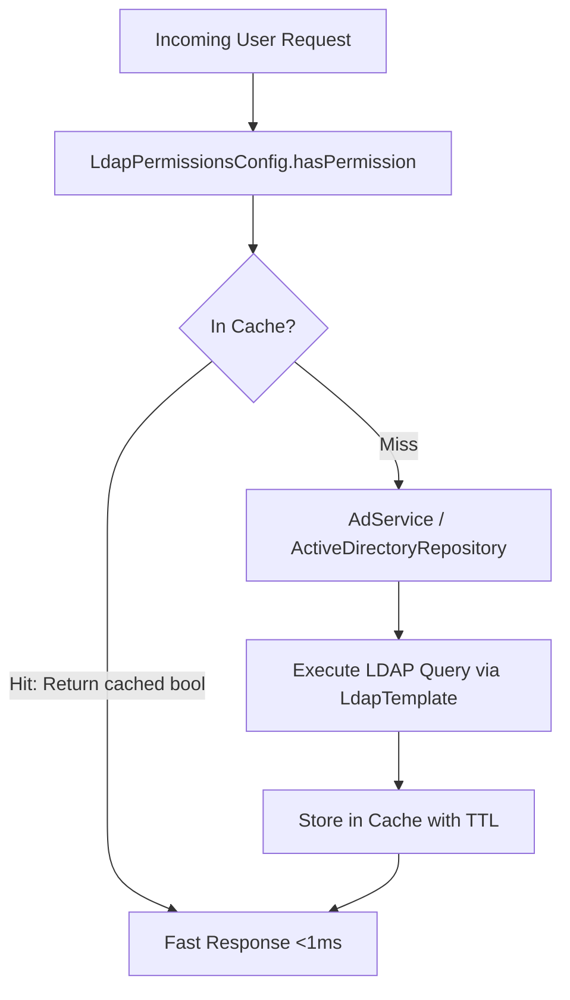

# LDAP Caching, Role-Based Access Control, and Permissions Reference

This reference describes caching strategies for Active Directory queries, integration with Caffeine, cache key design, TTL invalidation, Active Directory group-to-role mappings, and fail-fast authorization patterns.

---

## 1. Caching Strategy for Active Directory Operations

Active Directory queries over LDAP/LDAPS involve network hops, TLS negotiation, and directory tree traversal. Frequent permission checks on hot request paths cause high latency if evaluated on every HTTP request.

Spring Cache abstraction isolates the directory repository behind an in-memory cache layer.



---

## 2. Spring Cache Configuration with Caffeine

In production environments, use Caffeine cache provider to enforce time-to-live (TTL) and maximum size limits.

### Cache Configuration Bean

```java
package com.commerzbank.config;

import com.github.benmanes.caffeine.cache.Caffeine;
import org.springframework.boot.autoconfigure.AutoConfiguration;
import org.springframework.boot.autoconfigure.condition.ConditionalOnClass;
import org.springframework.boot.autoconfigure.condition.ConditionalOnProperty;
import org.springframework.cache.CacheManager;
import org.springframework.cache.annotation.EnableCaching;
import org.springframework.cache.caffeine.CaffeineCacheManager;
import org.springframework.context.annotation.Bean;
import org.springframework.context.annotation.Configuration;

import java.time.Duration;

@AutoConfiguration
@Configuration
@EnableCaching
@ConditionalOnProperty(name = "ldap.cache.enabled", havingValue = "true", matchIfMissing = true)
public class LdapCacheConfig {

    public static final String CACHE_USERS = "usersBySamAccountNameAndGroup";
    public static final String CACHE_USER_IN_GROUP = "userInGroup";
    public static final String CACHE_USER_DETAILS = "userDetailsByUsername";

    @Bean
    @ConditionalOnClass(Caffeine.class)
    public CacheManager cacheManager(LdapProperties ldapProperties) {
        CaffeineCacheManager cacheManager = new CaffeineCacheManager(
                CACHE_USERS,
                CACHE_USER_IN_GROUP,
                CACHE_USER_DETAILS
        );

        long ttlSeconds = ldapProperties.getCache().getTtlSeconds();
        long maxSize = ldapProperties.getCache().getMaxEntries();

        cacheManager.setCaffeine(Caffeine.newBuilder()
                .expireAfterWrite(Duration.ofSeconds(ttlSeconds > 0 ? ttlSeconds : 300))
                .maximumSize(maxSize > 0 ? maxSize : 10000)
                .recordStats());

        return cacheManager;
    }
}
```

### Application Properties

```yaml
ldap:
  cache:
    enabled: true
    ttl-seconds: 300       # 5 minutes TTL
    max-entries: 5000      # Prevent memory exhaustion
```

---

## 3. Cache Key Design and Declarative Annotations

LDAP search queries depend on multiple parameters (such as username, group DN, or search base). Cache keys must uniquely combine all parameters to prevent cross-account cache collisions.

### Key Combination Patterns in `AdService`

```java
package com.commerzbank.service;

import com.commerzbank.dto.UserDto;
import com.commerzbank.repository.ActiveDirectoryRepository;
import lombok.RequiredArgsConstructor;
import lombok.extern.slf4j.Slf4j;
import org.springframework.cache.annotation.CacheEvict;
import org.springframework.cache.annotation.Cacheable;
import org.springframework.cache.annotation.Caching;
import org.springframework.stereotype.Service;

import java.util.List;

@Slf4j
@Service
@RequiredArgsConstructor
public class AdService {

    private final ActiveDirectoryRepository adRepository;

    /**
     * Checks if a user is a member of a specific group.
     * Cache key combines both samAccountName and group distinguished name.
     */
    @Cacheable(value = "userInGroup", key = "#samAccountName.toLowerCase() + '-' + #groupDn.toLowerCase()")
    public boolean isUserInGroup(String samAccountName, String groupDn) {
        log.info("Checking directory group membership: user={}, group={}", samAccountName, groupDn);
        List<UserDto> matchingUsers = adRepository.searchUsersBySamAccountNameAndGroup(samAccountName, groupDn);
        return !matchingUsers.isEmpty();
    }

    /**
     * Searches for user details filtered by username and group.
     */
    @Cacheable(value = "usersBySamAccountNameAndGroup", key = "#samAccountName.toLowerCase() + '-' + #groupDn.toLowerCase()")
    public List<UserDto> searchUsersBySamAccountNameAndGroup(String samAccountName, String groupDn) {
        log.info("Searching users by samAccountName: {} and groupDn: {}", samAccountName, groupDn);
        return adRepository.searchUsersBySamAccountNameAndGroup(samAccountName, groupDn);
    }

    /**
     * Evicts cached directory records for a user across all LDAP caches.
     */
    @Caching(evict = {
            @CacheEvict(value = "userInGroup", allEntries = true),
            @CacheEvict(value = "usersBySamAccountNameAndGroup", allEntries = true)
    })
    public void evictLdapCaches() {
        log.info("Invalidating all LDAP permission caches");
    }
}
```

### TTL and Invalidation Trade-offs

Active Directory group modifications are asynchronous and replicate across domain controllers with minor delays.
- Setting a short TTL (e.g. 5 to 15 minutes) guarantees eventual consistency when users are added or removed from directory groups.
- Avoid caching indefinitely (`eternal=true`) because administrative revocation of privileges will not take effect until application restarts.

---

## 4. Role-Based Access Control (RBAC) Permission Configuration

Enterprise applications map business permissions (such as `ADMIN`, `APPROVER`, `VIEWER`) to specific Active Directory Distinguished Names (DN).

### YAML Configuration

```yaml
ldap:
  permissions:
    groups:
      admin: "CN=APP_CORP_ADMINS,OU=Groups,DC=corp,DC=example,DC=com"
      editor: "CN=APP_CORP_EDITORS,OU=Groups,DC=corp,DC=example,DC=com"
      viewer: "CN=APP_CORP_VIEWERS,OU=Groups,DC=corp,DC=example,DC=com"
```

### `LdapPermissionsConfig.java`

```java
package com.commerzbank.config;

import com.commerzbank.service.AdService;
import lombok.Data;
import lombok.RequiredArgsConstructor;
import lombok.extern.slf4j.Slf4j;
import org.springframework.boot.context.properties.ConfigurationProperties;
import org.springframework.stereotype.Component;

import java.util.Map;

@Slf4j
@Data
@Component
@RequiredArgsConstructor
@ConfigurationProperties(prefix = "ldap.permissions")
public class LdapPermissionsConfig {

    private final AdService adService;

    /**
     * Map of permission names to LDAP group distinguished names.
     */
    private Map<String, String> groups;

    /**
     * Checks if a user holds a specific permission name.
     * Uses guard clauses for missing configuration.
     *
     * @param userId The user ID (sAMAccountName)
     * @param permission The permission identifier (e.g. "admin")
     * @return true if group exists and user is member, false otherwise
     */
    public boolean hasPermission(String userId, String permission) {
        if (userId == null || userId.isBlank()) {
            log.warn("Permission check rejected: userId is blank");
            return false;
        }

        if (groups == null || !groups.containsKey(permission)) {
            log.warn("Permission '{}' not configured in application permissions", permission);
            return false;
        }

        String groupDn = groups.get(permission);
        boolean isMember = adService.isUserInGroup(userId, groupDn);
        log.debug("User '{}' permission '{}' evaluation: {}", userId, permission, isMember);
        return isMember;
    }

    /**
     * Validates permission and immediately throws SecurityException if unauthorized.
     *
     * @param userId The user ID to validate
     * @param permission The required permission name
     * @throws SecurityException if validation fails
     */
    public void validatePermission(String userId, String permission) throws SecurityException {
        if (!hasPermission(userId, permission)) {
            throw new SecurityException(
                    String.format("User '%s' lacks required permission '%s'. Not a member of the required group.",
                            userId, permission));
        }
    }
}
```

---

## 5. Exception Hierarchy and Authorization Guard Clauses

Differentiate between operational directory errors, authorization denials, and input validation failures.

### Exception Types Overview

| Exception                  | Hierarchy          | When to Use                                                                     |
| :------------------------- | :----------------- | :------------------------------------------------------------------------------ |
| `AdException`              | `RuntimeException` | LDAP communication failure, naming parsing error, or directory timeout.         |
| `SecurityException`        | `RuntimeException` | User is authenticated, but not a member of the required Active Directory group. |
| `IllegalArgumentException` | `RuntimeException` | Blank username, malformed group DN, or invalid parameter input.                 |

### `AdException.java` Definition

```java
package com.commerzbank.exception;

/**
 * Unchecked exception for operational errors occurring during Active Directory integration.
 */
public class AdException extends RuntimeException {

    public AdException(String message) {
        super(message);
    }

    public AdException(String message, Throwable cause) {
        super(message, cause);
    }
}
```

### Fail-Fast Guard Clause Usage in Service Controllers

```java
package com.commerzbank.service;

import com.commerzbank.config.LdapPermissionsConfig;
import lombok.RequiredArgsConstructor;
import org.springframework.stereotype.Service;

@Service
@RequiredArgsConstructor
public class TradeExecutionService {

    private final LdapPermissionsConfig permissionsConfig;

    public void executeTrade(String currentUsername, Long tradeId) {
        // Guard Clause: Validate authorization immediately before executing business logic
        permissionsConfig.validatePermission(currentUsername, "admin");

        // Business logic continues with clean, readable flow
        processTrade(tradeId);
    }

    private void processTrade(Long tradeId) {
        // Trade execution logic
    }
}
```

