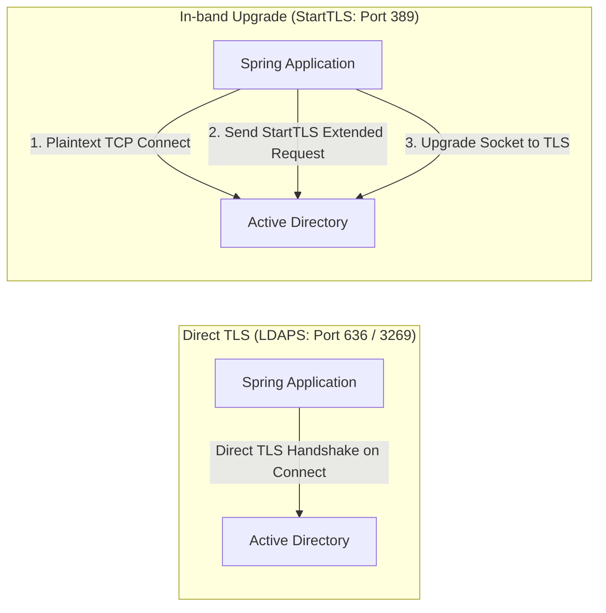

# Connection Pooling, Timeouts, and Secure Transport (LDAPS / StartTLS) Reference

This reference provides technical guidance on configuring connection pooling, socket timeouts, TLS encryption (LDAPS and StartTLS), truststore configuration, and port selection for Spring Boot Active Directory integrations.

---

## 1. Connection Pooling Mechanisms

Spring applications connecting to Active Directory can use two distinct connection pooling mechanisms:

1. **JNDI Level Pooling (`com.sun.jndi.ldap.connect.pool`)**: Built into the JDK JNDI provider. It operates at the low-level socket layer but lacks fine-grained lifecycle management, idle eviction, and connection health validation.
2. **Spring LDAP Pooling (`PooledContextSource` via Commons Pool 2)**: Recommended for enterprise applications. It wraps an underlying `LdapContextSource` with Apache Commons Pool 2 (`org.springframework.ldap.pool2.factory.PooledContextSource`), providing connection lifecycle validation, idle eviction, burst handling, and metrics.

### Comparison Matrix

| Capability                | JNDI Pool (`com.sun.jndi.ldap.connect.pool`) | Spring LDAP Pool (`PooledContextSource`)                              |
| :------------------------ | :------------------------------------------- | :-------------------------------------------------------------------- |
| Pool Implementation       | JVM-wide static table in JDK                 | Isolated bean instance via Commons Pool 2                             |
| Health Validation         | Not available (stale sockets fail on borrow) | Supported via `DirContextValidator` (`testOnBorrow`, `testWhileIdle`) |
| Eviction Thread           | Fixed idle timeout only                      | Configurable periodic background evictor (`timeBetweenEvictionRuns`)  |
| Security Contexts         | Shared across JVM classloader                | Scoped to individual `ContextSource` configuration                    |
| Spring Boot Compatibility | Spring Boot 2.x, 3.x, 4.x                    | Spring Boot 2.x, 3.x, 4.x (`spring-ldap-core` + `commons-pool2`)      |

---

## 2. Configuring `PooledContextSource` with Commons Pool 2

To use `PooledContextSource`, include `org.apache.commons:commons-pool2` on the classpath.

### Configuration Bean

```java
package com.commerzbank.config;

import org.springframework.context.annotation.Bean;
import org.springframework.context.annotation.Configuration;
import org.springframework.context.annotation.Primary;
import org.springframework.ldap.core.LdapTemplate;
import org.springframework.ldap.core.support.LdapContextSource;
import org.springframework.ldap.pool2.factory.PooledContextSource;
import org.springframework.ldap.pool2.validation.DefaultDirContextValidator;

import java.time.Duration;
import java.util.HashMap;
import java.util.Map;

@Configuration
public class LdapConnectionPoolConfig {

    @Bean
    public LdapContextSource targetContextSource(LdapProperties properties) {
        LdapContextSource contextSource = new LdapContextSource();
        contextSource.setUrl(properties.getContextSource().getUrl());
        contextSource.setBase(properties.getContextSource().getBase());
        contextSource.setUserDn(properties.getContextSource().getUserDn());
        contextSource.setPassword(properties.getContextSource().getPassword());

        // Configure environment properties including socket timeouts
        Map<String, Object> env = new HashMap<>();
        env.put("com.sun.jndi.ldap.connect.timeout", String.valueOf(properties.getTimeouts().getConnectTimeoutMs()));
        env.put("com.sun.jndi.ldap.read.timeout", String.valueOf(properties.getTimeouts().getReadTimeoutMs()));
        env.put("java.naming.referral", properties.getContextSource().getReferral());
        env.put("java.naming.ldap.attributes.binary", properties.getContextSource().getBinaryAttributes());

        contextSource.setBaseEnvironmentProperties(env);
        contextSource.setPooled(false); // Delegate pooling to PooledContextSource
        contextSource.afterPropertiesSet();
        return contextSource;
    }

    @Bean
    @Primary
    public PooledContextSource pooledContextSource(LdapContextSource targetContextSource, LdapProperties properties) {
        PooledContextSource pooledSource = new PooledContextSource();
        pooledSource.setContextSource(targetContextSource);

        // Pool capacity settings
        LdapProperties.Pool poolProps = properties.getPool();
        pooledSource.setMaxTotal(poolProps.getMaxTotal());
        pooledSource.setMaxIdle(poolProps.getMaxIdle());
        pooledSource.setMinIdle(poolProps.getMinIdle());
        pooledSource.setMaxWait(Duration.ofMillis(poolProps.getMaxWaitMillis()));

        // Health check and validation
        DefaultDirContextValidator validator = new DefaultDirContextValidator();
        validator.setBaseName("");
        validator.setFilterName("objectClass=*");
        validator.setSearchControls(new javax.naming.directory.SearchControls());
        pooledSource.setDirContextValidator(validator);

        pooledSource.setTestOnBorrow(poolProps.isTestOnBorrow());
        pooledSource.setTestWhileIdle(poolProps.isTestWhileIdle());
        pooledSource.setTimeBetweenEvictionRuns(Duration.ofMillis(poolProps.getTimeBetweenEvictionRunsMillis()));
        pooledSource.setMinEvictableIdleDuration(Duration.ofMillis(poolProps.getMinEvictableIdleTimeMillis()));

        return pooledSource;
    }

    @Bean
    public LdapTemplate ldapTemplate(PooledContextSource pooledContextSource) {
        LdapTemplate template = new LdapTemplate(pooledContextSource);
        template.setIgnorePartialResultException(true);
        return template;
    }
}
```

### Pool Properties Explained

- `maxTotal`: Maximum number of active and idle connections allocated by the pool concurrently (default: 20).
- `maxIdle`: Maximum number of idle connections retained in the pool without being closed (default: 10).
- `minIdle`: Minimum number of idle connections maintained in ready state to eliminate connection latency (default: 2).
- `maxWaitMillis`: Maximum time in milliseconds that a caller will block waiting for a pooled connection before throwing an exception (default: 5000ms).
- `testOnBorrow`: When set to `true`, the pool executes the `DirContextValidator` query before returning the connection to the caller. Prevents broken pipe errors after network blips.
- `testWhileIdle`: When set to `true`, the background eviction thread validates idle connections and purges dead sockets.
- `timeBetweenEvictionRunsMillis`: Interval between background eviction sweeps (default: 60000ms).

> **Note on Spring LDAP Version Compatibility**:  
> Spring Boot 3.x / Spring LDAP 3.0+ supports `java.time.Duration` setters (`setMaxWait(Duration)`, `setTimeBetweenEvictionRuns(Duration)`, `setMinEvictableIdleDuration(Duration)`). In older baselines, use the millisecond primitive variants (`setMaxWaitMillis(long)`, `setTimeBetweenEvictionRunsMillis(long)`, `setMinEvictableIdleTimeMillis(long)`).

---

## 3. Timeouts and Socket Protection

Without explicit socket timeouts, directory calls block indefinitely when an Active Directory domain controller freezes, is partitioned by a firewall, or drops TCP packets. This leads to worker thread pool exhaustion across the entire application.

### Key JNDI Socket Environment Properties

| JNDI Property                       | Type        | Description                                     | Recommended Production Value |
| :---------------------------------- | :---------- | :---------------------------------------------- | :--------------------------- |
| `com.sun.jndi.ldap.connect.timeout` | String (ms) | Socket connection handshake timeout             | `3000` (3 seconds)           |
| `com.sun.jndi.ldap.read.timeout`    | String (ms) | Socket read timeout waiting for search response | `10000` (10 seconds)         |

```properties
# Example in application.properties
ldap.timeouts.connect-timeout-ms=3000
ldap.timeouts.read-timeout-ms=10000
ldap.timeouts.search-time-limit-ms=5000
```

---

## 4. Secure Transport: LDAPS vs StartTLS

Active Directory communication containing credentials or sensitive employee data must always be encrypted in transit.



### 1. Direct LDAPS (Recommended)

Direct LDAPS uses dedicated SSL/TLS ports (636 for Standard Domain Controller, 3269 for Global Catalog). The connection begins with a TLS handshake immediately.

```yaml
ldap:
  context-source:
    url: ldaps://ad.corp.example.com:636
    base: dc=corp,dc=example,dc=com
```

### 2. StartTLS Extended Operation

StartTLS connects over standard plaintext port 389, then issues the StartTLS extended operation OID `1.3.6.1.4.1.1466.20037` to upgrade the active connection to TLS before authentication.

```java
package com.commerzbank.config;

import org.springframework.context.annotation.Bean;
import org.springframework.context.annotation.Configuration;
import org.springframework.ldap.core.support.DefaultTlsDirContextAuthenticationStrategy;
import org.springframework.ldap.core.support.LdapContextSource;

@Configuration
public class LdapStartTlsConfig {

    @Bean
    public LdapContextSource ldapContextSource(LdapProperties properties) {
        LdapContextSource contextSource = new LdapContextSource();
        // Plaintext port 389 used for StartTLS initial connection
        contextSource.setUrl(properties.getContextSource().getUrl());
        contextSource.setBase(properties.getContextSource().getBase());
        contextSource.setUserDn(properties.getContextSource().getUserDn());
        contextSource.setPassword(properties.getContextSource().getPassword());

        // Configure StartTLS authentication strategy
        DefaultTlsDirContextAuthenticationStrategy tlsStrategy = new DefaultTlsDirContextAuthenticationStrategy();
        tlsStrategy.setHostnameVerifier((hostname, session) -> true); // Use custom verifier if needed
        contextSource.setAuthenticationStrategy(tlsStrategy);

        contextSource.afterPropertiesSet();
        return contextSource;
    }
}
```

---

## 5. Truststore Configuration

When connecting to an enterprise Active Directory domain controller with private corporate Certificate Authorities (CA), the JVM must trust the root and intermediate certificates.

### Option A: Standard JVM System Properties

Pass the truststore parameters during JVM startup:

```bash
java -Djavax.net.ssl.trustStore=/etc/ssl/certs/corporate-truststore.p12 \
     -Djavax.net.ssl.trustStorePassword=changeit \
     -Djavax.net.ssl.trustStoreType=PKCS12 \
     -jar application.jar
```

### Option B: Programmatic Custom SSLContext

For applications requiring isolated truststores without modifying global JVM parameters:

```java
package com.commerzbank.config;

import org.springframework.core.io.Resource;
import javax.net.ssl.SSLContext;
import javax.net.ssl.TrustManagerFactory;
import java.io.InputStream;
import java.security.KeyStore;

public final class LdapSslHelper {

    private LdapSslHelper() {
    }

    public static SSLContext createCustomSslContext(Resource truststoreResource, char[] password) throws Exception {
        KeyStore keyStore = KeyStore.getInstance("PKCS12");
        try (InputStream in = truststoreResource.getInputStream()) {
            keyStore.load(in, password);
        }

        TrustManagerFactory tmf = TrustManagerFactory.getInstance(TrustManagerFactory.getDefaultAlgorithm());
        tmf.init(keyStore);

        SSLContext sslContext = SSLContext.getInstance("TLSv1.3");
        sslContext.init(null, tmf.getTrustManagers(), null);
        return sslContext;
    }
}
```

---

## 6. Port Selection Guide

Selecting the wrong port against Active Directory causes authentication failures, incomplete attribute sets, or `PartialResultException` referral loops.

| Port   | Protocol        | Target Directory Endpoint           | Scope & Behaviour                                                                                                         |
| :----- | :-------------- | :---------------------------------- | :------------------------------------------------------------------------------------------------------------------------ |
| `389`  | LDAP / StartTLS | Standard Domain Partition           | Domain local objects. Read and write. Referrals returned for cross-domain queries.                                        |
| `636`  | LDAPS           | Standard Domain Partition (SSL/TLS) | Domain local objects with direct encryption. Read and write.                                                              |
| `3268` | LDAP            | Global Catalog (GC)                 | Forest-wide read-only search. Contains partial attribute replica for all forest objects. No referrals for forest objects. |
| `3269` | LDAPS           | Global Catalog (GC SSL/TLS)         | Forest-wide encrypted read-only search. Best for multi-domain enterprise user lookups and group membership resolution.    |

### Decision Rule
- Use port `636` if your application only accesses objects within a single domain and requires write operations.
- Use port `3269` (Global Catalog LDAPS) if your application performs read-only user and group lookups across multiple subdomains in an enterprise forest.

