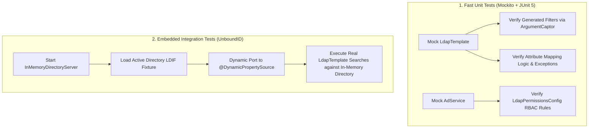

testing-ldap
---
# Testing Spring Boot LDAP and Active Directory Integrations Reference

This reference provides testing strategies for Spring Boot Active Directory integrations. It covers isolated Mockito unit tests, argument captors for LDAP filters, and embedded in-memory directory integration testing using UnboundID LDAP SDK with `@DynamicPropertySource`.

---

## 1. Testing Strategy Overview



---

## 2. Unit Testing Active Directory Repository with Mockito

Unit tests verify filter generation, attribute translation, and exception handling in milliseconds without requiring an external directory server.

### Repository Unit Test Implementation

```java
package com.commerzbank.repository;

import com.commerzbank.config.LdapProperties;
import com.commerzbank.dto.UserDto;
import com.commerzbank.exception.AdException;
import org.junit.jupiter.api.BeforeEach;
import org.junit.jupiter.api.DisplayName;
import org.junit.jupiter.api.Test;
import org.mockito.ArgumentCaptor;
import org.mockito.stubbing.Answer;
import org.springframework.ldap.core.AttributesMapper;
import org.springframework.ldap.core.LdapTemplate;

import javax.naming.NamingException;
import javax.naming.directory.Attributes;
import javax.naming.directory.BasicAttribute;
import javax.naming.directory.BasicAttributes;
import java.util.List;

import static org.junit.jupiter.api.Assertions.assertEquals;
import static org.junit.jupiter.api.Assertions.assertFalse;
import static org.junit.jupiter.api.Assertions.assertNull;
import static org.junit.jupiter.api.Assertions.assertThrows;
import static org.junit.jupiter.api.Assertions.assertTrue;
import static org.mockito.ArgumentMatchers.any;
import static org.mockito.ArgumentMatchers.anyString;
import static org.mockito.Mockito.mock;
import static org.mockito.Mockito.verify;
import static org.mockito.Mockito.when;

class ActiveDirectoryRepositoryTest {

    private LdapTemplate ldapTemplate;
    private LdapProperties props;
    private ActiveDirectoryRepository repository;

    @BeforeEach
    void setUp() {
        ldapTemplate = mock(LdapTemplate.class);
        props = new LdapProperties();
        props.getSearch().setUserSearchBase("ou=users,dc=corp,dc=example,dc=com");
        repository = new ActiveDirectoryRepository(ldapTemplate, props);
    }

    /**
     * Helper to invoke the AttributesMapper passed to ldapTemplate.search.
     */
    private Answer<List<UserDto>> mapperAnswer(List<Attributes> attributesList) {
        return invocation -> {
            AttributesMapper<UserDto> mapper = invocation.getArgument(2);
            return attributesList.stream()
                    .map(attrs -> {
                        try {
                            return mapper.mapFromAttributes(attrs);
                        } catch (NamingException e) {
                            throw new RuntimeException(e);
                        }
                    })
                    .toList();
        };
    }

    @Test
    @DisplayName("Should build exact LDAP filter for username and group membership")
    void searchBuildsCorrectFilter() {
        when(ldapTemplate.<UserDto>search(anyString(), anyString(), any(AttributesMapper.class)))
                .thenReturn(List.of());

        repository.searchUsersBySamAccountNameAndGroup("jdoe", "CN=Engineers,OU=Groups,DC=corp,DC=example,DC=com");

        ArgumentCaptor<String> baseCaptor = ArgumentCaptor.forClass(String.class);
        ArgumentCaptor<String> filterCaptor = ArgumentCaptor.forClass(String.class);

        verify(ldapTemplate).search(baseCaptor.capture(), filterCaptor.capture(), any(AttributesMapper.class));

        assertEquals("ou=users,dc=corp,dc=example,dc=com", baseCaptor.getValue());
        assertEquals("(&(samAccountName=jdoe)(memberof=CN=Engineers,OU=Groups,DC=corp,DC=example,DC=com))",
                filterCaptor.getValue());
    }

    @Test
    @DisplayName("Should correctly map all Active Directory attributes to UserDto")
    void mappingAttributesAllFieldsAndEnabled() {
        Attributes attrs = new BasicAttributes();
        attrs.put(new BasicAttribute("sAMAccountName", "jdoe"));
        attrs.put(new BasicAttribute("displayName", "John Doe"));
        attrs.put(new BasicAttribute("givenName", "John"));
        attrs.put(new BasicAttribute("sn", "Doe"));
        attrs.put(new BasicAttribute("mail", "jdoe@example.com"));
        attrs.put(new BasicAttribute("department", "Trading Systems"));
        attrs.put(new BasicAttribute("title", "Lead Engineer"));
        attrs.put(new BasicAttribute("telephoneNumber", "+49 69 123456"));
        attrs.put(new BasicAttribute("distinguishedName", "CN=John Doe,OU=Users,DC=corp,DC=example,DC=com"));
        attrs.put(new BasicAttribute("userAccountControl", "512")); // Bit 2 not set: enabled

        when(ldapTemplate.search(anyString(), anyString(), any(AttributesMapper.class)))
                .thenAnswer(mapperAnswer(List.of(attrs)));

        List<UserDto> results = repository.searchUsersBySamAccountNameAndGroup("jdoe", "CN=Engineers,OU=Groups,DC=corp,DC=example,DC=com");

        assertEquals(1, results.size());
        UserDto dto = results.get(0);
        assertEquals("jdoe", dto.getUsername());
        assertEquals("John Doe", dto.getDisplayName());
        assertEquals("Trading Systems", dto.getDepartment());
        assertTrue(dto.isEnabled());
    }

    @Test
    @DisplayName("Should detect disabled account when userAccountControl has bit 2 set")
    void mappingDisabledAccount() {
        Attributes attrs = new BasicAttributes();
        attrs.put(new BasicAttribute("sAMAccountName", "jdoe"));
        attrs.put(new BasicAttribute("userAccountControl", "514")); // 512 + 2: disabled account

        when(ldapTemplate.search(anyString(), anyString(), any(AttributesMapper.class)))
                .thenAnswer(mapperAnswer(List.of(attrs)));

        List<UserDto> results = repository.searchUsersBySamAccountNameAndGroup("jdoe", "CN=Engineers,OU=Groups,DC=corp,DC=example,DC=com");

        assertEquals(1, results.size());
        assertFalse(results.get(0).isEnabled());
    }

    @Test
    @DisplayName("Should translate NamingException into unchecked AdException")
    void mappingNamingExceptionConvertedToAdException() throws Exception {
        Attributes attrs = mock(Attributes.class);
        when(attrs.get(anyString())).thenThrow(new NamingException("Corrupt LDAP stream"));

        when(ldapTemplate.search(anyString(), anyString(), any(AttributesMapper.class)))
                .thenAnswer(mapperAnswer(List.of(attrs)));

        AdException thrown = assertThrows(AdException.class,
                () -> repository.searchUsersBySamAccountNameAndGroup("jdoe", "CN=Engineers,OU=Groups,DC=corp,DC=example,DC=com"));

        assertTrue(thrown.getMessage().contains("Corrupt LDAP stream"));
    }
}
```

---

## 3. Unit Testing Service and Permission Layers

```java
package com.commerzbank.config;

import com.commerzbank.service.AdService;
import org.junit.jupiter.api.BeforeEach;
import org.junit.jupiter.api.DisplayName;
import org.junit.jupiter.api.Test;

import java.util.Map;

import static org.junit.jupiter.api.Assertions.assertDoesNotThrow;
import static org.junit.jupiter.api.Assertions.assertFalse;
import static org.junit.jupiter.api.Assertions.assertThrows;
import static org.junit.jupiter.api.Assertions.assertTrue;
import static org.mockito.Mockito.mock;
import static org.mockito.Mockito.when;

class LdapPermissionsConfigTest {

    private AdService adService;
    private LdapPermissionsConfig permissionsConfig;

    @BeforeEach
    void setUp() {
        adService = mock(AdService.class);
        permissionsConfig = new LdapPermissionsConfig(adService);
    }

    @Test
    @DisplayName("Should return false when permission name is not configured in properties")
    void unknownPermissionReturnsFalse() {
        permissionsConfig.setGroups(Map.of("viewer", "CN=Viewers,DC=corp,DC=example,DC=com"));
        assertFalse(permissionsConfig.hasPermission("user123", "admin"));
    }

    @Test
    @DisplayName("Should return true when user belongs to configured group")
    void hasPermissionReturnsTrue() {
        permissionsConfig.setGroups(Map.of("admin", "CN=Admins,DC=corp,DC=example,DC=com"));
        when(adService.isUserInGroup("user123", "CN=Admins,DC=corp,DC=example,DC=com")).thenReturn(true);

        assertTrue(permissionsConfig.hasPermission("user123", "admin"));
    }

    @Test
    @DisplayName("Should throw SecurityException when permission validation fails")
    void validatePermissionThrowsSecurityException() {
        permissionsConfig.setGroups(Map.of("admin", "CN=Admins,DC=corp,DC=example,DC=com"));
        when(adService.isUserInGroup("user123", "CN=Admins,DC=corp,DC=example,DC=com")).thenReturn(false);

        SecurityException ex = assertThrows(SecurityException.class,
                () -> permissionsConfig.validatePermission("user123", "admin"));

        assertTrue(ex.getMessage().contains("user123"));
        assertTrue(ex.getMessage().contains("admin"));
    }
}
```

---

## 4. Embedded In-Memory Integration Testing with UnboundID

For end-to-end testing against real LDAP network sockets, use UnboundID LDAP SDK (`com.unboundid:unboundid-ldapsdk`). It starts a lightweight directory server in-process during test execution.

### Gradle Dependency

```kotlin
testImplementation("com.unboundid:unboundid-ldapsdk:6.0.11")
```

### Sample LDIF Fixture (`src/test/resources/schema/test-fixtures.ldif`)

```ldif
dn: dc=corp,dc=example,dc=com
objectClass: top
objectClass: domain
dc: corp

dn: ou=users,dc=corp,dc=example,dc=com
objectClass: top
objectClass: organizationalUnit
ou: users

dn: ou=groups,dc=corp,dc=example,dc=com
objectClass: top
objectClass: organizationalUnit
ou: groups

dn: cn=APP_ADMINS,ou=groups,dc=corp,dc=example,dc=com
objectClass: top
objectClass: groupOfNames
cn: APP_ADMINS
member: cn=Alice Admin,ou=users,dc=corp,dc=example,dc=com

dn: cn=Alice Admin,ou=users,dc=corp,dc=example,dc=com
objectClass: top
objectClass: person
objectClass: organizationalPerson
objectClass: inetOrgPerson
cn: Alice Admin
sAMAccountName: aadmin
givenName: Alice
sn: Admin
displayName: Alice Admin
mail: alice.admin@corp.example.com
userPassword: Password123!
memberOf: cn=APP_ADMINS,ou=groups,dc=corp,dc=example,dc=com
userAccountControl: 512

dn: cn=Bob User,ou=users,dc=corp,dc=example,dc=com
objectClass: top
objectClass: person
objectClass: organizationalPerson
objectClass: inetOrgPerson
cn: Bob User
sAMAccountName: buser
givenName: Bob
sn: User
displayName: Bob User
mail: bob.user@corp.example.com
userPassword: Password123!
userAccountControl: 514
```

### Spring Boot Integration Test with Dynamic Properties

```java
package com.commerzbank;

import com.commerzbank.config.LdapPermissionsConfig;
import com.commerzbank.dto.UserDto;
import com.commerzbank.repository.ActiveDirectoryRepository;
import com.commerzbank.service.AdService;
import com.unboundid.ldap.listener.InMemoryDirectoryServer;
import com.unboundid.ldap.listener.InMemoryDirectoryServerConfig;
import com.unboundid.ldap.listener.InMemoryListenerConfig;
import com.unboundid.ldif.LDIFReader;
import org.junit.jupiter.api.AfterAll;
import org.junit.jupiter.api.BeforeAll;
import org.junit.jupiter.api.DisplayName;
import org.junit.jupiter.api.Test;
import org.springframework.beans.factory.annotation.Autowired;
import org.springframework.boot.test.context.SpringBootTest;
import org.springframework.core.io.ClassPathResource;
import org.springframework.test.context.DynamicPropertyRegistry;
import org.springframework.test.context.DynamicPropertySource;

import java.io.InputStream;
import java.util.List;

import static org.junit.jupiter.api.Assertions.assertEquals;
import static org.junit.jupiter.api.Assertions.assertFalse;
import static org.junit.jupiter.api.Assertions.assertTrue;

@SpringBootTest
class ActiveDirectoryIntegrationTest {

    private static InMemoryDirectoryServer directoryServer;
    private static int ldapPort;

    @BeforeAll
    static void startDirectoryServer() throws Exception {
        InMemoryDirectoryServerConfig config = new InMemoryDirectoryServerConfig("dc=corp,dc=example,dc=com");
        
        // Listen on random available ephemeral port
        InMemoryListenerConfig listenerConfig = InMemoryListenerConfig.createLDAPConfig("default", 0);
        config.setListenerConfigs(listenerConfig);
        config.setSchema(null); // Relaxed schema for Active Directory test attributes

        directoryServer = new InMemoryDirectoryServer(config);
        
        // Import LDIF data fixture safely from classpath InputStream without assuming filesystem extraction
        ClassPathResource ldifResource = new ClassPathResource("schema/test-fixtures.ldif");
        try (InputStream inputStream = ldifResource.getInputStream();
             LDIFReader ldifReader = new LDIFReader(inputStream)) {
            directoryServer.importFromLDIF(true, ldifReader);
        }
        directoryServer.startListening();

        ldapPort = directoryServer.getListenPort("default");
    }

    @AfterAll
    static void stopDirectoryServer() {
        if (directoryServer != null) {
            directoryServer.shutDown(true);
        }
    }

    @DynamicPropertySource
    static void configureLdapProperties(DynamicPropertyRegistry registry) {
        registry.add("ldap.context-source.url", () -> "ldap://localhost:" + ldapPort);
        registry.add("ldap.context-source.base", () -> "dc=corp,dc=example,dc=com");
        registry.add("ldap.context-source.user-dn", () -> "cn=Alice Admin,ou=users,dc=corp,dc=example,dc=com");
        registry.add("ldap.context-source.password", () -> "Password123!");
        registry.add("ldap.search.user-search-base", () -> "ou=users");
        registry.add("ldap.permissions.groups.admin",
                () -> "cn=APP_ADMINS,ou=groups,dc=corp,dc=example,dc=com");
    }

    @Autowired
    private ActiveDirectoryRepository activeDirectoryRepository;

    @Autowired
    private AdService adService;

    @Autowired
    private LdapPermissionsConfig permissionsConfig;

    @Test
    @DisplayName("Should find active user and map attributes correctly from in-memory directory")
    void testSearchUserInGroup() {
        List<UserDto> users = activeDirectoryRepository.searchUsersBySamAccountNameAndGroup(
                "aadmin", "cn=APP_ADMINS,ou=groups,dc=corp,dc=example,dc=com");

        assertEquals(1, users.size());
        UserDto user = users.get(0);
        assertEquals("aadmin", user.getUsername());
        assertEquals("Alice Admin", user.getDisplayName());
        assertTrue(user.isEnabled());
    }

    @Test
    @DisplayName("Should evaluate group membership via AdService and Spring Cache")
    void testAdServiceGroupCheck() {
        boolean isAdmin = adService.isUserInGroup("aadmin", "cn=APP_ADMINS,ou=groups,dc=corp,dc=example,dc=com");
        assertTrue(isAdmin);

        boolean isBobAdmin = adService.isUserInGroup("buser", "cn=APP_ADMINS,ou=groups,dc=corp,dc=example,dc=com");
        assertFalse(isBobAdmin);
    }

    @Test
    @DisplayName("Should authorize user through LdapPermissionsConfig RBAC group mapping")
    void testPermissionsConfig() {
        assertTrue(permissionsConfig.hasPermission("aadmin", "admin"));
        assertFalse(permissionsConfig.hasPermission("buser", "admin"));
    }
}
```

