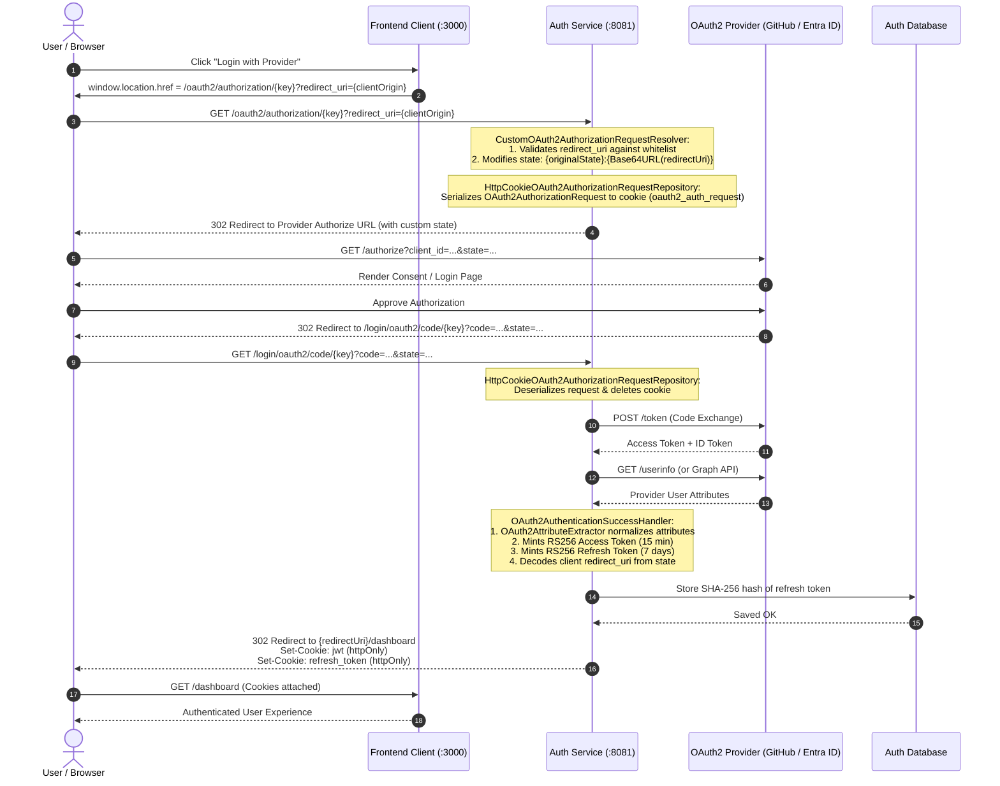

# OAuth2 Flows, Custom Resolvers & Handlers Reference

This reference document details the complete end-to-end OAuth2 Authorization Code flow, stateless cookie-based request persistence, dynamic multi-origin `redirect_uri` resolution, and cross-provider attribute normalization in Spring Security.

---

## 1. End-to-End OAuth2 Authorization Code Sequence



---

## 2. Dynamic Redirect URI Resolver (`CustomOAuth2AuthorizationRequestResolver`)

Spring Security's default resolver does not permit dynamic redirect destinations per request. This custom resolver intercepts the request, validates the requested `redirect_uri` against an allowed whitelist, and embeds it safely into the OAuth2 `state` parameter:

```java
package com.maruf.auth.config;

import jakarta.servlet.http.HttpServletRequest;
import lombok.extern.slf4j.Slf4j;
import org.springframework.security.oauth2.client.registration.ClientRegistrationRepository;
import org.springframework.security.oauth2.client.web.DefaultOAuth2AuthorizationRequestResolver;
import org.springframework.security.oauth2.client.web.OAuth2AuthorizationRequestResolver;
import org.springframework.security.oauth2.core.endpoint.OAuth2AuthorizationRequest;

import java.util.Base64;
import java.util.List;

@Slf4j
public class CustomOAuth2AuthorizationRequestResolver implements OAuth2AuthorizationRequestResolver {

    private final DefaultOAuth2AuthorizationRequestResolver defaultResolver;
    private final List<String> allowedRedirectUrls;

    public CustomOAuth2AuthorizationRequestResolver(
            ClientRegistrationRepository clientRegistrationRepository,
            List<String> allowedRedirectUrls) {
        this.defaultResolver = new DefaultOAuth2AuthorizationRequestResolver(
                clientRegistrationRepository, "/oauth2/authorization");
        this.allowedRedirectUrls = allowedRedirectUrls;
    }

    @Override
    public OAuth2AuthorizationRequest resolve(HttpServletRequest request) {
        OAuth2AuthorizationRequest authorizationRequest = defaultResolver.resolve(request);
        return customizeAuthorizationRequest(request, authorizationRequest);
    }

    @Override
    public OAuth2AuthorizationRequest resolve(HttpServletRequest request, String clientRegistrationId) {
        OAuth2AuthorizationRequest authorizationRequest = defaultResolver.resolve(request, clientRegistrationId);
        return customizeAuthorizationRequest(request, authorizationRequest);
    }

    private OAuth2AuthorizationRequest customizeAuthorizationRequest(
            HttpServletRequest request, OAuth2AuthorizationRequest authorizationRequest) {
        if (authorizationRequest == null) {
            return null;
        }

        String redirectUri = request.getParameter("redirect_uri");
        if (redirectUri != null && !redirectUri.isBlank()) {
            // Validate against whitelist to prevent Open Redirect vulnerabilities
            if (!isAllowedRedirectUrl(redirectUri)) {
                log.warn("Rejected unauthorized redirect_uri: {}", redirectUri);
                throw new IllegalArgumentException("Unauthorized redirect URI: " + redirectUri);
            }

            String originalState = authorizationRequest.getState();
            String encodedRedirect = Base64.getUrlEncoder().withoutPadding()
                    .encodeToString(redirectUri.getBytes());
            String customState = originalState + ":" + encodedRedirect;

            return OAuth2AuthorizationRequest.from(authorizationRequest)
                    .state(customState)
                    .build();
        }

        return authorizationRequest;
    }

    private boolean isAllowedRedirectUrl(String url) {
        return allowedRedirectUrls.stream().anyMatch(url::startsWith);
    }
}
```

---

## 3. Stateless Authorization Request Repository (`HttpCookieOAuth2AuthorizationRequestRepository`)

To keep the Authentication Service 100% stateless across cluster nodes without server-side HTTP session replication, the OAuth2 authorization request state is serialized into an `httpOnly` cookie:

```java
package com.maruf.auth.config;

import jakarta.servlet.http.Cookie;
import jakarta.servlet.http.HttpServletRequest;
import jakarta.servlet.http.HttpServletResponse;
import lombok.RequiredArgsConstructor;
import lombok.extern.slf4j.Slf4j;
import org.springframework.security.oauth2.client.web.AuthorizationRequestRepository;
import org.springframework.security.oauth2.core.endpoint.OAuth2AuthorizationRequest;
import org.springframework.stereotype.Component;

import java.io.*;
import java.time.Duration;
import java.util.Base64;

@Component
@RequiredArgsConstructor
@Slf4j
public class HttpCookieOAuth2AuthorizationRequestRepository
        implements AuthorizationRequestRepository<OAuth2AuthorizationRequest> {

    public static final String OAUTH2_AUTHORIZATION_REQUEST_COOKIE_NAME = "oauth2_auth_request";
    private static final int COOKIE_EXPIRE_SECONDS = 180; // 3 minute TTL

    private final HttpCookieFactory cookieFactory;

    @Override
    public OAuth2AuthorizationRequest loadAuthorizationRequest(HttpServletRequest request) {
        return getCookie(request, OAUTH2_AUTHORIZATION_REQUEST_COOKIE_NAME)
                .map(this::deserialize)
                .orElse(null);
    }

    @Override
    public void saveAuthorizationRequest(OAuth2AuthorizationRequest authorizationRequest,
                                         HttpServletRequest request,
                                         HttpServletResponse response) {
        if (authorizationRequest == null) {
            removeAuthorizationRequestCookies(response);
            return;
        }

        String serialized = serialize(authorizationRequest);
        cookieFactory.writeTo(response, OAUTH2_AUTHORIZATION_REQUEST_COOKIE_NAME, serialized,
                Duration.ofSeconds(COOKIE_EXPIRE_SECONDS));
    }

    @Override
    public OAuth2AuthorizationRequest removeAuthorizationRequest(HttpServletRequest request,
                                                                HttpServletResponse response) {
        OAuth2AuthorizationRequest original = loadAuthorizationRequest(request);
        removeAuthorizationRequestCookies(response);
        return original;
    }

    public void removeAuthorizationRequestCookies(HttpServletResponse response) {
        cookieFactory.writeTo(response, OAUTH2_AUTHORIZATION_REQUEST_COOKIE_NAME, "", Duration.ZERO);
    }

    private String serialize(OAuth2AuthorizationRequest object) {
        try (ByteArrayOutputStream baos = new ByteArrayOutputStream();
             ObjectOutputStream oos = new ObjectOutputStream(baos)) {
            oos.writeObject(object);
            return Base64.getUrlEncoder().withoutPadding().encodeToString(baos.toByteArray());
        } catch (IOException e) {
            throw new IllegalArgumentException("Failed to serialize OAuth2AuthorizationRequest", e);
        }
    }

    private OAuth2AuthorizationRequest deserialize(Cookie cookie) {
        try {
            byte[] bytes = Base64.getUrlDecoder().decode(cookie.getValue());
            try (ByteArrayInputStream bais = new ByteArrayInputStream(bytes);
                 ObjectInputStream ois = new ObjectInputStream(bais)) {
                return (OAuth2AuthorizationRequest) ois.readObject();
            }
        } catch (Exception e) {
            log.error("Failed to deserialize authorization request from cookie: {}", e.getMessage());
            return null;
        }
    }

    private java.util.Optional<Cookie> getCookie(HttpServletRequest request, String name) {
        if (request.getCookies() != null) {
            for (Cookie cookie : request.getCookies()) {
                if (name.equals(cookie.getName())) return java.util.Optional.of(cookie);
            }
        }
        return java.util.Optional.empty();
    }
}
```

---

## 4. OAuth2 Authentication Success Handler

Executes upon successful code exchange and userinfo retrieval:

```java
package com.maruf.auth.config;

import com.maruf.auth.exception.InsufficientScopeException;
import com.maruf.auth.service.JwtService;
import com.maruf.auth.service.RefreshTokenStore;
import com.maruf.auth.util.OAuth2AttributeExtractor;
import jakarta.servlet.http.HttpServletRequest;
import jakarta.servlet.http.HttpServletResponse;
import lombok.RequiredArgsConstructor;
import lombok.extern.slf4j.Slf4j;
import org.springframework.security.core.Authentication;
import org.springframework.security.oauth2.core.user.OAuth2User;
import org.springframework.security.web.authentication.SimpleUrlAuthenticationSuccessHandler;
import org.springframework.stereotype.Component;

import java.io.IOException;
import java.time.Duration;
import java.time.Instant;
import java.util.Base64;
import java.util.HashMap;
import java.util.Map;

@Component
@RequiredArgsConstructor
@Slf4j
public class OAuth2AuthenticationSuccessHandler extends SimpleUrlAuthenticationSuccessHandler {

    private final JwtService jwtService;
    private final RefreshTokenStore refreshTokenStore;
    private final HttpCookieFactory cookieFactory;
    private final AuthSecurityProperties authSecurityProperties;
    private final JwtSecurityProperties jwtSecurityProperties;

    @Override
    public void onAuthenticationSuccess(HttpServletRequest request,
                                        HttpServletResponse response,
                                        Authentication authentication) throws IOException {

        OAuth2User oauth2User = (OAuth2User) authentication.getPrincipal();
        String redirectUrl = resolveRedirectUrl(request);

        // 1. Validate required attributes from identity provider
        try {
            OAuth2AttributeExtractor.validateRequiredAttributes(oauth2User);
        } catch (InsufficientScopeException e) {
            log.warn("OAuth2 scope validation failed: {}", e.getMessage());
            getRedirectStrategy().sendRedirect(request, response, redirectUrl + "/?error=missing_scope");
            return;
        }

        String username = OAuth2AttributeExtractor.resolveUsername(oauth2User);
        if (username == null) {
            log.error("Unable to resolve username from attributes: {}", oauth2User.getAttributes());
            getRedirectStrategy().sendRedirect(request, response, redirectUrl + "/?error=missing_profile");
            return;
        }

        // 2. Generate Access Token (RS256)
        String accessToken = jwtService.generateAccessToken(oauth2User);

        // 3. Generate and Store Refresh Token (RS256 + SHA-256 Hashing)
        Map<String, Object> refreshClaims = new HashMap<>();
        refreshClaims.put("id", OAuth2AttributeExtractor.getUserId(oauth2User));
        refreshClaims.put("login", username);
        refreshClaims.put("name", OAuth2AttributeExtractor.getName(oauth2User));
        refreshClaims.put("email", OAuth2AttributeExtractor.getEmail(oauth2User));
        refreshClaims.put("avatar_url", OAuth2AttributeExtractor.getAvatarUrl(oauth2User));

        String refreshToken = jwtService.generateRefreshToken(username, refreshClaims);
        Instant refreshExpiresAt = Instant.now().plusMillis(jwtSecurityProperties.getRefreshTokenExpiration());
        refreshTokenStore.storeRefreshToken(refreshToken, username, refreshExpiresAt);

        // 4. Issue httpOnly Cookies
        cookieFactory.writeTo(response, CookieNames.JWT, accessToken,
                Duration.ofMillis(jwtSecurityProperties.getAccessTokenExpiration()));
        cookieFactory.writeTo(response, CookieNames.REFRESH_TOKEN, refreshToken,
                Duration.ofMillis(jwtSecurityProperties.getRefreshTokenExpiration()));

        // 5. Redirect to destination dashboard
        getRedirectStrategy().sendRedirect(request, response, redirectUrl + "/dashboard");
    }

    private String resolveRedirectUrl(HttpServletRequest request) {
        String state = request.getParameter("state");
        if (state != null && state.contains(":")) {
            try {
                String encodedRedirect = state.substring(state.indexOf(":") + 1);
                String redirectUri = new String(Base64.getUrlDecoder().decode(encodedRedirect));
                if (isAllowedRedirectUrl(redirectUri)) {
                    return redirectUri;
                }
                log.warn("Redirect URI from state rejected (not whitelisted): {}", redirectUri);
            } catch (Exception e) {
                log.warn("Failed to decode redirect URI from state parameter: {}", e.getMessage());
            }
        }
        return authSecurityProperties.getAllowedRedirectUrls().get(0);
    }

    private boolean isAllowedRedirectUrl(String url) {
        return authSecurityProperties.getAllowedRedirectUrls().stream().anyMatch(url::startsWith);
    }
}
```

---

## 5. Cross-Provider Attribute Normalization (`OAuth2AttributeExtractor`)

OAuth2 providers use disparate JSON keys for identical identity attributes. This static utility standardizes extraction across GitHub, Microsoft Entra ID (Azure AD), Google, and generic OIDC providers:

| Canonical Field    | GitHub Key     | Microsoft Entra ID (Azure AD)  | Google / OIDC | Fallback Chain                                      |
| ------------------ | -------------- | ------------------------------ | ------------- | --------------------------------------------------- |
| **User ID**        | `id` (integer) | `oid` (UUID)                   | `sub`         | `id` -> `oid` -> `sub`                              |
| **Login / Handle** | `login`        | `preferred_username`           | `email`       | `login` -> `preferred_username` -> `upn` -> `email` |
| **Display Name**   | `name`         | `name` / `displayName`         | `name`        | `name` -> `displayName` -> `login`                  |
| **Email**          | `email`        | `email` / `preferred_username` | `email`       | `email` -> `emails[0]` -> `preferred_username`      |
| **Avatar URL**     | `avatar_url`   | `picture`                      | `picture`     | `avatar_url` -> `picture`                           |

```java
package com.maruf.auth.util;

import com.maruf.auth.exception.InsufficientScopeException;
import org.springframework.security.oauth2.core.user.OAuth2User;

import java.util.List;
import java.util.Map;

public final class OAuth2AttributeExtractor {

    private OAuth2AttributeExtractor() {}

    public static String getUserId(OAuth2User user) {
        Object id = user.getAttribute("id");
        if (id != null) return id.toString();
        Object oid = user.getAttribute("oid");
        if (oid != null) return oid.toString();
        return user.getAttribute("sub");
    }

    public static String getLogin(OAuth2User user) {
        String login = user.getAttribute("login");
        if (login != null) return login;
        String preferredUsername = user.getAttribute("preferred_username");
        if (preferredUsername != null) return preferredUsername;
        String upn = user.getAttribute("upn");
        if (upn != null) return upn;
        return getEmail(user);
    }

    public static String getName(OAuth2User user) {
        String name = user.getAttribute("name");
        if (name != null) return name;
        return user.getAttribute("displayName");
    }

    public static String getEmail(OAuth2User user) {
        String email = user.getAttribute("email");
        if (email != null) return email;
        
        String preferredUsername = user.getAttribute("preferred_username");
        if (preferredUsername != null && preferredUsername.contains("@")) {
            return preferredUsername;
        }

        Object emailsObj = user.getAttribute("emails");
        if (emailsObj instanceof List<?> list && !list.isEmpty()) {
            Object first = list.get(0);
            if (first instanceof String s) return s;
            if (first instanceof Map<?, ?> map && map.get("value") != null) {
                return map.get("value").toString();
            }
        }
        return null;
    }

    public static String getAvatarUrl(OAuth2User user) {
        String avatar = user.getAttribute("avatar_url");
        if (avatar != null) return avatar;
        return user.getAttribute("picture");
    }

    public static String resolveUsername(OAuth2User user) {
        String login = getLogin(user);
        if (login != null) return login;
        String email = getEmail(user);
        if (email != null) return email;
        return getUserId(user);
    }

    public static void validateRequiredAttributes(OAuth2User user) {
        if (getUserId(user) == null) {
            throw new InsufficientScopeException("Missing unique user identifier in provider claims");
        }
        if (getLogin(user) == null && getEmail(user) == null) {
            throw new InsufficientScopeException("Missing login and email in provider claims");
        }
    }
}
```

