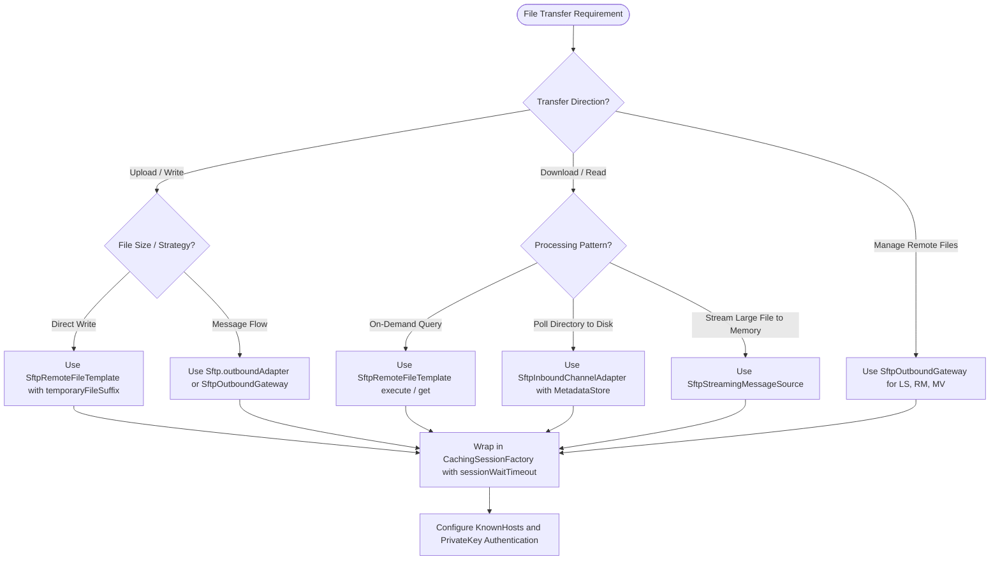

# Spring Boot SFTP Integration

## Overview
Spring Integration SFTP provides non-blocking, resilient file transfer capabilities over SSH using Apache Mina SSHD. Spring Integration 6.0 (Spring Boot 3.0) and later versions use Apache Mina SSHD exclusively as the underlying SSH client, replacing the deprecated legacy JSch library. Use pooled session factories, atomic write protocols, and metadata stores to ensure reliable file processing.

## When to Use

### Use This Skill For
- Configuring SFTP connections in Spring Boot 3.x and 4.x applications.
- Setting up `DefaultSftpSessionFactory` and `CachingSessionFactory`.
- Fixing session pool exhaustion, connection leaks, or thread contention.
- Setting up public key authentication, passphrases, and `known_hosts` verification.
- Implementing atomic file uploads using temporary file extensions (such as `.writing`).
- Polling remote directories with idempotent file filtering across clustered instances.
- Streaming large files directly into memory without local disk storage.
- Writing integration tests using Testcontainers or embedded Apache Mina SSHD servers.

### When NOT to Use
- Plain FTP or FTPS without SSH (use `spring-integration-ftp` instead).
- Amazon S3, Azure Blob, or Google Cloud Storage (use cloud vendor SDKs or Spring Cloud AWS).
- Local file system operations (use standard `java.nio.file` or `spring-integration-file`).
- REST or HTTP based file upload endpoints (use Spring MVC or WebFlux `MultipartFile`).

---

## Architecture Decision Flowchart

---

## Quick Reference Table

| Operation | Primary Spring Class / Method | Reference Document |
| :--- | :--- | :--- |
| **Session Pool Setup** | `CachingSessionFactory`, `DefaultSftpSessionFactory` | [Session Factory and Pooling](references/session-factory-and-pooling.md) |
| **Dynamic Routing** | `DelegatingSessionFactory` | [Session Factory and Pooling](references/session-factory-and-pooling.md) |
| **Atomic Upload** | `SftpRemoteFileTemplate.send(..., FileExistsMode.REPLACE)` | [SFTP Interaction Patterns](references/sftp-interaction-patterns.md) |
| **Directory Polling** | `Sftp.inboundAdapter()`, `SftpInboundFileSynchronizingMessageSource` | [SFTP Interaction Patterns](references/sftp-interaction-patterns.md) |
| **Stream to Memory** | `Sftp.inboundStreamingAdapter()`, `SftpStreamingMessageSource` | [SFTP Interaction Patterns](references/sftp-interaction-patterns.md) |
| **Remote Commands (LS/MV)** | `Sftp.outboundGateway()`, `SftpOutboundGateway` | [SFTP Interaction Patterns](references/sftp-interaction-patterns.md) |
| **Key Authentication** | `DefaultSftpSessionFactory.setPrivateKey()` | [Authentication and Security](references/authentication-and-security.md) |
| **Host Verification** | `DefaultSftpSessionFactory.setKnownHostsResource()` | [Authentication and Security](references/authentication-and-security.md) |
| **Retry & Recovery** | `RequestHandlerRetryAdvice`, `StatefulRetryOperationsInterceptor` | [Resilience and Error Handling](references/resilience-and-error-handling.md) |
| **Clustered Filter** | `SftpPersistentAcceptOnceFileListFilter`, `ConcurrentMetadataStore` | [Resilience and Error Handling](references/resilience-and-error-handling.md) |
| **Embedded Test** | `org.apache.sshd.server.SshServer`, `TestSftpSessionFactory` | [Testing SFTP](references/testing-sftp.md) |
| **Testcontainers** | `org.testcontainers.containers.GenericContainer` | [Testing SFTP](references/testing-sftp.md) |

---

## Core Patterns Summary

### 1. SftpRemoteFileTemplate
The primary high level abstraction for on-demand SFTP operations. It acquires a session from the pool, runs the callback or transfer, and returns the session automatically. Always configure a temporary file suffix (for example `.writing`) during uploads to prevent downstream processes reading incomplete files.

### 2. Inbound File Synchronising Channel Adapter
Polls a remote SFTP directory on a scheduled trigger, downloads new files to a local directory, and sends a `Message<File>` to a message channel. Requires an `SftpPersistentAcceptOnceFileListFilter` backed by a shared `MetadataStore` (such as Redis or JDBC) when deployed in multi-instance clusters.

### 3. Inbound Streaming Message Source
Reads remote files as an `InputStream` without writing to local storage. The downstream message handler receives `Message<InputStream>`. The consumer must close the `InputStream` or close the `Closeable` session header (`IntegrationMessageHeaderAccessor.CLOSEABLE_RESOURCE`) to avoid session leaks.

### 4. Outbound Gateway
Executes remote commands (`ls`, `get`, `mget`, `rm`, `mv`, `put`, `mput`) through Spring Integration messaging channels. Useful for building request-reply flows and managing remote directories dynamically.

---

## Common Mistakes and Gotchas

### 1. Direct Use of SftpSession Across Threads
`SftpSession` is not thread-safe. Never share an `SftpSession` instance between concurrent threads. Always use `SftpRemoteFileTemplate` or acquire and close individual sessions per operation using try-with-resources.

### 2. Missing sessionWaitTimeout on CachingSessionFactory
By default, `CachingSessionFactory` blocks indefinitely if the session pool is exhausted. Set `setSessionWaitTimeout(Duration.ofMillis(5000))` to throw an explicit exception instead of hanging threads permanently.

### 3. Unclosed InputStreams in Streaming Adapter
When using `SftpStreamingMessageSource`, the acquired session stays open until the `InputStream` closes. Failing to close the stream in a `finally` block leads to pool exhaustion.

### 4. Non-Atomic File Uploads
Writing directly to the target filename allows remote consumers to read partial data while the upload is in progress. Always set `setTemporaryFileSuffix(".writing")` or upload to a staging folder and execute an SFTP `rename` operation.

### 5. Disabling Host Key Verification in Production
Setting `allowUnknownKeys = true` disables man-in-the-middle protection. Always configure a valid `known_hosts` file or specify an explicit trusted server public key in production environments.

---

## Detailed Reference Guides

- [Session Factory and Pooling](references/session-factory-and-pooling.md): Connection configuration, caching pools, dynamic routing, and health verification.
- [SFTP Interaction Patterns](references/sftp-interaction-patterns.md): Templates, inbound polling, streaming sources, and outbound gateways.
- [Authentication and Security](references/authentication-and-security.md): Private keys, passphrases, `known_hosts`, proxy servers, and cipher configurations.
- [Resilience and Error Handling](references/resilience-and-error-handling.md): Retries, circuit breakers, cluster deduplication, and stale session handling.
- [Testing SFTP](references/testing-sftp.md): Unit tests, embedded Apache Mina SSHD, and Testcontainers.

