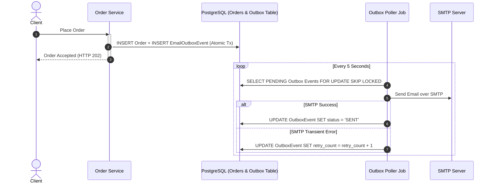

mime-messages-and-templating
---
# Resilience, Asynchronous Execution, and Outbox Patterns

## Overview

SMTP transmissions require multi-step TCP and TLS handshakes, SMTP command negotiations (`HELO`, `AUTH`, `MAIL FROM`, `RCPT TO`, `DATA`), and payload transmission. This process typically takes between 200 ms and 3,000 ms per email.

Synchronous email sending inside an HTTP request handler blocks web container worker threads (such as Tomcat worker threads). Under high load, this causes thread pool exhaustion and severe request latency.

---

## 1. Asynchronous Email Sending with Dedicated TaskExecutor

Never use the default unbounded `@Async` task executor for email sending. Always configure a dedicated, bounded thread pool.

### Step 1: Configure Dedicated ThreadPool

```java
package com.example.mail.config;

import java.util.concurrent.Executor;
import org.springframework.context.annotation.Bean;
import org.springframework.context.annotation.Configuration;
import org.springframework.scheduling.annotation.EnableAsync;
import org.springframework.scheduling.concurrent.ThreadPoolTaskExecutor;

@Configuration
@EnableAsync
public class AsyncMailConfig {

    @Bean(name = "mailTaskExecutor")
    public Executor mailTaskExecutor() {
        ThreadPoolTaskExecutor executor = new ThreadPoolTaskExecutor();
        executor.setCorePoolSize(4);
        executor.setMaxPoolSize(16);
        executor.setQueueCapacity(500);
        executor.setThreadNamePrefix("mail-exec-");
        executor.setWaitForTasksToCompleteOnShutdown(true);
        executor.setAwaitTerminationSeconds(30);
        executor.initialize();
        return executor;
    }
}
```

### Step 2: Virtual Threads (Spring Boot 3.2+)

In Spring Boot 3.2 and higher running on Java 21+, enable Virtual Threads to handle blocking SMTP I/O with minimal memory footprint:

```yaml
spring:
  threads:
    virtual:
      enabled: true
```

When virtual threads are enabled, `@Async` tasks automatically execute on lightweight virtual threads without pool size constraints.

### Step 3: Asynchronous Email Service

```java
package com.example.mail.service;

import org.slf4j.Logger;
import org.slf4j.LoggerFactory;
import org.springframework.mail.MailException;
import org.springframework.mail.SimpleMailMessage;
import org.springframework.mail.javamail.JavaMailSender;
import org.springframework.scheduling.annotation.Async;
import org.springframework.stereotype.Service;

@Service
public class AsyncEmailService {

    private static final Logger log = LoggerFactory.getLogger(AsyncEmailService.class);
    private final JavaMailSender mailSender;

    public AsyncEmailService(JavaMailSender mailSender) {
        this.mailSender = mailSender;
    }

    @Async("mailTaskExecutor")
    public void sendEmailAsync(SimpleMailMessage message) {
        try {
            mailSender.send(message);
            log.info("Email successfully sent to {}", (Object) message.getTo());
        } catch (MailException e) {
            log.error("Failed to send email to {}: {}", message.getTo(), e.getMessage(), e);
        }
    }
}
```

---

## 2. Retry Logic for Transient Failures

Network timeouts and temporary SMTP server throttling (HTTP 421/450/451 SMTP status codes) should be retried automatically. Permanent errors (such as `MailAuthenticationException` or `MailParseException`) must **not** be retried.

### Spring Retry Configuration

```xml
<dependency>
    <groupId>org.springframework.retry</groupId>
    <artifactId>spring-retry</artifactId>
</dependency>
<dependency>
    <groupId>org.springframework</groupId>
    <artifactId>spring-aspects</artifactId>
</dependency>
```

### Resilient Email Sender

```java
package com.example.mail.service;

import org.slf4j.Logger;
import org.slf4j.LoggerFactory;
import org.springframework.mail.MailAuthenticationException;
import org.springframework.mail.MailParseException;
import org.springframework.mail.MailSendException;
import org.springframework.mail.SimpleMailMessage;
import org.springframework.mail.javamail.JavaMailSender;
import org.springframework.retry.annotation.Backoff;
import org.springframework.retry.annotation.Recover;
import org.springframework.retry.annotation.Retryable;
import org.springframework.stereotype.Service;

@Service
public class ResilientMailSender {

    private static final Logger log = LoggerFactory.getLogger(ResilientMailSender.class);
    private final JavaMailSender mailSender;

    public ResilientMailSender(JavaMailSender mailSender) {
        this.mailSender = mailSender;
    }

    @Retryable(
        retryFor = { MailSendException.class },
        noRetryFor = { MailAuthenticationException.class, MailParseException.class },
        maxAttempts = 3,
        backoff = @Backoff(delay = 2000, multiplier = 2)
    )
    public void sendWithRetry(SimpleMailMessage message) {
        mailSender.send(message);
    }

    @Recover
    public void recover(MailSendException e, SimpleMailMessage message) {
        log.error("All retry attempts exhausted for email to {}. Alerting operations.", (Object) message.getTo(), e);
        // Persist to failed message dead-letter queue or alert administrators
    }
}
```

---

## 3. Transactional Outbox Pattern

> **Golden Rule**: Never execute non-transactional network I/O (such as sending an SMTP email) inside an active database transaction (`@Transactional`).

If the email succeeds but the database transaction rolls back later (for example, due to a database constraint violation), the customer receives an email for an action that never occurred in the database.

### The Outbox Solution



### Outbox Entity Example

```java
package com.example.mail.outbox;

import jakarta.persistence.*;
import java.time.Instant;
import java.util.UUID;

@Entity
@Table(name = "email_outbox")
public class EmailOutboxEntity {

    @Id
    private UUID id = UUID.randomUUID();

    @Column(nullable = false)
    private String recipient;

    @Column(nullable = false)
    private String subject;

    @Column(columnDefinition = "TEXT", nullable = false)
    private String body;

    @Enumerated(EnumType.STRING)
    @Column(nullable = false)
    private OutboxStatus status = OutboxStatus.PENDING;

    private int retryCount = 0;
    private Instant createdAt = Instant.now();
    private Instant processedAt;

    // Standard getters, setters, and constructors
}
```

---

## 4. SMTP Provider Rate Limiting

Cloud SMTP providers (such as Amazon SES, Mailgun, and SendGrid) enforce strict sending rates (for example, 14 messages per second).

To prevent provider throttling (HTTP 454 / Too many requests):
- Use a token-bucket rate limiter (such as Bucket4j or Resilience4j `RateLimiter`).
- Throttle outbox workers to process messages in batches matching provider quota.

