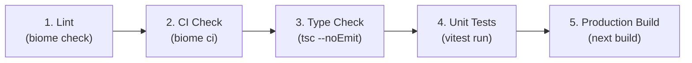

# Verification Pipeline & Biome Troubleshooting Catalog

Multi-gate quality verification pipeline and troubleshooting catalog for common Biome errors, formatting traps, CI issues, and real-world fixes.

---

## 1. Multi-Gate Verification Pipeline

Biome is an AST-based linter and formatter. Complete quality verification requires executing all quality gates:



### Verification Matrix

| Gate | Command | Purpose |
| :--- | :--- | :--- |
| **Gate 1: Lint** | `yarn lint` (`biome check .`) | Verifies AST correctness, syntax, import order, and lint rules. |
| **Gate 2: CI Check** | `yarn ci` (`biome ci .`) | Strict read-only gate ensuring zero formatting drift or unorganized imports. |
| **Gate 3: Type Check** | `npx tsc --noEmit` | Full semantic TypeScript verification via native Go compiler. |
| **Gate 4: Unit Tests** | `yarn test` (`vitest run`) | Validates runtime behavior and test suites. |
| **Gate 5: Production Build** | `yarn build` (`next build --turbopack`) | Verifies Next.js SSG page generation, Turbopack bundling, and compilation. |

---

## 2. Troubleshooting Catalog: Common Biome Errors & Fixes

### 1. `useBiomeIgnoreFolder` / Folder Ignore Syntax in Biome 2.2+

- **Error**:
  ```text
  Incorrect usage of ignore a folder found. Since version 2.2.0, ignoring folders doesn't require the use of trailing /**.
  ```
- **Fix**:
  In `biome.json`, use bare directory names in `files.includes` with `!`:
  ```json
  "files": {
    "includes": ["**", "!coverage", "!.next", "!node_modules", "!public"]
  }
  ```

---

### 2. `noDuplicateEnumValues` (Duplicate Enum Member Value)

- **Error**:
  ```text
  lint/suspicious/noDuplicateEnumValues: Duplicate enum member value.
  ```
- **Fix**:
  Check enum definitions for duplicate or misspelled keys assigning the same string literal, and remove the redundant key:
  ```typescript
  // Before (Bug caught by Biome 2.5):
  GenerativeAdversarialNetworks = "generative-adversarial-networks",
  GenerativeAversarialNetworks = "generative-adversarial-networks", // Remove duplicate!
  ```

---

### 3. Template Literal Whitespace Collapsing (`className` Merging)

- **Symptom**:
  UI layout or sizing breaks silently after running `biome format --write .` (e.g. navbar width collapses, element sticks to left side of screen).
- **Root Cause**:
  Biome collapses multiline template literals in `className` onto a single line. If the original code relied on newlines rather than space characters to separate interpolations from adjacent classes:
  ```tsx
  // Collapsed result:
  className={`h-${NAVBAR_HEIGHT}w-full fixed ...`} // Evaluates to "h-20w-full fixed" (w-full lost!)
  ```
- **Fix**:
  1. Add explicit spaces: `className={`h-${NAVBAR_HEIGHT} w-full fixed ...`}`.
  2. Search for unspaced interpolations across codebase:
     - `\$\{[^}]+\}[a-zA-Z0-9_-]`
     - `[a-zA-Z0-9_-]\$\{[^}]+\}`
  3. Or refactor to `cn(...)` / `twMerge(...)`.

---

### 4. Dynamic Tailwind Class Name Extraction Failures

- **Symptom**:
  Dynamic classes like `pt-${NAVBAR_HEIGHT}` or `text-${color}` work in development but fail in production builds because the CSS rule is missing from the stylesheet.
- **Root Cause**:
  Tailwind CSS statically parses source files for full string literals at compile time; it cannot evaluate JavaScript template expressions.
- **Fix**:
  Use full static class names (e.g., `pt-20`) or inline style attributes (`style={{ paddingTop: 80 }}`).

---

### 5. `noDangerouslySetInnerHtml` (Security Warning)

- **Error**:
  ```text
  lint/security/noDangerouslySetInnerHtml: Avoid passing content using the dangerouslySetInnerHTML prop.
  ```
- **Fix**:
  For trusted static database content, add an explicit suppression comment directly above the element:
  ```tsx
  // biome-ignore lint/security/noDangerouslySetInnerHtml: Trusted static database content
  <div dangerouslySetInnerHTML={{ __html: html }} />
  ```

---

### 6. `useExhaustiveDependencies` on Route/Transition Triggers

- **Error**:
  ```text
  lint/correctness/useExhaustiveDependencies: This hook specifies more dependencies than necessary: pathname
  ```
- **Fix**:
  When an effect is intentionally designed to trigger on route changes (e.g. scroll reset on `pathname` change):
  ```tsx
  // biome-ignore lint/correctness/useExhaustiveDependencies: Scroll reset triggers on pathname transitions
  useEffect(() => {
    window.scroll(0, 0);
  }, [pathname]);
  ```

---

### 7. `noUnusedFunctionParameters` / `noUnusedVariables`

- **Error**:
  ```text
  lint/correctness/noUnusedFunctionParameters: Parameter 'foo' is defined but never used.
  ```
- **Fix**:
  Prefix unused arguments with an underscore (`_foo`) or remove them from the signature.

---

### 8. `useSortedClasses` (Tailwind Class Sorting Warning)

- **Warning**:
  ```text
  lint/nursery/useSortedClasses: The Tailwind CSS classes are not sorted.
  ```
- **Fix**:
  Run `yarn lint:fix` (`biome check --write --unsafe .`) to automatically sort classes in JSX strings and helper function arguments (`clsx`, `cva`, `twMerge`, `cn`).

---

### 9. GitHub Actions Workflow YAML Syntax Errors (`Map keys must be unique`)

- **Error**:
  ```text
  Map keys must be unique at line X
  ```
- **Root Cause**:
  When updating workflow steps from ESLint to Biome, omitting an intermediate job declaration (e.g., omitting `build:` between `lint` and `needs: lint`) causes the parser to treat subsequent job properties (`name:`, `runs-on:`, `steps:`) as duplicate keys under the previous job.
- **Fix**:
  Ensure each job header is explicitly defined and distinct:
  ```yaml
  jobs:
    lint:
      name: Lint
      steps:
        - run: yarn biome ci .

    build:
      needs: lint
      name: Build
      steps:
        - run: yarn build
  ```
