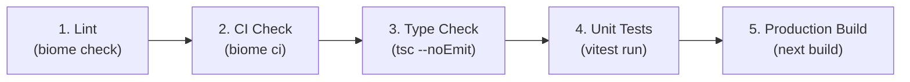

# Verification Pipeline & Biome Troubleshooting Catalog

Multi-gate quality verification pipeline and troubleshooting catalog for common Biome errors, formatting traps, CI issues, and real-world fixes.

---

## 1. Multi-Gate Verification Pipeline

Biome is an AST-based linter and formatter. Complete quality verification requires executing all quality gates:



### Verification Matrix

| Gate                         | Command                                 | Purpose                                                                      |
| :--------------------------- | :-------------------------------------- | :--------------------------------------------------------------------------- |
| **Gate 1: Lint**             | `yarn lint` (`biome check .`)           | Verifies AST correctness, syntax, import order, and lint rules.              |
| **Gate 2: CI Check**         | `yarn ci` (`biome ci .`)                | Strict read-only gate ensuring zero formatting drift or unorganized imports. |
| **Gate 3: Type Check**       | `npx tsc --noEmit`                      | Full semantic TypeScript verification via native Go compiler.                |
| **Gate 4: Unit Tests**       | `yarn test` (`vitest run`)              | Validates runtime behavior and test suites.                                  |
| **Gate 5: Production Build** | `yarn build` (`next build --turbopack`) | Verifies Next.js SSG page generation, Turbopack bundling, and compilation.   |

---

## 2. Troubleshooting Catalog: Common Biome Errors & Fixes

### 1. `useBiomeIgnoreFolder` / Folder Ignore Syntax in Biome 2.2+

- **Error**:
  ```text
  Incorrect usage of ignore a folder found. Since version 2.2.0, ignoring folders doesn't require the use of trailing /**.
  ```
- **Fix**:
  In `biome.json`, use bare directory names in `files.includes` with `!`:
  ```json
  "files": {
    "includes": ["**", "!coverage", "!.next", "!node_modules", "!public"]
  }
  ```

---

### 2. `noDuplicateEnumValues` (Duplicate Enum Member Value)

- **Error**:
  ```text
  lint/suspicious/noDuplicateEnumValues: Duplicate enum member value.
  ```
- **Fix**:
  Check enum definitions for duplicate or misspelled keys assigning the same string literal, and remove the redundant key:
  ```typescript
  // Before (Bug caught by Biome 2.5):
  GenerativeAdversarialNetworks = "generative-adversarial-networks",
  GenerativeAversarialNetworks = "generative-adversarial-networks", // Remove duplicate!
  ```

---

### 3. Template Literal Whitespace Collapsing (`className` Merging)

- **Symptom**:
  UI layout or sizing breaks silently after running `biome format --write .` (e.g. navbar width collapses, element sticks to left side of screen).
- **Root Cause**:
  Biome collapses multiline template literals in `className` onto a single line. If the original code relied on newlines rather than space characters to separate interpolations from adjacent classes:
  ```tsx
  // Collapsed result:
  className={`h-${NAVBAR_HEIGHT}w-full fixed ...`} // Evaluates to "h-20w-full fixed" (w-full lost!)
  ```
- **Fix**:
  1. Add explicit spaces: `className={`h-${NAVBAR_HEIGHT} w-full fixed ...`}`.
  2. Search for unspaced interpolations across codebase:
     - `\$\{[^}]+\}[a-zA-Z0-9_-]`
     - `[a-zA-Z0-9_-]\$\{[^}]+\}`
  3. Or refactor to `cn(...)` / `twMerge(...)`.

---

### 4. Dynamic Tailwind Class Name Extraction Failures

- **Symptom**:
  Dynamic classes like `pt-${NAVBAR_HEIGHT}` or `text-${color}` work in development but fail in production builds because the CSS rule is missing from the stylesheet.
- **Root Cause**:
  Tailwind CSS statically parses source files for full string literals at compile time; it cannot evaluate JavaScript template expressions.
- **Fix**:
  Use full static class names (e.g., `pt-20`) or inline style attributes (`style={{ paddingTop: 80 }}`).

---

### 5. `noDangerouslySetInnerHtml` (Security Warning)

- **Error**:
  ```text
  lint/security/noDangerouslySetInnerHtml: Avoid passing content using the dangerouslySetInnerHTML prop.
  ```
- **Fix**:
  For trusted static database content, add an explicit suppression comment directly above the element:
  ```tsx
  // biome-ignore lint/security/noDangerouslySetInnerHtml: Trusted static database content
  <div dangerouslySetInnerHTML={{ __html: html }} />
  ```

---

### 6. `useExhaustiveDependencies` on Route/Transition Triggers

- **Error**:
  ```text
  lint/correctness/useExhaustiveDependencies: This hook specifies more dependencies than necessary: pathname
  ```
- **Fix**:
  When an effect is intentionally designed to trigger on route changes (e.g. scroll reset on `pathname` change):
  ```tsx
  // biome-ignore lint/correctness/useExhaustiveDependencies: Scroll reset triggers on pathname transitions
  useEffect(() => {
    window.scroll(0, 0);
  }, [pathname]);
  ```

---

### 7. `noUnusedFunctionParameters` / `noUnusedVariables`

- **Error**:
  ```text
  lint/correctness/noUnusedFunctionParameters: Parameter 'foo' is defined but never used.
  ```
- **Fix**:
  Prefix unused arguments with an underscore (`_foo`) or remove them from the signature.

---

### 8. `useSortedClasses` (Tailwind Class Sorting Warning)

- **Warning**:
  ```text
  lint/nursery/useSortedClasses: The Tailwind CSS classes are not sorted.
  ```
- **Fix**:
  Run `yarn lint:fix` (`biome check --write --unsafe .`) to automatically sort classes in JSX strings and helper function arguments (`clsx`, `cva`, `twMerge`, `cn`).

---

### 9. GitHub Actions Workflow YAML Syntax Errors (`Map keys must be unique`)

- **Error**:
  ```text
  Map keys must be unique at line X
  ```
- **Root Cause**:
  When updating workflow steps from ESLint to Biome, omitting an intermediate job declaration (e.g., omitting `build:` between `lint` and `needs: lint`) causes the parser to treat subsequent job properties (`name:`, `runs-on:`, `steps:`) as duplicate keys under the previous job.
- **Fix**:
  Ensure each job header is explicitly defined and distinct:
  ```yaml
  jobs:
    lint:
      name: Lint
      steps:
        - run: yarn biome ci .

    build:
      needs: lint
      name: Build
      steps:
        - run: yarn build
  ```

---

### 10. `useIterableCallbackReturn` (Concise Arrow Callback in `.forEach`)

- **Error**:
  ```text
  lint/suspicious/useIterableCallbackReturn: This callback passed to forEach() iterable method should not return a value.
  ```
- **Root Cause**:
  Arrow functions with concise expressions (e.g. `items.forEach((item) => store.set(item))` or `listeners.forEach((cb) => cb())`) implicitly return the expression result. Since `.forEach()` ignores return values, returning values often signals confusing `.forEach()` with `.map()`.
- **Fix**:
  Wrap the callback body in braces or use a `for..of` loop:
  ```typescript
  // Before:
  items.forEach((item) => store.set(item));

  // After:
  items.forEach((item) => {
    store.set(item);
  });
  ```

---

### 11. `suppressions/unused` (Unused Suppression Comment)

- **Error**:
  ```text
  suppressions/unused: Suppression comment has no effect.
  ```
- **Root Cause**:
  A `// biome-ignore` comment was added or migrated for a rule that is already disabled in `biome.json` (e.g., in test `overrides`), or the underlying violation was resolved by an automated fix (such as `useExhaustiveDependencies` populating dependencies).
- **Fix**:
  Delete the redundant suppression comment.

---

### 12. JSX Attribute Suppression Positioning (`noDangerouslySetInnerHtml`)

- **Error**:
  `lint/security/noDangerouslySetInnerHtml` flags `dangerouslySetInnerHTML` even when `// biome-ignore` is present above the opening tag `<style>` or `<div>`.
- **Root Cause**:
  Biome evaluates JSX attribute rules at the attribute AST node. Placing the comment before the element tag attaches it to the element, leaving the attribute unsuppressed.
- **Fix**:
  Place the suppression comment inside the element tag directly above the attribute line:
  ```tsx
  <style
    // biome-ignore lint/security/noDangerouslySetInnerHtml: Theme CSS generation
    dangerouslySetInnerHTML={{ __html: themeCss }}
  />
  ```

---

### 13. `useExhaustiveDependencies` Unsafe Auto-Fix Stripping Intentional Dependencies

- **Symptom**:
  Running `biome check --write --unsafe .` drops dependencies from `useEffect` (e.g. changes `[isSignedIn, user]` to `[isSignedIn]`), causing test failures or stale UI when `user` changes.
- **Root Cause**:
  Biome AST analysis inspects variables referenced directly inside the effect closure. When state is derived outside the effect (e.g. `const isSignedIn = !!user;`), Biome treats `user` as an extraneous dependency and strips it under `--unsafe`.
- **Fix**:
  Reference the entity directly within the effect body so Biome recognizes it as an active dependency:
  ```typescript
  // Before:
  const isSignedIn = !!user;
  useEffect(() => {
    if (!isSignedIn) return;
    fetchData();
  }, [user]); // Biome --unsafe removes user!

  // After:
  useEffect(() => {
    if (!user) return;
    fetchData();
  }, [user]); // Biome recognises user as an active dependency
  ```

---

### 14. Test Mock `noThenProperty` and `noImgElement`

- **Error**:
  `lint/suspicious/noThenProperty` on mock database/query builder objects defining thenable properties (`Object.defineProperty(b, "then", ...)`), or `lint/performance/noImgElement` on mocked Next.js Image components (``).
- **Fix**:
  Add `performance.noImgElement: "off"` and `suspicious.noThenProperty: "off"` to the `overrides` block in `biome.json` for test file globs (`__tests__/**/*`, `**/*.test.{ts,tsx}`).

---

### 15. `useArrowFunction` Breaking Class Constructor Mocks (`TypeError: is not a constructor`)

- **Error**:
  ```text
  TypeError: Class constructor S3Client cannot be invoked without 'new'
  TypeError: _postmark.ServerClient is not a constructor
  ```
- **Root Cause**:
  Biome's `complexity/useArrowFunction` rule converts standard functions `function () { ... }` into arrow functions `() => { ... }`. Arrow functions do not possess a `[[Construct]]` internal method and cannot be instantiated with `new`. When libraries (e.g. `@aws-sdk/client-s3`, `postmark`) instantiate mocked classes via `new S3Client(...)`, arrow function mocks throw a runtime TypeError.
- **Fix**:
  1. Set `"complexity": { "useArrowFunction": "off" }` in `biome.json` (or under test `overrides`).
  2. Implement constructor mocks using standard function expressions:
     ```typescript
     vi.mock("@aws-sdk/client-s3", () => ({
       S3Client: vi.fn().mockImplementation(function () {
         return { send: mockSend };
       }),
     }));
     ```

---

### 16. Next.js Turbopack Font Download Failure in Sandboxed / Offline Builds

- **Error**:
  ```text
  Failed to fetch font `Geist` from Google Fonts: 403 Forbidden / Network error
  ```
- **Root Cause**:
  `next build` with Turbopack downloads Google Fonts (`next/font/google`) during static page generation. In sandboxed or offline container environments without outbound network access, font fetching fails and aborts the build.
- **Fix**:
  Ensure outbound network access is permitted for production builds (e.g. `BypassSandbox: true` in agent tooling or network access in CI runners).

---

### 17. `noDuplicateObjectKeys` (Duplicate Object Literal or JSON Keys)

- **Error**:
  ```text
  lint/suspicious/noDuplicateObjectKeys: The key X was already declared.
  ```
- **Root Cause**:
  Duplicated object keys or JSON properties left after manual edits or migrations (e.g. duplicate `"lint"` scripts in `package.json` or duplicate command mocks).
- **Fix**:
  Remove the duplicate preceding or shadowed key definition.

---

### 18. `assist/source/organizeImports` (Import Organization & Sorting)

- **Error**:
  ```text
  assist/source/organizeImports FIXABLE: Sort the imported names.
  ```
- **Root Cause**:
  Biome strictly enforces alphabetical and grouped import ordering. Modifying imports manually can leave specifiers out of order.
- **Fix**:
  Run `biome check --write --unsafe .` (or `npm run lint:fix`) to automatically sort import specifiers and group imports.


