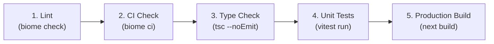

# Verification Pipeline & Biome Troubleshooting Catalog

Multi-gate quality verification pipeline and troubleshooting catalog for common Biome errors, formatting traps, CI issues, and real-world fixes.

---

## 1. Multi-Gate Verification Pipeline

Biome is an AST-based linter and formatter. Complete quality verification requires executing all quality gates:


```mermaid
flowchart LR
    A["1. Lint\n(biome check)"] --> B["2. CI Check\n(biome ci)"]
    B --> C["3. Type Check\n(tsc --noEmit)"]
    C --> D["4. Unit Tests\n(vitest run)"]
    D --> E["5. Production Build\n(next build)"]
```

### Verification Matrix

| Gate                         | Command                                 | Purpose                                                                      |
| :--------------------------- | :-------------------------------------- | :--------------------------------------------------------------------------- |
| **Gate 1: Lint**             | `yarn lint` (`biome check .`)           | Verifies AST correctness, syntax, import order, and lint rules.              |
| **Gate 2: CI Check**         | `yarn ci` (`biome ci .`)                | Strict read-only gate ensuring zero formatting drift or unorganized imports. |
| **Gate 3: Type Check**       | `npx tsc --noEmit`                      | Full semantic TypeScript verification via native Go compiler.                |
| **Gate 4: Unit Tests**       | `yarn test` (`vitest run`)              | Validates runtime behavior and test suites.                                  |
| **Gate 5: Production Build** | `yarn build` (`next build --turbopack`) | Verifies Next.js SSG page generation, Turbopack bundling, and compilation.   |

---

## 2. Troubleshooting Catalog: Common Biome Errors & Fixes

### 1. `useBiomeIgnoreFolder` / Folder Ignore Syntax in Biome 2.2+

- **Error**:
  ```text
  Incorrect usage of ignore a folder found. Since version 2.2.0, ignoring folders doesn't require the use of trailing /**.
  ```
- **Fix**:
  In `biome.json`, use bare directory names in `files.includes` with `!`:
  ```json
  "files": {
    "includes": ["**", "!coverage", "!.next", "!node_modules", "!public"]
  }
  ```

---

### 2. `noDuplicateEnumValues` (Duplicate Enum Member Value)

- **Error**:
  ```text
  lint/suspicious/noDuplicateEnumValues: Duplicate enum member value.
  ```
- **Fix**:
  Check enum definitions for duplicate or misspelled keys assigning the same string literal, and remove the redundant key:
  ```typescript
  // Before (Bug caught by Biome 2.5):
  GenerativeAdversarialNetworks = "generative-adversarial-networks",
  GenerativeAversarialNetworks = "generative-adversarial-networks", // Remove duplicate!
  ```

---

### 3. Template Literal Whitespace Collapsing (`className` Merging)

- **Symptom**:
  UI layout or sizing breaks silently after running `biome format --write .` (e.g. navbar width collapses, element sticks to left side of screen).
- **Root Cause**:
  Biome collapses multiline template literals in `className` onto a single line. If the original code relied on newlines rather than space characters to separate interpolations from adjacent classes:
  ```tsx
  // Collapsed result:
  className={`h-${NAVBAR_HEIGHT}w-full fixed ...`} // Evaluates to "h-20w-full fixed" (w-full lost!)
  ```
- **Fix**:
  1. Add explicit spaces: `className={`h-${NAVBAR_HEIGHT} w-full fixed ...`}`.
  2. Search for unspaced interpolations across codebase:
     - `\$\{[^}]+\}[a-zA-Z0-9_-]`
     - `[a-zA-Z0-9_-]\$\{[^}]+\}`
  3. Or refactor to `cn(...)` / `twMerge(...)`.

---

### 4. Dynamic Tailwind Class Name Extraction Failures

- **Symptom**:
  Dynamic classes like `pt-${NAVBAR_HEIGHT}` or `text-${color}` work in development but fail in production builds because the CSS rule is missing from the stylesheet.
- **Root Cause**:
  Tailwind CSS statically parses source files for full string literals at compile time; it cannot evaluate JavaScript template expressions.
- **Fix**:
  Use full static class names (e.g., `pt-20`) or inline style attributes (`style={{ paddingTop: 80 }}`).

---

### 5. `noDangerouslySetInnerHtml` (Security Warning)

- **Error**:
  ```text
  lint/security/noDangerouslySetInnerHtml: Avoid passing content using the dangerouslySetInnerHTML prop.
  ```
- **Fix**:
  For trusted static database content, add an explicit suppression comment directly above the element:
  ```tsx
  // biome-ignore lint/security/noDangerouslySetInnerHtml: Trusted static database content
  <div dangerouslySetInnerHTML={{ __html: html }} />
  ```

---

### 6. `useExhaustiveDependencies` on Route/Transition Triggers

- **Error**:
  ```text
  lint/correctness/useExhaustiveDependencies: This hook specifies more dependencies than necessary: pathname
  ```
- **Fix**:
  When an effect is intentionally designed to trigger on route changes (e.g. scroll reset on `pathname` change):
  ```tsx
  // biome-ignore lint/correctness/useExhaustiveDependencies: Scroll reset triggers on pathname transitions
  useEffect(() => {
    window.scroll(0, 0);
  }, [pathname]);
  ```
  *(Note: Always place the suppression comment directly above `useEffect`, never inside the callback body, to avoid `suppressions/unused` errors).*

---

### 7. `noUnusedFunctionParameters` / `noUnusedVariables`

- **Error**:
  ```text
  lint/correctness/noUnusedFunctionParameters: Parameter 'foo' is defined but never used.
  ```
- **Fix**:
  Prefix unused arguments with an underscore (`_foo`) or remove them from the signature.

---

### 8. `useSortedClasses` (Tailwind Class Sorting Warning)

- **Warning**:
  ```text
  lint/nursery/useSortedClasses: The Tailwind CSS classes are not sorted.
  ```
- **Fix**:
  Run `yarn lint:fix` (`biome check --write --unsafe .`) to automatically sort classes in JSX strings and helper function arguments (`clsx`, `cva`, `twMerge`, `cn`).

---

### 9. GitHub Actions Workflow YAML Syntax Errors (`Map keys must be unique`)

- **Error**:
  ```text
  Map keys must be unique at line X
  ```
- **Root Cause**:
  When updating workflow steps from ESLint to Biome, omitting an intermediate job declaration (e.g., omitting `build:` between `lint` and `needs: lint`) causes the parser to treat subsequent job properties (`name:`, `runs-on:`, `steps:`) as duplicate keys under the previous job.
- **Fix**:
  Ensure each job header is explicitly defined and distinct:
  ```yaml
  jobs:
    lint:
      name: Lint
      steps:
        - run: yarn biome ci .

    build:
      needs: lint
      name: Build
      steps:
        - run: yarn build
  ```

---

### 10. `useIterableCallbackReturn` (Concise Arrow Callback in `.forEach` or Side-Effect `.map`)

- **Error**:
  ```text
  lint/suspicious/useIterableCallbackReturn: This callback passed to forEach() iterable method should not return a value.
  lint/suspicious/useIterableCallbackReturn: This callback passed to map() iterable method should always return a value.
  ```
- **Root Cause**:
  1. Arrow functions with concise expressions (e.g. `items.forEach((item) => store.set(item))` or `listeners.forEach((cb) => cb())`) implicitly return the expression result. Since `.forEach()` ignores return values, returning values often signals confusing `.forEach()` with `.map()`.
  2. Calling `.map()` solely for side-effects without returning a value (e.g. `users.map((user) => { socket.emit(user); })`) violates functional semantics and creates unnecessary arrays.
- **Fix**:
  - For `.forEach()` returning values: wrap the callback body in braces `{ ... }` or use a `for..of` loop.
  - For `.map()` without returns: replace `.map(...)` with `.forEach(...)`:
  ```typescript
  // Before (.forEach returning concise expression):
  items.forEach((item) => store.set(item));
  // After:
  items.forEach((item) => {
    store.set(item);
  });

  // Before (.map used for side effects without return):
  items.map((item) => {
    dispatch(item);
  });
  // After:
  items.forEach((item) => {
    dispatch(item);
  });
  ```

---

### 11. `suppressions/unused` (Unused Suppression Comment)

- **Error**:
  ```text
  suppressions/unused: Suppression comment has no effect.
  ```
- **Root Cause**:
  A `// biome-ignore` comment was added or migrated for a rule that is already disabled in `biome.json` (e.g., in test `overrides`), or the underlying violation was resolved by an automated fix (such as `useExhaustiveDependencies` populating dependencies).
- **Fix**:
  Delete the redundant suppression comment.

---

### 12. JSX Attribute Suppression Positioning (`noDangerouslySetInnerHtml`)

- **Error**:
  `lint/security/noDangerouslySetInnerHtml` flags `dangerouslySetInnerHTML` even when `// biome-ignore` is present above the opening tag `<style>` or `<div>`.
- **Root Cause**:
  Biome evaluates JSX attribute rules at the attribute AST node. Placing the comment before the element tag attaches it to the element, leaving the attribute unsuppressed.
- **Fix**:
  Place the suppression comment inside the element tag directly above the attribute line:
  ```tsx
  <style
    // biome-ignore lint/security/noDangerouslySetInnerHtml: Theme CSS generation
    dangerouslySetInnerHTML={{ __html: themeCss }}
  />
  ```

---

### 13. `useExhaustiveDependencies` Unsafe Auto-Fix Stripping Intentional Dependencies

- **Symptom**:
  Running `biome check --write --unsafe .` drops dependencies from `useEffect` (e.g. changes `[isSignedIn, user]` to `[isSignedIn]`), causing test failures or stale UI when `user` changes.
- **Root Cause**:
  Biome AST analysis inspects variables referenced directly inside the effect closure. When state is derived outside the effect (e.g. `const isSignedIn = !!user;`), Biome treats `user` as an extraneous dependency and strips it under `--unsafe`.
- **Fix**:
  Reference the entity directly within the effect body so Biome recognizes it as an active dependency:
  ```typescript
  // Before:
  const isSignedIn = !!user;
  useEffect(() => {
    if (!isSignedIn) return;
    fetchData();
  }, [user]); // Biome --unsafe removes user!

  // After:
  useEffect(() => {
    if (!user) return;
    fetchData();
  }, [user]); // Biome recognises user as an active dependency
  ```

---

### 14. Test Mock `noThenProperty` and `noImgElement`

- **Error**:
  `lint/suspicious/noThenProperty` on mock database/query builder objects defining thenable properties (`Object.defineProperty(b, "then", ...)`), or `lint/performance/noImgElement` on mocked Next.js Image components (``).
- **Fix**:
  Add `performance.noImgElement: "off"` and `suspicious.noThenProperty: "off"` to the `overrides` block in `biome.json` for test file globs (`__tests__/**/*`, `**/*.test.{ts,tsx}`).

---

### 15. `useArrowFunction` Breaking Class Constructor Mocks (`TypeError: is not a constructor`)

- **Error**:
  ```text
  TypeError: Class constructor S3Client cannot be invoked without 'new'
  TypeError: _postmark.ServerClient is not a constructor
  ```
- **Root Cause**:
  Biome's `complexity/useArrowFunction` rule converts standard functions `function () { ... }` into arrow functions `() => { ... }`. Arrow functions do not possess a `[[Construct]]` internal method and cannot be instantiated with `new`. When libraries (e.g. `@aws-sdk/client-s3`, `postmark`) instantiate mocked classes via `new S3Client(...)`, arrow function mocks throw a runtime TypeError.
- **Fix**:
  1. Set `"complexity": { "useArrowFunction": "off" }` in `biome.json` (or under test `overrides`).
  2. Implement constructor mocks using standard function expressions:
     ```typescript
     vi.mock("@aws-sdk/client-s3", () => ({
       S3Client: vi.fn().mockImplementation(function () {
         return { send: mockSend };
       }),
     }));
     ```

---

### 16. Next.js Turbopack Font Download Failure in Sandboxed / Offline Builds

- **Error**:
  ```text
  Failed to fetch font `Geist` from Google Fonts: 403 Forbidden / Network error
  ```
- **Root Cause**:
  `next build` with Turbopack downloads Google Fonts (`next/font/google`) during static page generation. In sandboxed or offline container environments without outbound network access, font fetching fails and aborts the build.
- **Fix**:
  Ensure outbound network access is permitted for production builds (e.g. `BypassSandbox: true` in agent tooling or network access in CI runners).

---

### 17. `noDuplicateObjectKeys` (Duplicate Object Literal or JSON Keys)

- **Error**:
  ```text
  lint/suspicious/noDuplicateObjectKeys: The key X was already declared.
  ```
- **Root Cause**:
  Duplicated object keys or JSON properties left after manual edits or migrations (e.g. duplicate `"lint"` scripts in `package.json` or duplicate command mocks).
- **Fix**:
  Remove the duplicate preceding or shadowed key definition.

---

### 18. `assist/source/organizeImports` (Import Organization & Sorting)

- **Error**:
  ```text
  assist/source/organizeImports FIXABLE: Sort the imported names.
  ```
- **Root Cause**:
  Biome strictly enforces alphabetical and grouped import ordering. Modifying imports manually can leave specifiers out of order.
- **Fix**:
  Run `biome check --write .` (or `npm run lint`) to automatically sort import specifiers and group imports safely without risking semantic changes.

---

### 19. Next.js 16+ `next lint` Command Removal (`Invalid project directory provided: .../lint`)

- **Error**:
  ```text
  Invalid project directory provided, no such directory: /path/to/project/lint
  ```
- **Root Cause**:
  Next.js 16 deprecated and removed `next lint`. When `next lint` is executed, Next.js treats `lint` as a positional project directory argument instead of a CLI subcommand.
- **Fix**:
  Update `package.json` scripts directly to invoke Biome:
  ```json
  "scripts": {
    "lint": "biome check .",
    "lint:fix": "biome check --write --unsafe .",
    "format": "biome format --write .",
    "ci": "biome ci ."
  }
  ```

---

### 20. `noNonNullAssertedOptionalChain` (`user?.uid!`)

- **Error**:
  ```text
  lint/suspicious/noNonNullAssertedOptionalChain: Forbidden non-null assertion after optional chaining.
  ```
- **Root Cause**:
  Using `!` immediately following optional chaining `?.` defeats the purpose of optional chaining and risks runtime exceptions if nullish.
- **Fix**:
  Use nullish coalescing `?? ""` or standard non-null assertion `!` if the reference is already guarded:
  ```typescript
  // Before:
  await createItem(user?.uid!);

  // After:
  await createItem(user?.uid ?? "");
  // or if guarded earlier:
  await createItem(user!.uid);
  ```

---

### 21. `noRedeclare` on Test Factory Functions and Domain Types

- **Error**:
  ```text
  lint/suspicious/noRedeclare: 'Post' is redeclared in the same scope.
  ```
- **Root Cause**:
  Test helper files often import a type `import type { Post } from "@/types/post"` while also declaring a factory function `function Post(over = {}): Post`. TypeScript in `isolatedModules` and Biome's `noRedeclare` flag this as a naming collision in the same module scope.
- **Fix**:
  Alias the imported type when defining factory functions:
  ```typescript
  // Before:
  import type { Post, PostVote } from "@/types/post";
  export function Post(over: Partial<Post> = {}): Post { ... }

  // After:
  import type { Post as PostType, PostVote } from "@/types/post";
  export function Post(over: Partial<PostType> = {}): PostType { ... }
  ```

---

### 22. React Hooks Flagged on Lowercase Component Definitions

- **Error / Warning**:
  ```text
  React Hook "useCallCreatePost" is called in function "icons" that is neither a React component function nor a custom React Hook function.
  ```
- **Root Cause**:
  Component names starting with a lowercase letter (e.g. `const icons: React.FC = () => ...`) violate React component naming conventions. Linters fail to recognize them as components, leading developers to mistakenly add `/* eslint-disable react-hooks/rules-of-hooks */`.
- **Fix**:
  Rename the component to PascalCase (`const Icons: React.FC = () => ...`) and remove the disable comment.

---

### 23. Package Manager Removal Traps with Mixed Dependencies

- **Error**:
  ```text
  error This module isn't specified in a package.json file.
  error Request failed "403 Forbidden" (during lockfile re-indexing in offline/restricted sandbox)
  ```
- **Root Cause**:
  Running `yarn remove` across packages that span both `dependencies` and `devDependencies` (such as `eslint-config-next` in `dependencies` and `eslint` in `devDependencies`), or in environments where lockfile regeneration attempts registry network lookups during module removal.
- **Fix**:
  Directly remove the legacy packages from `dependencies` and `devDependencies` in `package.json`, then install `@biomejs/biome`:
  ```bash
  # After removing legacy dependencies in package.json:
  yarn add -D @biomejs/biome
  ```

---

### 24. `noUselessFragments` Breaking Positional Children / Slot Layouts

- **Symptom**:
  Sidebars disappear, layout columns break, or components receive `undefined` slots after removing `<>...</>` to satisfy `lint/complexity/noUselessFragments`.
- **Root Cause**:
  Parent layout components (e.g. `PageContent.tsx`) often index positional children directly (`children?.[0]` for main column, `children?.[1]` for sidebar). If a slot contained multiple children wrapped in a fragment:
  ```tsx
  <PageContent>
    <>
      <MainHeader />
      <MainFeed />
    </>
    <Sidebar />
  </PageContent>
  ```
  Unwrapping the fragment flattens `children` into 3 elements: `children[0]` is `<MainHeader />`, `children[1]` is `<MainFeed />`, and `<Sidebar />` (child 2) is completely dropped!
- **Fix**:
  1. Wrap multiple elements inside a slot with a semantic container like `<Stack>` or `<Box>` instead of `<>`:
     ```tsx
     <PageContent>
       <Stack gap={4}>
         <MainHeader />
         <MainFeed />
       </Stack>
       <Sidebar />
     </PageContent>
     ```
  2. For intentional empty/placeholder slots in conditionals, pass `{null}` rather than empty fragments `<></>`:
     ```tsx
     <PageContent>
       <MainLoader />
       {null}
     </PageContent>
     ```

---

### 25. `noBannedTypes` on Empty Component Props (`type Props = {};`)

- **Error**:
  ```text
  lint/complexity/noBannedTypes: Don't use '{}' as a type.
  ```
- **Root Cause**:
  In TypeScript, `{}` denotes any non-nullish value (including numbers and strings), not an empty object. Developers often used `type Props = {};` for components without props.
- **Fix**:
  Replace `{}` with `Record<string, never>` or remove the empty type annotation:
  ```typescript
  // Before:
  type CreatePostProps = {};
  export const CreatePost: React.FC<CreatePostProps> = () => { ... };

  // After:
  type CreatePostProps = Record<string, never>;
  // or simply:
  export const CreatePost: React.FC = () => { ... };
  ```

---

### 26. `useExhaustiveDependencies` Infinite Loop Trap (Inlining vs Suppressing Unmemoized Callbacks)

- **Symptom**:
  Adding functions flagged by `useExhaustiveDependencies` causes the browser to freeze with `Maximum update depth exceeded` or continuous network fetching.
- **Root Cause**:
  Helper functions defined at the component/hook level (e.g. `const fetchPosts = async () => { ... }`) are re-instantiated on every render. If passed into `useEffect` dependencies, invoking the function triggers a state update (`setState`), which causes a re-render, creating a new function instance, re-running the effect in an infinite loop.
- **Fix**:
  - **Pattern A (Self-contained helper)**: Define the function *inside* the `useEffect` body so it does not need to be in dependencies, keeping only stable primitives, setters, or refs in the dependency array:
    ```typescript
    useEffect(() => {
      if (!user || !communityId) return;
      const loadVotes = async () => {
        const votes = await fetchVotesLib(user.uid, communityId);
        setVotes(votes);
      };
      loadVotes();
    }, [user, communityId, setVotes]);
    ```
  - **Pattern B (Intentional lifecycle/route trigger or external unmemoized function)**: Add an explicit explanatory ignore comment instead of creating loops:
    ```typescript
    // biome-ignore lint/correctness/useExhaustiveDependencies: Refetch feed when community or mode changes
    useEffect(() => {
      fetchPosts();
    }, [communityId, isGenericFeed]);
    ```

---

### 27. `noUnusedVariables` in Tuple Destructuring & Public Component Props

- **Error**:
  `lint/correctness/noUnusedVariables` or `lint/correctness/noUnusedFunctionParameters` on hook returns or component props.
- **Root Cause**:
  1. Destructuring positional tuples (e.g. `const [func, user, loading, error] = useAuthHook()`). Deleting `user` breaks the index position of `loading` and `error`.
  2. Component props that implement a shared interface or are passed by external callers/tests but not rendered.
- **Fix**:
  Prefix with `_` — Biome natively recognizes the underscore prefix convention:
  ```typescript
  // Tuple destructuring:
  const [func, _user, loading, _error] = useAuthHook();

  // Component props destructuring:
  const PostItem: React.FC<PostItemProps> = ({
    post,
    showCommunityImage: _showCommunityImage,
    votingDisabled: _votingDisabled,
  }) => { ... };
  ```

---

### 28. `useIndexOf` Breaking Strict TypeScript Types (`TS2345`)

- **Error**:
  ```text
  error TS2345: Argument of type 'T | undefined' is not assignable to parameter of type 'T'.
    Type 'undefined' is not assignable to type 'T'.
  ```
- **Root Cause**:
  Biome's `complexity/useIndexOf` rule replaces `array.findIndex((item) => item === target)` with `array.indexOf(target)`. In strict TypeScript mode, `Array.prototype.indexOf(searchElement: T)` requires `searchElement` to strictly match `T`. If `target` is typed `T | undefined` (common for state like `activeId` or optional parameters), `indexOf` throws `TS2345` because `undefined` is not assignable to `T`.
- **Fix**:
  1. Add `"complexity": { "useIndexOf": "off" }` to `biome.json` to prevent automated replacement of safe `findIndex` predicates.
  2. Keep `findIndex((item) => item === target)` whenever searching by an optional/nullable identifier.

---

### 29. `noShadowRestrictedNames` on Next.js `app/error.tsx`

- **Error**:
  ```text
  lint/suspicious/noShadowRestrictedNames: Do not shadow the global "Error" property.
  ```
- **Root Cause**:
  Next.js App Router conventions often define error boundaries with `const Error = () => ... export default Error`. Biome flags local variables named `Error` because they shadow the global JavaScript `Error` constructor.
- **Fix**:
  Rename the local component to `RootError` or `GlobalError`:
  ```tsx
  // app/error.tsx
  const RootError = () => {
    return <ErrorMessage />;
  };

  export default RootError;
  ```

---

### 30. Deprecated `target: es5` Emitting `TS5107` in Modern TypeScript (TS 6.0+)

- **Error**:
  ```text
  tsconfig.json:3:15 - error TS5107: Option 'target=ES5' is deprecated and will stop functioning in TypeScript 7.0.
  ```
- **Root Cause**:
  Older repository templates often keep `"target": "es5"`. TypeScript 6.0+ deprecates ES5 emit, warning that it will be removed entirely in TypeScript 7.0.
- **Fix**:
  Update `tsconfig.json` compiler options to target a modern ECMAScript standard:
  ```json
  "compilerOptions": {
    "target": "es2022"
  }
  ```

---

### 31. Preserving ESLint Parity with `"a11y": { "preset": "none" }`

- **Symptom**:
  Running Biome check on a project previously using `eslint-config-next` emits numerous accessibility errors (`useButtonType`, `useKeyWithClickEvents`, `noStaticElementInteractions`, `useSemanticElements`).
- **Root Cause**:
  Standard Next.js ESLint (`eslint-config-next/core-web-vitals`) does not include strict `eslint-plugin-jsx-a11y` rules. Biome 2.x recommended rules enable the full `a11y` rule suite by default, causing immediate lint failures on existing components.
- **Fix**:
  Add `"a11y": { "preset": "none" }` to `biome.json` under `linter.rules` to preserve exact baseline parity with ESLint Next.js projects, or enable a11y rules incrementally.

---

### 32. Excluding Test Directories from Biome (`files.includes`)

- **Symptom**:
  Biome emits diagnostics or formatting churn across test files for test globals (`vi`, `jest`, `describe`), thenable query builder mocks (`noThenProperty`), unoptimized test `` tags (`noImgElement`), or requires complex overrides.
- **Root Cause**:
  Test suites follow testing framework paradigms rather than production code rules. Including test suites in Biome source linting produces false positives without adding value over Vitest/Jest execution.
- **Fix**:
  Exclude test folders directly in `files.includes`:
  ```json
  "files": {
    "includes": ["**", "!node_modules", "!.next", "!coverage", "!__tests__", "!tests"]
  }
  ```

---

### 33. React 19 Dropzone Ref Forwarding (`DropzoneInputProps` / `TS2353`)

- **Error**:
  ```text
  Type error: Object literal may only specify known properties, and 'ref' does not exist in type 'DropzoneInputProps'.
  ```
- **Root Cause**:
  In React 19 (`@types/react` v19), `ref` was removed from generic HTML attribute interfaces (`React.InputHTMLAttributes`). `react-dropzone`'s `DropzoneInputProps` extends `React.InputHTMLAttributes<HTMLInputElement>` without `ref`. Passing `{ ref: ... }` to `getInputProps({ ref })` triggers TS2353 excess property checking, and mutating refs during render violates React Compiler rules.
- **Fix**:
  Destructure `inputRef` from `useDropzone(...)`, link the forwarded `ref` via `React.useImperativeHandle`, and invoke `getInputProps()` cleanly without arguments:
  ```tsx
  const { getInputProps, inputRef } = useDropzone({ ... });
  React.useImperativeHandle(ref, () => inputRef.current as HTMLInputElement);

  return <input {...getInputProps()} />;
  ```

---

### 34. Sandbox & Read-Only Filesystem Errors on Editor Metadata (`os error 30`)

- **Error**:
  ```text
  internalError/io INTERNAL: Read-only file system (os error 30)
  ```
- **Root Cause**:
  Biome formats all JSON files by default. In sandboxed environments or container runners where `.vscode` or system metadata is mounted read-only, Biome crashes when attempting to format editor files (e.g. `.vscode/launch.json`).
- **Fix**:
  Exclude editor and non-source metadata folders in `files.includes`:
  ```json
  "files": {
    "includes": ["**", "!node_modules", "!.vscode", "!wiki"]
  }
  ```

---

### 35. Git Index Corruption After Rapid Batch Formatting (`index file smaller than expected`)

- **Error**:
  ```text
  fatal: .git/index: index file smaller than expected
  ```
- **Root Cause**:
  Rapidly writing and modifying dozens to hundreds of files during batch `biome check --write .` passes while background lockfile or file watchers interact with `.git` can truncate `.git/index` to 0 bytes.
- **Fix**:
  Rebuild the index from HEAD without discarding working directory changes:
  ```bash
  rm .git/index && git reset
  ```


