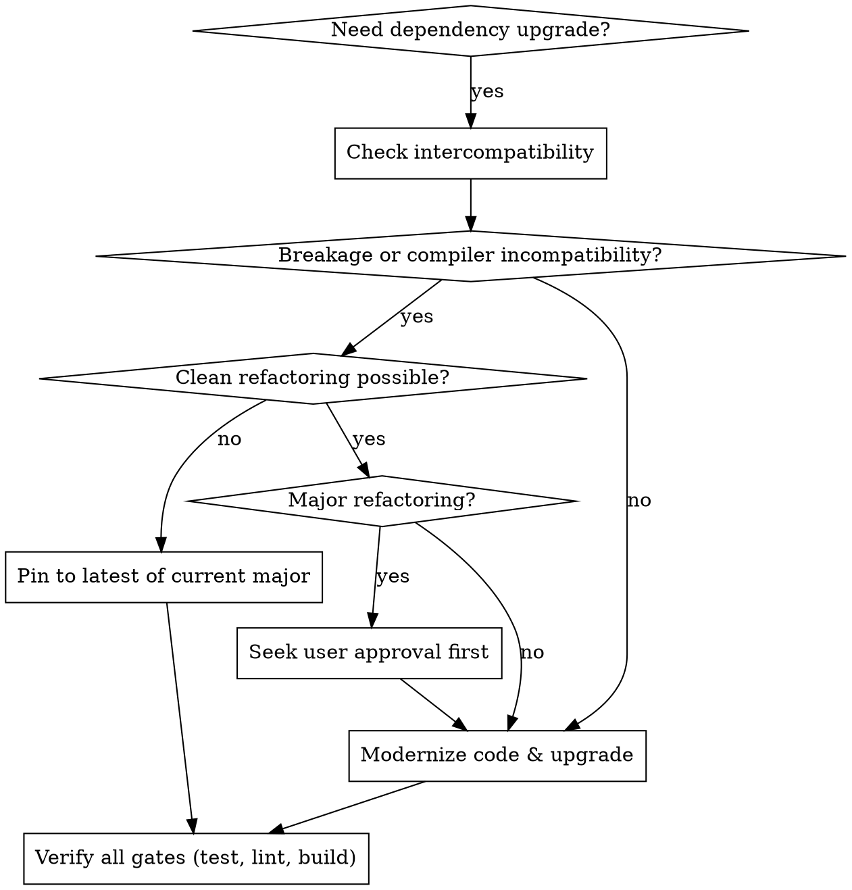

# Upgrading Dependencies

## Overview

Upgrading dependencies is a disciplined, multi-gate engineering process: upgrade to the latest intercompatible versions, modernize deprecated code, and verify every check without employing fragile hacks or monkey-patching.

## When to Use



### Symptoms & Triggers
- `yarn outdated`, `npm outdated`, or `pnpm outdated` reports pending major/minor/patch releases.
- Framework upgrades (e.g. Next.js 15 -> 16) require aligning React, TypeScript, and ESLint.
- Deprecation warnings appear during build, test, or linting runs.
- Node.js LTS version updates require synchronizing `@types/node` and container engines.

### When NOT to Use
- Single-line ad-hoc bug fixes unrelated to dependency versions.
- Projects using non-standard package managers without lockfiles.

---

## Core Upgrade Principles

### 1. Zero Hacky Workarounds
Never use monkey-patching (e.g. `patch-package`), custom compiler shims, or fragile aliasing hacks to force incompatible majors to run. If an upstream dependency (such as `eslint-plugin-react` under ESLint 10 or Next.js under TypeScript 7 Go port) breaks due to dropped APIs, **retain the latest compatible version of the current major version**.

### 2. Node.js LTS Target Alignment
Always target active Node.js LTS versions (e.g., Node 24 or Node 26). Ensure `@types/node` matches the major runtime version declared in `package.json` -> `engines.node` and Docker/CI environments.

### 3. Deprecated Code Modernization
Always scan for and update deprecated language, framework, and library APIs (e.g., `String.prototype.substr` -> `substring`/`slice`, `defaultProps` -> default parameters, legacy synchronous Next.js route params -> `await params`).

### 4. Refactoring Approval Gate
- **Minor / Localized Modernization**: Modernize automatically without interrupting the workflow.
- **Major Architectural Refactorings**: Always create an implementation plan and seek explicit user approval before executing large structural changes (e.g. state management rewrites, router paradigm migrations).

### 5. Multi-Gate Verification
Every upgrade must pass all gates:
1. Type Safety: `tsc --noEmit`
2. Linting: `eslint . --max-warnings=0`
3. Test Suite: `vitest run` or `jest`
4. Test Coverage: `vitest run --coverage`
5. Production Build: `next build --turbopack` (all static/dynamic routes compile)

---

## Step-by-Step Upgrade Workflow

### Step 1: Pre-Upgrade Audit & Baseline
Run existing checks to establish a clean passing baseline:
```bash
yarn test
yarn lint
yarn build
yarn outdated
```

### Step 2: Research Compatibility & Major Version Contracts
For each major update, investigate breaking changes:
- **TypeScript 7 vs 6**: TS 7 dropped `lib/typescript.js` JS Compiler API. If Next.js relies on in-process compiler, stay on TS 6.x.
- **ESLint 10 vs 9**: ESLint 10 removed `.eslintrc` and `context.getFilename()`. If plugins throw errors, stay on ESLint 9.x with latest `@eslint/eslintrc`.
- Detailed compatibility rules: [framework-compatibility.md](references/framework-compatibility.md) and [eslint-flat-config.md](references/eslint-flat-config.md).

### Step 3: Update Manifest & Install
Update `package.json` with target versions and install cleanly:
```bash
yarn install # or pnpm install / npm install
```

### Step 4: Modernize Deprecated Code
Scan and modernize deprecated calls across the codebase.
- See catalog and rules: [deprecation-modernization.md](references/deprecation-modernization.md).

### Step 5: Multi-Gate Verification
Execute full verification sequence:
```bash
# 1. Tests & Coverage
yarn test:coverage

# 2. Linting
yarn lint

# 3. Production Build & Static Page Generation
yarn build
```
- See full diagnostic guide: [verification-matrix.md](references/verification-matrix.md).

---

## Rationalization Table

| Excuse / Temptation | Reality & Correct Action |
| :--- | :--- |
| "Let's install TypeScript 7 and alias it or use an experimental flag." | Violates the zero-hack rule. TS 7 dropped the JS Compiler API needed by Next.js. Pin to latest TS 6.x. |
| "ESLint 10 failed on a plugin, let's patch node_modules with patch-package." | Fragile workaround. Pin to latest ESLint 9.x until upstream plugins support Flat Config natively. |
| "Tests passed, so we can skip the production build check." | Tests do not validate Next.js Turbopack compilation, font fetching, or static page generation. Run `next build`. |
| "Let's upgrade @types/node to latest even if runtime is an older LTS." | Type mismatch will allow unsupported Node APIs in code. Pin `@types/node` to the project's target Node LTS. |
| "We don't need to fix minor deprecated methods like substr." | Deprecated methods are technical debt and risk engine removal. Modernize them during dependency upgrades. |

---

## Red Flags - STOP and Correct

- Upgrading to a major version that requires monkey-patching or `patch-package`.
- Bypassing type-checking or linting errors with `--no-verify` or `ignoreBuildErrors`.
- Upgrading runtime dependencies across major versions without checking `peerDependencies`.
- Making major architectural refactorings without prior user approval.
- Leaving any test failure or lint warning unresolved.

---

## Reference Guides

- [Next.js, TypeScript & React Compatibility](references/framework-compatibility.md)
- [ESLint Flat Config & Plugin Ecosystem](references/eslint-flat-config.md)
- [Deprecated Code Modernization & Refactoring](references/deprecation-modernization.md)
- [Multi-Gate Verification & Diagnostics](references/verification-matrix.md)

