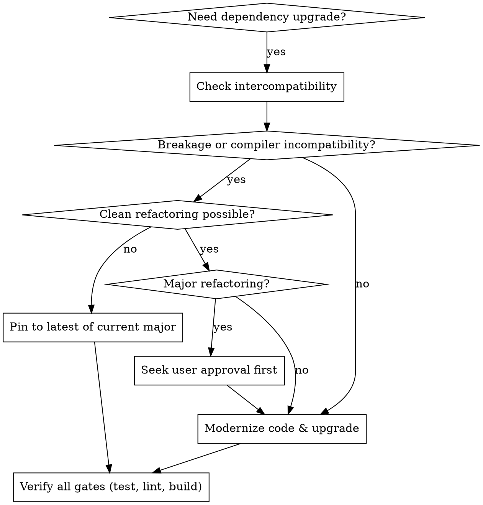

# Upgrading Dependencies

## Overview

Upgrading dependencies is a disciplined, multi-gate engineering process: upgrade to the latest intercompatible versions, modernize deprecated code, and verify every check without employing fragile hacks or monkey-patching.

## When to Use



### Symptoms & Triggers
- `yarn outdated`, `npm outdated`, or `pnpm outdated` reports pending major/minor/patch releases.
- Framework upgrades (e.g. Next.js 15 -> 16) require aligning React, TypeScript, and ESLint.
- Deprecation warnings appear during build, test, or linting runs.
- Node.js LTS version updates require synchronizing `@types/node` and container engines.

### When NOT to Use
- Single-line ad-hoc bug fixes unrelated to dependency versions.
- Projects using non-standard package managers without lockfiles.

---

## Core Upgrade Principles

### 1. Zero Hacky Workarounds
Never use monkey-patching (e.g. `patch-package`), custom compiler shims, or fragile aliasing hacks to force incompatible majors to run. If an upstream dependency (such as legacy ESLint AST plugins under ESLint 10 or tools requiring dropped JS Compiler APIs) breaks, **retain the latest compatible version of the current major version**.

### 2. Node.js LTS Target Alignment
Always target active Node.js LTS versions (e.g., Node 24 or Node 26). Ensure `@types/node` matches the major runtime version declared in `package.json` -> `engines.node` and Docker/CI environments.

### 3. Deprecated Code Modernization
Always scan for and update deprecated language, framework, and library APIs (e.g., `String.prototype.substr` -> `substring`/`slice`, `defaultProps` -> default parameters, legacy synchronous Next.js route params -> `await params`).

### 4. Refactoring Approval Gate
- **Minor / Localized Modernization**: Modernize automatically without interrupting the workflow.
- **Major Architectural Refactorings**: Always create an implementation plan and seek explicit user approval before executing large structural changes (e.g. state management rewrites, router paradigm migrations).

### 5. Multi-Gate Verification
Every upgrade must pass all gates:
1. Type Safety: `tsc --noEmit`
2. Linting: `biome check .` or `eslint . --max-warnings=0`
3. Test Suite: `vitest run` or `jest`
4. Test Coverage: `vitest run --coverage`
5. Production Build: `next build --turbopack` (or `--turbo`) (all static/dynamic routes compile)

---

## Step-by-Step Upgrade Workflow

### Step 1: Pre-Upgrade Audit & Baseline
Run existing checks to establish a clean passing baseline:
```bash
yarn test
yarn lint # (biome check . or eslint .)
yarn build
yarn outdated
```

### Step 2: Research Compatibility & Toolchain Constraints
For each major update, investigate toolchain and engine constraints:
- **TypeScript 7 vs 6**: Next.js 16+ Turbopack and Biome projects support TS 7.0+ for native speed (5x–12x faster). Pin to TS 6.x only when legacy ESLint AST plugins strictly require the deprecated `lib/typescript.js`.
- **Next.js `tsconfig.json` Scope**: Ensure `tsconfig.json` excludes test files (`exclude: ["__tests__", "coverage"]`) so mock function typing does not block production build type checking.
- **Node.js Engine Ranges**: When major upgrades specify strict Node engine ranges (e.g. `jsdom@30`), check the runtime Node version. Pin to the prior major if the environment does not meet engine requirements.
- Detailed compatibility rules: [framework-compatibility.md](references/framework-compatibility.md) and [eslint-flat-config.md](references/eslint-flat-config.md).

### Step 3: Update Manifest & Install
Update `package.json` with target versions and install cleanly:
```bash
yarn install # or pnpm install / npm install
```

### Step 4: Modernize Deprecated Code
Scan and modernize deprecated calls across the codebase.
- See catalog and rules: [deprecation-modernization.md](references/deprecation-modernization.md).

### Step 5: Multi-Gate Verification
Execute full verification sequence:
```bash
# 1. Type Safety
yarn tsc --noEmit

# 2. Linting
yarn lint

# 3. Tests & Coverage
yarn test:coverage

# 4. Production Build & Static Page Generation
yarn build
```
- See full diagnostic guide: [verification-matrix.md](references/verification-matrix.md).

---

## Rationalization Table

| Excuse / Temptation | Reality & Correct Action |
| :--- | :--- |
| "We can't upgrade to TypeScript 7 on Next.js." | Next.js 16+ with Turbopack and Biome supports TS 7 cleanly. Verify if actual AST plugin blockers exist before assuming TS 7 is incompatible. |
| "Let's use --ignore-engines to force install an incompatible major (e.g. jsdom@30)." | Engine mismatches cause runtime or parser crashes. Pin to the latest compatible major until the Node runtime is updated. |
| "Test mock type errors mean application code has broken types." | Next.js type-checks files matching `tsconfig.json`. Exclude test directories from the production build tsconfig. |
| "ESLint 10 failed on a plugin, let's patch node_modules with patch-package." | Fragile workaround. Pin to latest ESLint 9.x until upstream plugins support Flat Config natively, or migrate to Biome. |
| "Tests passed, so we can skip the production build check." | Tests do not validate Next.js Turbopack compilation, font fetching, or static page generation. Run `next build`. |
| "Let's upgrade @types/node to latest even if runtime is an older LTS." | Type mismatch will allow unsupported Node APIs in code. Pin `@types/node` to the project's target Node LTS. |

---

## Red Flags - STOP and Correct

- Upgrading to a major version that requires monkey-patching, `patch-package`, or `--ignore-engines`.
- Bypassing type-checking or linting errors with `--no-verify` or `ignoreBuildErrors`.
- Upgrading runtime dependencies across major versions without checking `peerDependencies` or Node engine ranges.
- Letting test mock signatures fail production `next build` type checking instead of properly configuring `tsconfig.json` exclusions.
- Making major architectural refactorings without prior user approval.
- Leaving any test failure or lint warning unresolved.

---

## Reference Guides

- [Next.js, TypeScript & React Compatibility](references/framework-compatibility.md)
- [ESLint Flat Config & Plugin Ecosystem](references/eslint-flat-config.md)
- [Deprecated Code Modernization & Refactoring](references/deprecation-modernization.md)
- [Multi-Gate Verification & Diagnostics](references/verification-matrix.md)

