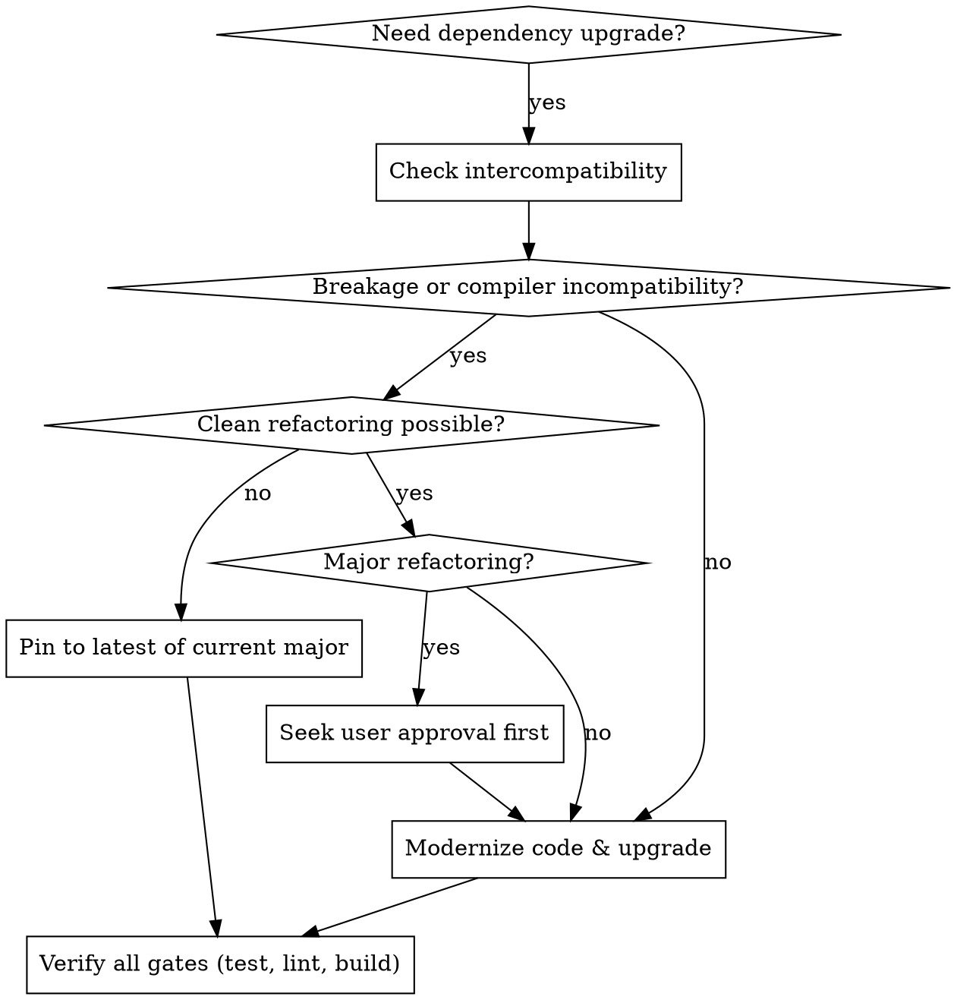

# Upgrading Dependencies

## Overview

Upgrading dependencies is a disciplined, multi-gate engineering process: upgrade to the latest intercompatible versions, modernize deprecated code, and verify every check without employing fragile hacks or monkey-patching.

## When to Use


```dot
digraph upgrade_decision {
    "Need dependency upgrade?" [shape=diamond];
    "Check intercompatibility" [shape=box];
    "Breakage or compiler incompatibility?" [shape=diamond];
    "Clean refactoring possible?" [shape=diamond];
    "Major refactoring?" [shape=diamond];
    "Seek user approval first" [shape=box];
    "Modernize code & upgrade" [shape=box];
    "Pin to latest of current major" [shape=box];
    "Verify all gates (test, lint, build)" [shape=box];

    "Need dependency upgrade?" -> "Check intercompatibility" [label="yes"];
    "Check intercompatibility" -> "Breakage or compiler incompatibility?";
    "Breakage or compiler incompatibility?" -> "Clean refactoring possible?" [label="yes"];
    "Breakage or compiler incompatibility?" -> "Modernize code & upgrade" [label="no"];
    "Clean refactoring possible?" -> "Major refactoring?" [label="yes"];
    "Clean refactoring possible?" -> "Pin to latest of current major" [label="no"];
    "Major refactoring?" -> "Seek user approval first" [label="yes"];
    "Major refactoring?" -> "Modernize code & upgrade" [label="no"];
    "Seek user approval first" -> "Modernize code & upgrade";
    "Modernize code & upgrade" -> "Verify all gates (test, lint, build)";
    "Pin to latest of current major" -> "Verify all gates (test, lint, build)";
}
```

### Symptoms & Triggers
- `yarn outdated`, `npm outdated`, or `pnpm outdated` reports pending major/minor/patch releases.
- Framework upgrades (e.g. Next.js 15 -> 16) require aligning React, TypeScript, and ESLint.
- Deprecation warnings appear during build, test, or linting runs.
- Node.js LTS version updates require synchronizing `@types/node` and container engines.

### When NOT to Use
- Single-line ad-hoc bug fixes unrelated to dependency versions.
- Projects using non-standard package managers without lockfiles.

---

## Core Upgrade Principles

### 1. Zero Hacky Workarounds
Never use monkey-patching (e.g. `patch-package`), custom compiler shims, or fragile aliasing hacks to force incompatible majors to run. If an upstream dependency (such as legacy ESLint AST plugins under ESLint 10 or tools requiring dropped JS Compiler APIs) breaks, **retain the latest compatible version of the current major version**.

### 2. Node.js LTS Target Alignment
Always target active Node.js LTS versions (e.g., Node 24 or Node 26). When upgrading Node LTS targets, synchronize the complete runtime stack:
1. `package.json` -> `"engines.node"`
2. `devDependencies` -> `"@types/node"` (pinned to lowest supported runtime major)
3. CI workflows -> `.github/workflows/*.yml` matrix
4. Containers -> Dockerfile base images (e.g., `FROM node:26-alpine`)
5. Docs & environment -> `README.md` prerequisites, `.nvmrc`, `.node-version`

### 3. Deprecated Code Modernization
Always scan for and update deprecated language, framework, and library APIs (e.g., `String.prototype.substr` -> `substring`/`slice`, `defaultProps` -> default parameters, legacy synchronous Next.js route params -> `await params`, removed prebuilt component props like Clerk's `<UserButton afterSignOutUrl>`).

### 4. Refactoring Approval Gate
- **Minor / Localized Modernization**: Modernize automatically without interrupting the workflow.
- **Major Architectural Refactorings**: Always create an implementation plan and seek explicit user approval before executing large structural changes (e.g. state management rewrites, router paradigm migrations).

### 5. Transitive Singleton Deduplication
Libraries relying on singleton state across plugins (e.g. ProseMirror, TipTap, Lexical, GraphQL, React) fail when package managers hoist an older transitive version to root while nesting the upgraded version. Enforce unified modern versions via `"resolutions"` (Yarn) or `"overrides"` (npm/pnpm), and eliminate unreferenced direct dependencies pulling conflicting sub-ranges.

### 6. Unmocked Integration Smoke Tests
Unit tests that mock entire component ecosystems (e.g., `vi.mock("@blocknote/*")`) pass with 100% coverage even when runtime imports or prototype methods crash on mount. Always verify unmocked component instantiation or include an integration smoke test for critical third-party dependencies.

### 7. Multi-Gate Verification
Every upgrade must pass all gates:
1. Type Safety: `tsc --noEmit`
2. Linting: `biome check .` or `eslint . --max-warnings=0`
3. Test Suite: `vitest run` or `jest` (including unmocked smoke tests)
4. Test Coverage: `vitest run --coverage`
5. Production Build: `next build --turbopack` (or `--turbo`) (all static/dynamic routes compile)

---

## Step-by-Step Upgrade Workflow

### Step 1: Pre-Upgrade Audit & Baseline
Run existing checks to establish a clean passing baseline (run build and registry audits with network access if Google Fonts or registries are required):
```bash
yarn test
yarn lint # (biome check . or eslint .)
yarn build # (run unsandboxed if next/font fetches Google Fonts)
yarn outdated # (run unsandboxed to query registry)
# To query specific package metadata reliably: npm view <pkg> dist-tags
```

### Step 2: Research Compatibility & Toolchain Constraints
For each major update, investigate toolchain and engine constraints:
- **Ground-Truth Metadata for Newly Released Majors**: When a package manager reports a new major version that search engines or models claim is unreleased, check the source of truth directly: query `npm view <pkg> dist-tags` and fetch GitHub release notes or raw migration guides via curl. Never assume outdated reports are erroneous without checking npm.
- **TypeScript 7 vs 6**: Next.js 16+ Turbopack and Biome projects support TS 7.0+ for native speed (5x–12x faster). Pin to TS 6.x only when legacy ESLint AST plugins strictly require the deprecated `lib/typescript.js`. In TS 7, `"baseUrl"` is removed (`TS5102`); declare root-relative `"paths"` without `baseUrl`.
- **Next.js `tsconfig.json` Scope & Test Aliases**: Ensure `tsconfig.json` excludes test files (`exclude: ["__tests__", "coverage"]`) so mock function typing does not block production build type checking. When excluding tests, configure explicit path alias fallback in `vitest.config.ts` (`resolve.alias`) so test runners resolve module aliases reliably.
- **Vitest 5 Peer Dependencies**: Vitest 5 unbundles Vite and requires `vite` (`^6.4.0 || ^7.0.0 || ^8.0.0`) as an explicit `devDependency` in non-Vite frameworks (e.g. Next.js).
- **Node.js Engine Ranges**: When major upgrades specify strict Node engine ranges (e.g. `jsdom@30`, `jotai@3`), check the runtime Node version. Pin to the prior major if the environment does not meet engine requirements.
- **State Management & Ecosystem Shifts**: For state management upgrades (e.g. Jotai 3), audit imports for moved/deprecated utilities (`atomFamily` -> `jotai-family`, `loadable` -> `unwrap`, `jotai/babel` -> `jotai-babel`) and ensure the bundler supports ESM-only packaging.
- **Transitive Singleton Ecosystems**: Check for shared core frameworks (ProseMirror, TipTap, GraphQL) that require strict singletons. If transitive packages lock older versions, define `"resolutions"` / `"overrides"` in `package.json` and remove redundant unimported direct dependencies.
- **Component & UI Peer Shifts**: Audit prebuilt component props (e.g. Clerk v7 `<UserButton afterSignOutUrl>` removed) and breaking changes in UI peers (e.g. `react-day-picker` v10 dropping `getDefaultClassNames`/`DayButton` required by shadcn/ui; pin to `^9.14.0`).
- Detailed compatibility rules: [framework-compatibility.md](references/framework-compatibility.md) and [eslint-flat-config.md](references/eslint-flat-config.md).

### Step 3: Update Manifest & Install
Update `package.json` with target versions, configure `resolutions`/`overrides` if needed, and install cleanly (requires network access):
```bash
yarn install # or pnpm install / npm install
```

### Step 4: Modernize Deprecated Code
Scan and modernize deprecated calls across the codebase.
- See catalog and rules: [deprecation-modernization.md](references/deprecation-modernization.md).

### Step 5: Multi-Gate Verification
Execute full verification sequence:
```bash
# 1. Type Safety (sandboxed)
yarn tsc --noEmit

# 2. Linting (sandboxed)
yarn lint

# 3. Tests & Coverage (sandboxed) - includes unmocked integration tests
yarn test:coverage

# 4. Production Build & Static Page Generation (run unsandboxed if fetching fonts)
yarn build

# 5. Outdated Verification (run unsandboxed)
yarn outdated
```
- See full diagnostic guide: [verification-matrix.md](references/verification-matrix.md).

---

## Rationalization Table

| Excuse / Temptation | Reality & Correct Action |
| :--- | :--- |
| "Web search says this major version hasn't been released yet." | Search engine indexes and LLM priors lag behind newly published packages. Query `npm view <pkg> dist-tags` and GitHub release notes directly. |
| "yarn info failed with 'Too many arguments'." | Yarn v1 limits argument counts. Use cross-manager `npm view <pkg> dist-tags` or `npm view <pkg> <field>` instead. |
| "We can't upgrade to TypeScript 7 on Next.js." | Next.js 16+ with Turbopack and Biome supports TS 7 cleanly. Verify if actual AST plugin blockers exist before assuming TS 7 is incompatible. |
| "Let's use --ignore-engines to force install an incompatible major (e.g. jsdom@30)." | Engine mismatches cause runtime or parser crashes. Pin to the latest compatible major until the Node runtime is updated. |
| "Test mock type errors mean application code has broken types." | Next.js type-checks files matching `tsconfig.json`. Exclude test directories from the production build tsconfig. |
| "ESLint 10 failed on a plugin, let's patch node_modules with patch-package." | Fragile workaround. Pin to latest ESLint 9.x until upstream plugins support Flat Config natively, or migrate to Biome. |
| "Tests passed, so we can skip the production build check." | Tests do not validate Next.js Turbopack compilation, font fetching, or static page generation. Run `next build`. |
| "All unit tests pass with 100% coverage, so runtime works." | Unit tests often mock heavy UI/editor packages entirely (`vi.mock`). Add an unmocked integration smoke test to catch runtime prototype/singleton crashes. |
| "Transitive dependency version mismatch is an upstream bug." | Package managers hoist the first or loosest matched version to root. Use `resolutions` (Yarn) or `overrides` (npm/pnpm) to unify singletons. |
| "Let's upgrade @types/node to latest even if runtime is an older LTS." | Type mismatch will allow unsupported Node APIs in code. Pin `@types/node` to the project's target Node LTS. |
| "Keep 'baseUrl' in tsconfig.json when upgrading to TS 7." | TypeScript 7 removes `baseUrl` entirely (error TS5102). Remove it and use root-relative `paths`. |
| "Vitest 5 should run in Next.js without Vite in devDependencies." | Vitest 5 unbundled Vite; Next.js projects must install `vite` explicitly in `devDependencies` to prevent `ERR_MODULE_NOT_FOUND`. |
| "next build failed fetching Google Fonts in sandbox." | Next.js downloads Google Fonts during build. Run `next build` unsandboxed with network access enabled rather than disabling font optimization. |
| "yarn outdated exited with code 1, so the verification failed." | Yarn exits with code 1 whenever any outdated packages exist. Check if remaining entries are only intentional LTS/engine pins, or code 0 when 100% clean. |
| "TypeScript 7 failed on side-effect CSS imports (`TS2882`)." | TS 6/7 enables `noUncheckedSideEffectImports` by default. Declare ambient styles in a root declaration file (`global.d.ts` with `declare module "*.css";`) instead of relaxing compiler checks. |
| "Better Auth logs schema mismatch errors during next build." | Better Auth 1.7 validates plugin database columns. Run `npx auth generate --yes` and synchronize table definitions. For array relations on MongoDB, assign `@default([])` in `schema.prisma`. |
| "Prisma reported a new major (v7), so we should upgrade it." | Prisma 7 removed embedded query engines for SQL driver adapters and dropped MongoDB support. Verify database provider compatibility before upgrading ORMs across majors; retain `^6.19.x` for MongoDB. |
| "Zod 4 broke `useForm<FieldValues>` resolver types (`TS2322`)." | In `@hookform/resolvers@5` and Zod 4, resolvers are strictly typed `Resolver<z.infer<typeof Schema>>`. Type forms with `z.infer<typeof Schema>` or let `useForm` infer from the resolver instead of using generic `FieldValues`. |

---

## Red Flags - STOP and Correct

- Upgrading to a major version that requires monkey-patching, `patch-package`, or `--ignore-engines`.
- Bypassing type-checking or linting errors with `--no-verify` or `ignoreBuildErrors`.
- Upgrading runtime dependencies across major versions without checking `peerDependencies` or Node engine ranges.
- Ignoring package manager warnings about multiple instances of singleton packages (e.g. `prosemirror-model is loaded more than once`).
- Relying exclusively on 100% mocked unit tests without verifying unmocked component mounting.
- Letting test mock signatures fail production `next build` type checking instead of properly configuring `tsconfig.json` exclusions.
- Making major architectural refactorings without prior user approval.
- Leaving any test failure or lint warning unresolved.

---

## Reference Guides

- [Next.js, TypeScript & React Compatibility](references/framework-compatibility.md)
- [ESLint Flat Config & Plugin Ecosystem](references/eslint-flat-config.md)
- [Deprecated Code Modernization & Refactoring](references/deprecation-modernization.md)
- [Multi-Gate Verification & Diagnostics](references/verification-matrix.md)

