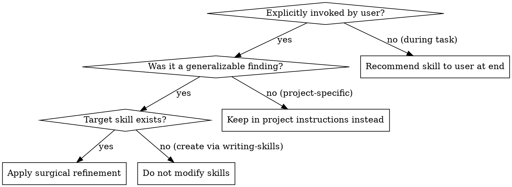

# Refining Skills

## Overview

Skill refinement is surgical, incremental maintenance: capture concrete discoveries, failure modes, and CLI quirks from active sessions into existing skills without bloating, rewriting, or introducing project-specific noise.

## When to Use



### Symptoms & Triggers
- User explicitly invokes `/refining-skills` or requests updating an existing skill after an engineering task.
- A tool command failed due to non-obvious CLI flags (e.g. package manager argument limits).
- Web search or training priors lagged behind real-time ground truth (e.g. newly published major packages).
- An unmocked edge case or unexpected engine/environment constraint was surfaced and resolved.

### When NOT to Use
- **Autonomous Modifications**: Agents must never invoke this skill or update skills unprompted. If discoveries occur during a task, recommend the skill to the user at the end of the response.
- **Project-Specific Logic**: Application business logic, local paths, or repo-specific quirks belong in project instructions (e.g. `GEMINI.md`, `CLAUDE.md`), not cross-project skills.
- **Skill Overhauls**: If a skill's core architecture or workflow must be completely rewritten, use `writing-skills` with full RED-GREEN-REFACTOR testing rather than incremental tuning.

---

## Core Refinement Principles

### 1. Surgical Delta, Zero Bloat
Never rewrite entire sections or overhaul existing skills during refinement. Insert only the missing command, edge-case caveat, or diagnostic entry. If an edit does not directly prevent a failure seen in practice, omit it.

### 2. Generalizable Truths Only
Distinguish between project quirks and universal tool behavior:
- **Generalizable (Skill candidate)**: "Yarn v1 `yarn info <pkg> versions dist-tags` fails with 'Too many arguments'; use `npm view <pkg> dist-tags` instead."
- **Project-specific (Do NOT add to skill)**: "The forum discussions app uses Firebase auth tokens in cookies."

### 3. Anti-Narrative Rule
Skills are reference documents, not session diaries. Never write narrative retrospectives (e.g. *"In our session on September 8th, we discovered that..."*). Translate every lesson into timeless, imperative, actionable guidance:
- ❌ BAD: *"We noticed that Jotai 3 was released today, which caused search to fail."*
- ✅ GOOD: *"When a package manager reports a newly published major version that search engines claim is unreleased, verify `npm view <pkg> dist-tags` and repository release tags directly."*

### 4. File-Placement Discipline
- **`SKILL.md`**: Keep under 500 words. Add concise bullets to existing steps or new rows to the rationalization table.
- **`references/*.md`**: Place dense reference data, version compatibility matrices, or detailed troubleshooting scenarios (e.g. Scenario J) into existing reference files rather than expanding the main document.

---

## Step-by-Step Refinement Protocol

### Step 1: Filter & Generalize Session Discoveries
Review session history for candidate improvements:
1. Did a command fail due to syntax, argument limits, or flag incompatibilities?
2. Did an external source (search, model output) provide inaccurate or outdated facts disproved by ground-truth checks?
3. Did a test or build failure reveal an undocumented peer dependency or runtime constraint?
4. Discard any findings tied solely to the specific repository's business logic.

### Step 2: Locate the Minimal Insertion Point
Identify where the finding belongs in the target skill:
- **Workflow Step**: A critical command or pre-flight check omitted from the step sequence.
- **Rationalization Table**: An excuse or false assumption an agent might make.
- **Red Flags**: A dangerous shortcut or workaround that must be strictly forbidden.
- **Reference Document (`references/*.md`)**: An engine compatibility matrix row or named troubleshooting scenario.

### Step 3: Apply Surgical Edits
Use targeted file editing tools (`replace_file_content`). Make minimal, contiguous changes. Maintain existing headings, markdown style, and tone.

### Step 4: Validate Integrity
1. Confirm YAML frontmatter remains valid and retains the required `name` and `description` fields.
2. Confirm the description retains the user-invocation requirement.
3. Ensure no narrative prose or project-specific artifacts leaked into the skill.
4. Verify word count remains compact and token-efficient.

---

## Post-Session Recommendation Pattern

When working on tasks where skills are used but `/refining-skills` was not invoked, **do not edit skills autonomously**. Instead, append a brief recommendation at the end of your final response:

```markdown
> [!TIP]
> **Recommended Skill Refinement**:
> During this task, we discovered that [brief summary of generalizable finding].
> If you would like to capture this in the `[skill-name]` skill, run `/refining-skills`.
```

---

## Rationalization Table

| Excuse / Temptation | Reality & Correct Action |
| :--- | :--- |
| "I should rewrite this section to make it better." | Refinement is for surgical updates, not stylistic overhauls. Keep existing structures intact. |
| "Let me update the skill automatically so the user doesn't have to ask." | Agents must never modify skills unprompted. Suggest the update to the user at the end of the session. |
| "This repository-specific path will help future agents on this project." | Skills are cross-project assets. Project specifics belong in project instructions or READMEs. |
| "I'll include context about the bug we hit today in the skill." | Never write narrative history. State the rule, command, or symptom imperatively. |
| "I should add an example in five different languages." | One concise, realistic example or command is sufficient. Avoid token bloat. |

---

## Red Flags - STOP and Correct

- Modifying any skill without explicit user instruction.
- Writing dates, session numbers, or first-person stories (*"we found"*, *"in our run"*).
- Expanding `SKILL.md` with multi-page logs or long code dumps instead of using `references/`.
- Overwriting existing rules or flowcharts during an incremental update.

